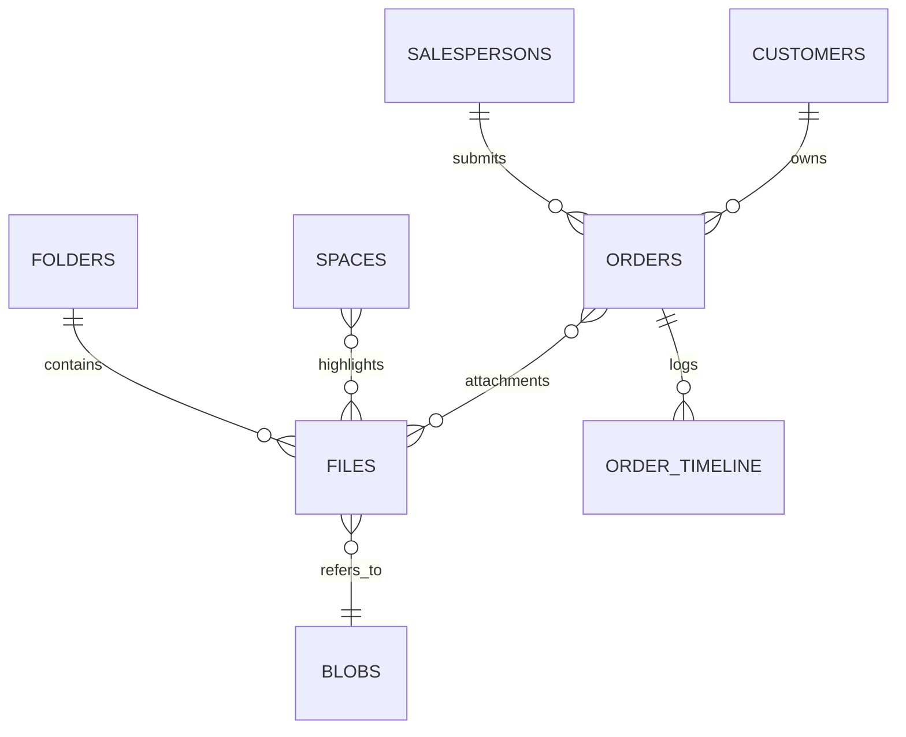

# Database Schema (SOTA)

> **Last Updated**: 2026-01-14
> **Database Engine**: Cloudflare D1 (SQLite)

本文档描述 **kk-life** 的核心数据库结构。所有表结构定义源自 `scripts/init-database.sql`。

## 1. 核心文件系统 (Core File System)

### `folders` (文件夹)
支持无限层级嵌套的文件目录结构。
| Column | Type | Description |
|--------|------|-------------|
| `id` | TEXT | PK, UUID/NanoID |
| `parent_id` | TEXT | FK -> folders.id (Null for root) |
| `name` | TEXT | 文件夹名称 |
| `is_public` | INTEGER | 0/1 是否公开 |

### `files` (文件元数据)
存储文件的业务元数据，通过 `storage_key` 关联 R2 对象，通过 `content_hash` 关联物理存储 blob（去重）。
| Column | Type | Description |
|--------|------|-------------|
| `id` | TEXT | PK |
| `folder_id` | TEXT | FK -> folders.id |
| `name` | TEXT | 显示文件名 |
| `storage_key`| TEXT | R2 中的 Key |
| `content_hash`| TEXT | SHA-256 哈希 (用于 CAS 去重) |
| `size` | INTEGER | 字节大小 |
| `mime_type` | TEXT | e.g. image/jpeg |

### `blobs` (物理存储/CAS)
内容寻址存储表，实现文件去重。
| Column | Type | Description |
|--------|------|-------------|
| `content_hash`| TEXT | PK, SHA-256 |
| `ref_count` | INTEGER | 引用计数 |

| `created_at` | INTEGER | 创建时间 |
| `updated_at` | INTEGER | 更新时间 (Added in v2) |
| `created_by` | TEXT | 创建人ID (Added in migration 0006) |
| `width` | INTEGER | 宽 (px) |
| `height` | INTEGER | 高 (px) |
| `blurhash` | TEXT | 模糊占位符 |

### `blobs` (物理存储/CAS)

内容寻址存储表，实现文件去重。

| Column | Type | Description |
| --- | --- | --- |
| `content_hash` | TEXT | PK, SHA-256 |
| `ref_count` | INTEGER | 引用计数 |
| `size` | INTEGER | 文件大小 |
| `mime_type` | TEXT | 媒体类型 |
| `created_at` | INTEGER | 创建时间 |

### `albums` (虚拟相册) (SOTA Feature)
支持多文件逻辑分组的虚拟相册，不改变物理文件结构。

| Column | Type | Description |
| --- | --- | --- |
| `id` | TEXT | PK |
| `name` | TEXT | 相册名称 |
| `share_token`| TEXT | 分享 Token |
| `is_public` | INTEGER | 0/1 |
| `cover_file_id`| TEXT | FK -> files.id |

---

## 2. 共享空间 (Shared Spaces)

### `spaces`
类似于网盘分享链接的逻辑实体，支持多种视图模板。
| Column | Type | Description |
|--------|------|-------------|
| `id` | TEXT | PK |
| `share_token`| TEXT | Unique, 用于公开访问 URL |
| `template` | TEXT | `gallery`, `product`, `portfolio` 等 |
| `template_data`| TEXT | JSON, 存储 SKU、价格等扩展字段 |
| `password` | TEXT | 访问密码 (明文/简单哈希) |
| `expires_at` | INTEGER | 过期时间戳 |

### `space_files` (关联表)
多对多关联 Space 和 Files。

---

## 3. 订单与 CRM 系统 (Order & CRM)

### `salespersons` (销售人员)
独立的销售端账户体系，基于 Access Token 登录。
| Column | Type | Description |
|--------|------|-------------|
| `id` | TEXT | PK |
| `name` | TEXT | 销售姓名 |
| `access_token`| TEXT | 登录凭证 (Unique) |
| `store` | TEXT | 所属门店/区域 |
| `wechat_openid`| TEXT | 微信小程序 OpenID (Unique) |

### `customers` (客户)
简易 CRM 客户档案。
| Column | Type | Description |
|--------|------|-------------|
| `id` | TEXT | PK |
| `name` | TEXT | 客户姓名 |
| `phone` | TEXT | 联系电话 |
| `tags` | TEXT | JSON Array |

### `orders` (订单)
核心业务表。
| Column | Type | Description |
|--------|------|-------------|
| `id` | TEXT | PK |
| `order_no` | TEXT | 唯一订单号 (ORD-Date-Seq) |
| `salesperson_id`| TEXT | FK |
| `customer_id`| TEXT | FK |
| `status` | TEXT | `pending`, `confirmed`, `production`, `shipping`, `delivered`, `void` |
| `original_data` | TEXT | JSON, 原始提交数据 (不可变) |
| `current_data` | TEXT | JSON, 当前有效数据 |
| `unread_by_admin`| INT | 1 = 管理员未读 |

### `order_timeline` (时间轴)
记录订单的所有操作日志。
| Column | Type | Description |
|--------|------|-------------|
| `action_type` | TEXT | `created`, `field_updated`, `status_changed`, `comment` |
| `actor_type` | TEXT | `salesperson` / `admin` |
| `old_value` / `new_value` | TEXT | 变更前后的值 |

---

## 4. 系统模块

### `users` (管理员)
后台通过用户名/密码登录。

### `notifications` (通知)
站内消息通知。
| Column | Type | Description |
|--------|------|-------------|
| `type` | TEXT | `system`, `order`, `deadline` |
| `is_read` | INTEGER | 0/1 |

### `webhooks` & `webhook_logs`
外部系统集成回调配置及日志。

---

## ER Diagram (Simplified)

