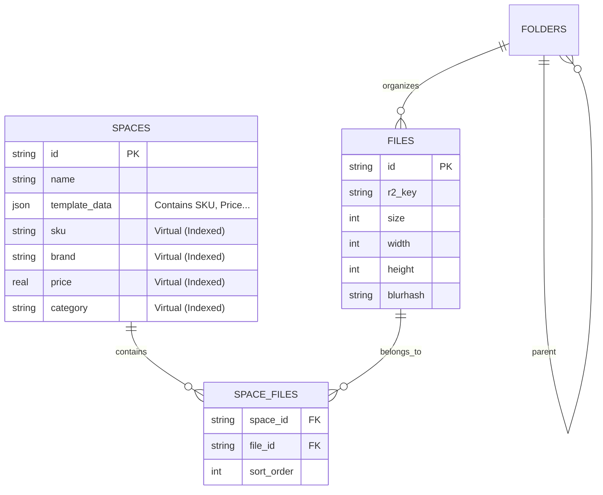

# KK-Image Database Schema

## 1. Overview
Current Architecture: **SOTA Hybrid Relational-Document Store**
Using **Cloudflare D1 (SQLite)** with **Generated Columns** to combine the flexibility of NoSQL (JSON storage) with the performance of SQL (Indexed Virtual Columns).

## 2. Tables

### `spaces` (Core Table)
Stores all space/album information. Uses a hybrid schema strategy.

| Column | Type | Description | Index |
|--------|------|-------------|-------|
| `id` | TEXT | Primary Key (NanoID), e.g. `s_a1b2c3d4` | PK |
| `name` | TEXT | Space Name | |
| `description` | TEXT | Description | |
| `is_public` | INTEGER | 0=Private, 1=Public | |
| `password` | TEXT | Access password (optional) | |
| `share_token` | TEXT | Public access token | UNIQUE |
| `expires_at` | INTEGER | Expiration Timestamp (ms) | |
| `template` | TEXT | `product`, `gallery`, `portfolio`, `collection` | |
| `template_data` | TEXT | **JSON Blob** storing dynamic fields | |
| `created_at` | INTEGER | Creation Timestamp (ms) | |
| `updated_at` | INTEGER | Update Timestamp (ms) | |
| `view_count` | INTEGER | Total views | |
| `download_count` | INTEGER | Total downloads | |
| `parent_id` | TEXT | Parent Space ID (for Subspaces) | FK |

#### 🚀 Virtual Generated Columns (Auto-Extracted from `template_data`)
These columns DO NOT occupy extra storage but are INDEXED for O(log n) search performance.

| Virtual Column | Source JSON Key | Type | Use Case |
|----------------|-----------------|------|----------|
| `sku` | `$.sku` | TEXT | Product Search |
| `brand` | `$.brand` | TEXT | Brand Filtering |
| `series` | `$.series` | TEXT | Series Grouping |
| `price` | `$.price` | REAL | Price Range Sorting |
| `material` | `$.material` | TEXT | Material Filtering |
| `category` | `$.category` | TEXT | General Categorization |
| `author` | `$.author` | TEXT | Author filtering (Portfolio) |
| `tags` | `$.tags` | TEXT | Tag Search |

```sql
-- Definition Example
ALTER TABLE spaces ADD COLUMN sku TEXT 
  GENERATED ALWAYS AS (json_extract(template_data, '$.sku')) VIRTUAL;
```

---

### `files` (Asset Table)
Stores file metadata mapped to R2 objects.

| Column | Type | Description | Index |
|--------|------|-------------|-------|
| `id` | TEXT | Primary Key (NanoID) | PK |
| `name` | TEXT | Original Filename | |
| `r2_key` | TEXT | Cloudflare R2 Key | UNIQUE |
| `size` | INTEGER | File size in bytes | |
| `mime_type` | TEXT | MIME type (e.g. `image/jpeg`) | |
| `width` | INTEGER | Image Width (px) | |
| `height` | INTEGER | Image Height (px) | |
| `blurhash` | TEXT | BlurHash string for placeholders | |
| `created_by` | TEXT | Uploader User ID | IDX |
| `created_at` | INTEGER | Timestamp | |

---

### `folders` (File Organization)
Hierarchical folder structure for file management.

| Column | Type | Description | Index |
|--------|------|-------------|-------|
| `id` | TEXT | Primary Key | PK |
| `name` | TEXT | Folder Name | |
| `parent_id` | TEXT | Parent Folder ID (NULL = Root) | IDX |
| `created_by` | TEXT | Creator User ID | IDX |
| `created_at` | INTEGER | Timestamp | |

---

### `space_files` (Junction Table)
Many-to-Many relationship between Spaces and Files.

| Column | Type | Description | Index |
|--------|------|-------------|-------|
| `space_id` | TEXT | Foreign Key -> `spaces.id` | PK(Composite) |
| `file_id` | TEXT | Foreign Key -> `files.id` | PK(Composite) |
| `sort_order` | INTEGER | Display order in space | |
| `created_at` | INTEGER | Timestamp | |

---

## 3. Operations & Performance

### Read Optimization
*   **Filters**: `SELECT * FROM spaces WHERE brand = 'Nike'` uses the functional index `idx_spaces_brand`.
*   **Search**: `SELECT * FROM spaces WHERE sku = '12345'` uses `idx_spaces_sku`.
*   **Sorting**: `SELECT * FROM spaces ORDER BY price DESC` uses `idx_spaces_price`.

### Write Simplicity
Application logic simply writes JSON to `template_data`:
```js
// Backend Insert
const templateData = { sku: "A001", brand: "Sony", price: 299.99 };
await env.DB.prepare("INSERT INTO spaces (..., template_data) VALUES(?, ?)")
  .bind(..., JSON.stringify(templateData)).run();
```
SQLite automatically populates the virtual columns and updates indexes. No separate column logic needed.

## 4. Entity Relationship Diagram (ERD)


