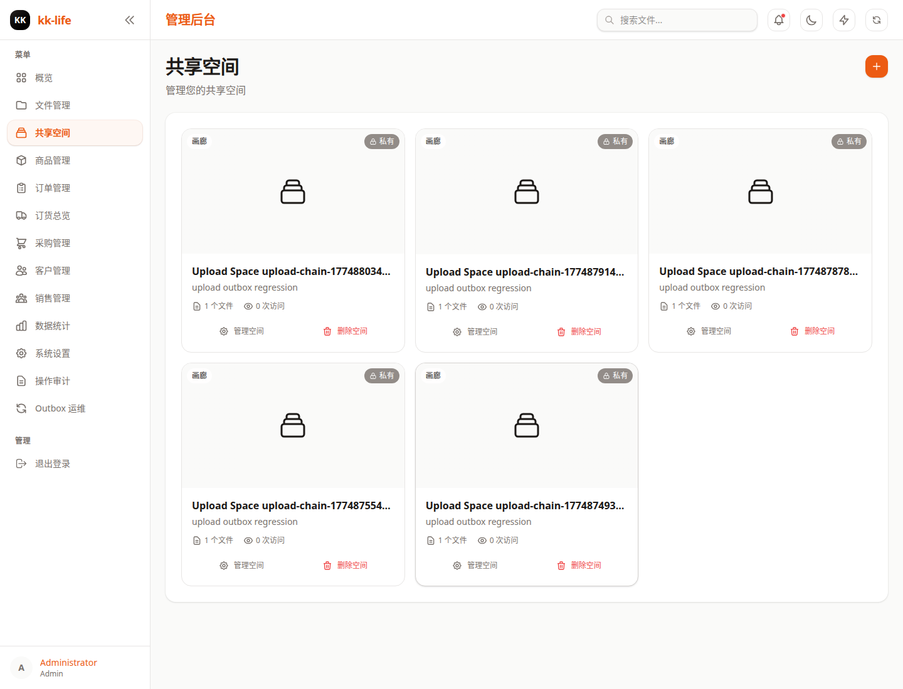

# 管理端使用手册

本文档面向管理员、运营、采购和维护人员，说明当前管理后台的真实入口、页面职责与日常操作顺序。

截图基于 `2026-04-02` 的当前管理端界面和本地演示数据采集，字段数量会随环境变化，但页面结构与主流程应保持一致。

如果你想直接查看某一个后台页的单独教程，可从 [后台逐页教程](pages/README.md) 进入。

## 1. 入口与适用范围

- 登录页：`/login`
- 后台首页：`/admin`
- 当前后台采用 `/admin/*` 单页路由，不再使用旧版独立后台页模型
- 本手册覆盖仪表盘、文件、空间、商品、订单、采购、客户、销售员、统计、设置、审计日志等日常模块
- Outbox replay 等高风险运维动作继续以 [审计与 Outbox 运维手册](audit-operations.md) 为准

## 2. 登录与导航

- 使用已配置的管理端账号登录
- 本地开发默认绑定通常为 `admin / 123`，生产环境请使用正式账号与权限配置
- 登录后左侧侧边栏会根据权限显示可访问模块
- 建议先确认自己是否具备 `products:manage`、`orders:manage`、`audit:read`、`admin:full` 等权限

## 3. 仪表盘

适合在每天开始处理工作时先看一遍：

- 查看核心统计卡片、待处理订单、最近分享和最近文件
- 用于判断今天优先处理的是订单、图片资料还是共享空间
- 如果摘要卡片为空或异常，优先检查登录权限、数据同步和 API 可用性

## 4. 文件管理

文件页主要负责原始资料管理：

- 浏览文件夹、文件列表和搜索结果
- 上传图片或文档，整理目录结构
- 对文件执行移动、分享、删除或回收站相关操作
- 当销售页、空间页或商品页缺图时，通常先回到这里补资料

详细操作流见 [文件与空间管理](files-and-spaces.md)。

## 5. 空间管理

空间页用于组织对外展示内容：

- 创建和维护展示空间
- 关联封面图、空间文件与公开分享入口
- 维护商品空间、相册空间或分层子空间
- 如果某个销售链接或展示页内容不完整，优先检查这里的空间绑定关系

详细操作流见 [文件与空间管理](files-and-spaces.md)。

## 6. 商品管理

商品页是商品主数据维护中心：

- 维护商品基础信息、规格、编码、图片和价格
- 导入、导出或批量调整商品数据
- 在商品详情中处理图片、规格和空间绑定
- 正式建单前，建议先把商品与规格信息维护完整

更深入的采购、库存和规格规则请看 [商品与库存管理](product-inventory.md)。

## 7. 订单管理

订单页承担日常履约处理：

- 按状态、关键字、销售员或时间筛选订单
- 进入详情查看订单行、图片、备注和进度
- 处理状态更新、备注沟通、行级预留、释放与出货
- 当客户催单或采购进度异常时，这里是第一排查入口

详细操作流见 [订单与客户操作手册](order-and-customer-operations.md)。

## 8. 订货总览

订货总览适合采购和运营做缺货判断：

- 查看当前需求、库存、缺口和补货优先级
- 从订单行视角判断哪些 SKU 需要尽快采购
- 导出汇总结果给采购或供应链同事
- 如果订单多但不清楚先买什么，先看这页再开采购单

## 9. 采购单管理

采购单页负责把缺货需求落成执行动作：

- 新建采购单，维护供应商、明细和费用
- 跟踪草稿、已下单、运输中、到货、完成等状态
- 记录收货、处理部分到货、执行收货冲销
- 在需要时重新分摊运费和关税成本

采购与库存事实流转请结合 [商品与库存管理](product-inventory.md) 阅读。

## 10. 客户管理

客户页用于维护客户主档：

- 搜索客户姓名、电话、公司等信息
- 新建或编辑客户档案、标签、备注和联系方式
- 从客户详情查看客户背景，支撑订单跟进
- 当订单沟通链路混乱时，先把客户资料补全

详细操作流见 [订单与客户操作手册](order-and-customer-operations.md)。

## 11. 销售员管理

销售员页用于管理业务入口账号：

- 新建销售员并分配门店、初始密码或访问凭据
- 查看当前销售员列表和状态
- 在需要时重置访问 token
- 销售端链接异常、人员变动或权限回收时优先处理这里

配套接口和 token 说明见 [销售人员管理](sales-management.md)。

## 12. 统计分析

统计页适合做阶段复盘：

- 查看订单、销售、商品和运营趋势
- 用于周报、月报和阶段复盘
- 结合仪表盘看实时状态，结合统计页看趋势变化

详细操作流见 [统计与系统设置](stats-and-settings.md)。

## 13. 系统设置

设置页主要用于系统级配置检查：

- 核对系统开关、环境项与基础运行状态
- 检查 AI、通知、存储等能力是否启用
- 配置变更后，建议立即回到相关业务页做一次实际验证

高风险配置变更应先在预览环境验证，再进入生产。

详细操作流见 [统计与系统设置](stats-and-settings.md)。

## 14. 审计日志

审计页适合做追责、排障和合规留痕：

- 按业务域、动作、结果、严重级别和时间范围过滤日志
- 查看谁在什么时间对什么对象做了什么操作
- 导出审计结果进行留档或复盘
- 当出现权限拒绝、失败写操作或异常状态流转时，先查这里

详细筛选与 replay 流程见 [审计与 Outbox 运维手册](audit-operations.md)。

## 15. Outbox 运维

Outbox 运维入口为 `/admin/outbox-ops`，主要用于处理副作用链路问题：

- 查看 outbox 事件、consumer job 和 webhook 投递情况
- 先做 dry-run，再执行 replay
- 适合排查“主业务成功，但通知、Webhook、缓存刷新未完成”的问题

这部分属于高风险运维动作，使用规范请直接参考 [审计与 Outbox 运维手册](audit-operations.md)。

## 16. 推荐日常操作顺序

1. 先看仪表盘，确认今天的待处理重点。
2. 需要补图片或资料时，先处理文件与空间。
3. 涉及业务履约时，先看订单，再看订货总览和采购单。
4. 需要补业务档案时，处理客户和销售员信息。
5. 出现异常、争议或副作用故障时，查看审计日志与 Outbox 运维页。

## 17. 手册配套文档

- [商品与库存管理](product-inventory.md)
- [销售人员管理](sales-management.md)
- [文件与空间管理](files-and-spaces.md)
- [订单与客户操作手册](order-and-customer-operations.md)
- [统计与系统设置](stats-and-settings.md)
- [审计与 Outbox 运维手册](audit-operations.md)
