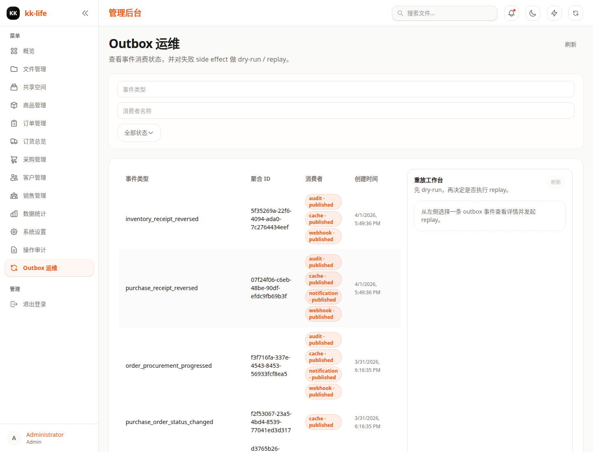

# 审计与 Outbox 运维手册

本文档说明如何在 kk-life 中查看审计日志、检查 outbox 事件，以及在必要时执行 replay 排障。

相关页面：

- 审计日志：`/admin/audit-logs`
- Outbox 运维：`/admin/outbox-ops`




## 1. 适用范围

- 管理端审计中心
- `audit:read` / `audit:export` 权限持有者
- 运维、合规、事故响应人员

## 2. 权限与入口

审计能力：

- 审计列表：`GET /api/manage/audit-logs`
- 审计导出：`GET /api/manage/audit-logs/export`

权限要求：

- 查看日志：`audit:read`
- 导出日志：`audit:export`

Outbox 运维能力：

- 页面：`/admin/outbox-ops`
- outbox 事件列表：`GET /api/manage/outbox`
- outbox 事件详情：`GET /api/manage/outbox/:eventId`
- replay 预演：`POST /api/manage/audit-replay/dry-run`
- replay 执行：`POST /api/manage/audit-replay/execute`

Replay 权限要求：

- `dry-run` 需要 `audit:read`
- `execute` 也走 `audit:read` 入口，但当前额外要求管理员身份 `role=admin` 或 `type=admin`

## 3. 建议的排障顺序

1. 先查审计日志，确认主业务动作是否真的发生。
2. 再看 Outbox 列表，确认副作用事件是否已经入队。
3. 选中具体事件查看详情，确认失败 consumer 或 webhook 尝试记录。
4. 先做 dry-run，确认命中范围。
5. 需要时再执行 replay。

这套顺序适合排查“主业务成功，但通知 / Webhook / 缓存等副作用缺失”的问题。

## 4. 审计日志怎么用

常用筛选项：

- `actorId`
- `actorType`
- `domain`
- `action`
- `result`
- `severity`
- `targetType`
- `targetId`
- `start`
- `end`

排查顺序：

1. 先按 `domain` 缩小业务域
2. 再按 `result=denied|failed` 看异常
3. 最后结合 `actorId` / `targetId` 追溯具体操作和实体

适合场景：

- 查谁修改了订单、商品、采购单
- 查为什么某次写操作失败
- 查权限拒绝、越权尝试和高风险操作

## 5. 审计导出

JSON 导出：

```bash
GET /api/manage/audit-logs/export?format=json&domain=orders&start=...
```

CSV 导出：

```bash
GET /api/manage/audit-logs/export?format=csv&domain=orders&severity=high
```

说明：

- 导出始终是过滤后导出
- 不提供整表裸导出
- 导出动作本身会写入审计事件 `audit.export`
- CSV 导出会对危险公式前缀做安全转义

## 6. Outbox 列表与详情

### 6.1 列表接口

`GET /api/manage/outbox`

常用筛选：

- `eventType`
- `consumerName`
- `status`

适用场景：

- 查某类事件是否已经成功写入 outbox
- 查某个 consumer 是否有挂起或失败任务
- 查收货、冲销、通知、Webhook 是否真的发过事件

当前列表页会展示：

- 事件类型
- 聚合 ID
- 消费者状态摘要
- 创建时间

也就是说，列表页主要用于“缩小范围”，不是一次性展示全部明细。

### 6.2 详情接口

`GET /api/manage/outbox/:eventId`

详情一般用于查看：

- outbox 原始事件
- `outbox_consumer_jobs`
- Webhook 投递尝试记录

对排查很有用的字段：

- `event_type`
- `aggregate_type`
- `aggregate_id`
- `command_id`
- `consumerJobs`
- `webhookAttempts`

说明：

- `webhookAttempts` 只在详情阶段查看，不在列表页整批展开
- 推荐先筛列表，再点开单个事件看详情

## 7. Replay 使用方式

### 7.1 Dry Run

`POST /api/manage/audit-replay/dry-run`

Body：

```json
{
  "scopeType": "event",
  "scopeId": "evt_xxx",
  "consumerName": "notification"
}
```

或：

```json
{
  "scopeType": "command",
  "scopeId": "cmd_xxx"
}
```

作用：

- 只预演本次会命中哪些事件
- 返回会重放哪些 consumer
- 不真正执行 consumer

推荐在所有正式 replay 前先执行一次。

### 7.2 Execute

`POST /api/manage/audit-replay/execute`

和 dry-run 使用同样的 `scopeType` / `scopeId` / `consumerName` 参数。

当前支持的 replay consumer：

- `audit`
- `cache`
- `notification`
- `webhook`

限制：

- `execute` 属于高风险操作
- 当前仅管理员身份可执行
- 它用于重驱动副作用，不用于重写主业务事实

## 8. 典型排障场景

### 8.1 订单创建成功，但管理员没有收到通知

排查顺序：

1. 查审计里是否有 `order.create`
2. 查 `/api/manage/outbox` 是否存在 `order_created_by_sales` 或 `order_created_by_admin`
3. 查该事件详情里的 `notification` consumer job 状态
4. 如事件存在但消费者未成功，先做 dry-run，再按需 replay `notification`

### 8.2 采购收货成功，但前端列表没刷新

排查顺序：

1. 查是否存在 `purchase_receipt_recorded`
2. 查是否存在 `order_procurement_progressed`
3. 查对应 `cache` consumer job
4. 必要时 replay `cache`

### 8.3 Webhook 漏发

排查顺序：

1. 查 outbox 事件详情
2. 查 `webhookAttempts`
3. 判断是未入队、未消费还是消费失败
4. 先 dry-run，再 replay `webhook`

如果只是验证订阅地址是否可达，可先用：

- `POST /api/manage/webhooks/:id/test`

它会直接发送 `webhook.test`，不依赖业务事件触发。

## 9. 失败写操作与权限拒绝

### 权限拒绝

重点关注：

- `result=denied`
- `severity=high`
- 高频重复的 `actorId`

### 失败写操作

重点关注：

- `result=failed`
- 同一 `action` 短时间内重复出现
- `metadata_json` / `changes_json` 的状态或约束线索

常见根因：

- 权限问题
- 状态机冲突
- 库存不足
- 幂等键重复
- 外部副作用消费者失败

## 10. 来源可信度与访问留痕

- `source_app` 仅从服务端认证上下文推断
- `ip_address` 默认使用 `CF-Connecting-IP`
- `request_id` 默认使用 `CF-Ray`

访问留痕：

- `GET /api/manage/audit-logs` 会写 `audit.read`
- `GET /api/manage/audit-logs/actions` 会写 `audit.actions.read`
- `GET /api/manage/audit-logs/export` 会写 `audit.export`
- replay 动作会写 `outbox.replay.dry_run` / `outbox.replay.execute`

## 11. 标准本地回归

做真实 API 快速业务回归时，推荐先跑：

```bash
pnpm build
pnpm start
pnpm test:real-api:fast
```

这套命令会覆盖：

- 订单行履约命令触发的缓存刷新链路
- 文件、商品、订单、采购、公开分享和销售商品可用性等 smoke 链路

如需对 outbox / Webhook / 通知整体链路做本地 Worker / HTTP 高保真验收，再运行 `pnpm build`、`pnpm start` 和
`pnpm test:real-api:full-chain:blackbox`。

## 12. 与排除路由的关系

部分非变更型 POST 接口不进入主操作审计台账，例如：

- AI chat / stream / report
- hash 预检查
- 影响预览类接口

排除项统一登记在：

- `functions/lib/hono/_shared/audit-route-exclusions.js`

如需看后台整体导航和其它关联模块，请回到 [管理端使用手册（带截图）](admin-console-guide.md)。
