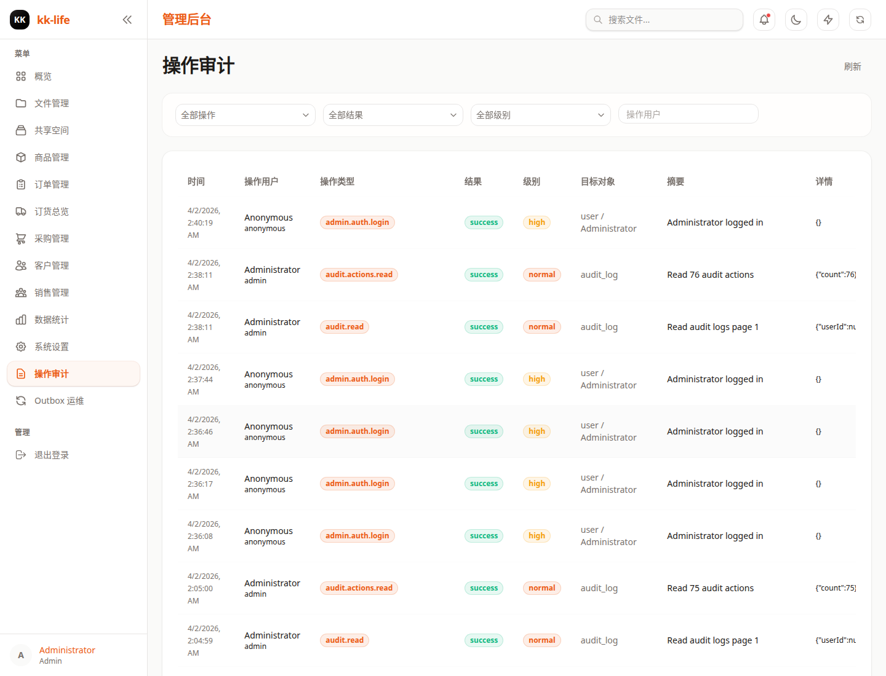

# 审计日志页面教程

- 页面路由：`/admin/audit-logs`
- 典型权限：查看 `audit:read`，导出 `audit:export`

## 页面用途

审计日志页用于查“谁在什么时间对什么对象做了什么”。

## 页面里可以做什么

- 按动作筛选
- 按结果筛选
- 按严重级别筛选
- 按操作人筛选
- 刷新列表
- 分页查看审计记录
- 通过接口导出审计结果

## 导出与告警说明

- 审计结果导出走管理端导出接口，不在当前页面直接放按钮。
- 每次导出都会额外生成一条管理员提醒，用于让值班人员知道高敏感审计数据被导出过。
- 备份恢复的 `validate`、`dry-run`、`restore` 也会在这里留下审计轨迹，其中生产环境被拒绝的恢复会记为 `denied`。

当前页面主要是查阅页，不是 replay 操作页。

## 推荐使用顺序

1. 先按动作或业务域缩小范围。
2. 再看结果列，优先关注 `failed`、`denied`。
3. 最后结合目标对象和摘要定位具体记录。

## 常见排查

### 不确定是谁改了订单或商品

先用动作和操作人筛选，再看目标对象列。

### 出现权限拒绝

优先筛 `denied`，再观察是否同一操作人重复触发。

### 想导出审计结果

当前页面没有直接导出按钮。导出请按 [审计与 Outbox 运维手册](../audit-operations.md) 使用接口。

### 想排查谁做了备份恢复演练

按 `backups` 业务域或 `backup.restore.*` 动作筛选，优先看 `denied` 和 `success` 两类记录。

## 深入阅读

- [审计与 Outbox 运维手册](../audit-operations.md)
- [Outbox 运维](outbox-ops.md)
