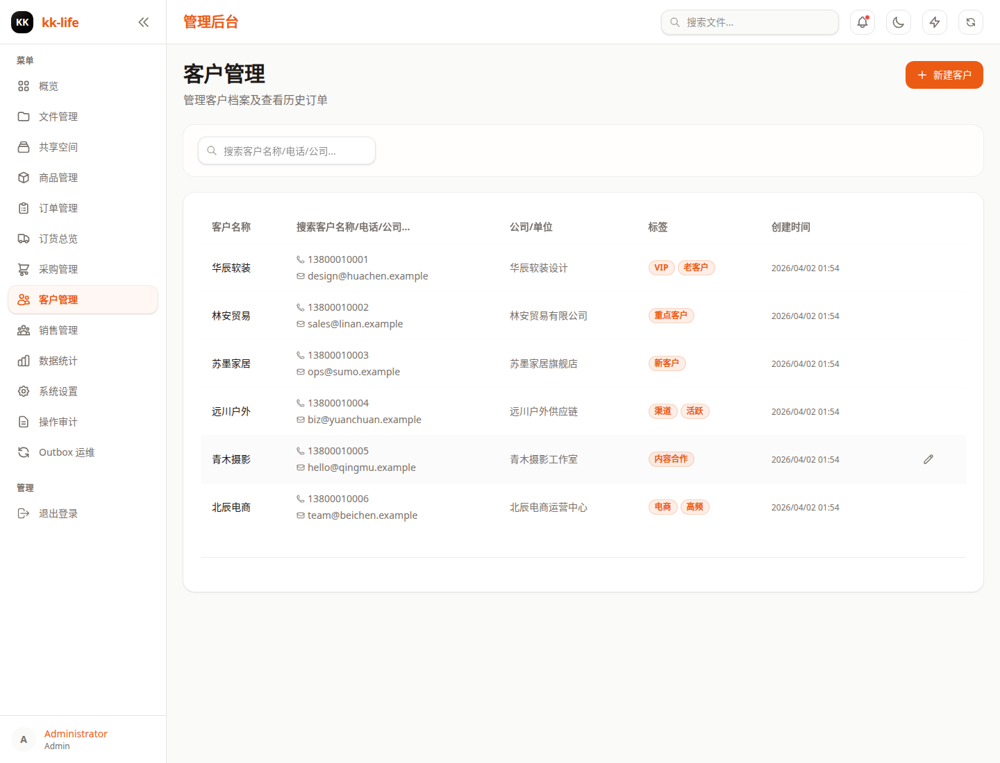

# 客户管理页面教程

- 页面路由：`/admin/customers`
- 典型权限：`orders:manage`

## 页面用途

客户页负责维护客户主档，并把客户资料和历史订单放到同一处查看。

## 页面里可以做什么

- 搜索客户
- 新建客户
- 编辑客户
- 打开右侧详情面板
- 查看客户历史订单
- 在无关联订单时删除客户

## 推荐使用顺序

1. 先搜索确认客户是否已经存在。
2. 缺资料时补姓名、电话、公司、标签、备注。
3. 订单排查需要沟通背景时，打开详情面板看历史订单。

## 详情页重点

当前详情分两个标签：

- 基本信息
  - 联系方式、公司、标签、备注
- 历史订单
  - 该客户关联订单、销售员和金额

## 常见排查

### 客户删不掉

有历史订单的客户不能直接删除，正常做法是保留档案。

### 只知道客户公司或电话

先用搜索定位，再看是否需要补完整资料。

### 订单沟通信息不完整

先补客户备注和标签，再回订单页处理。

## 深入阅读

- [订单与客户操作手册](../order-and-customer-operations.md)
- [订单管理](orders.md)
