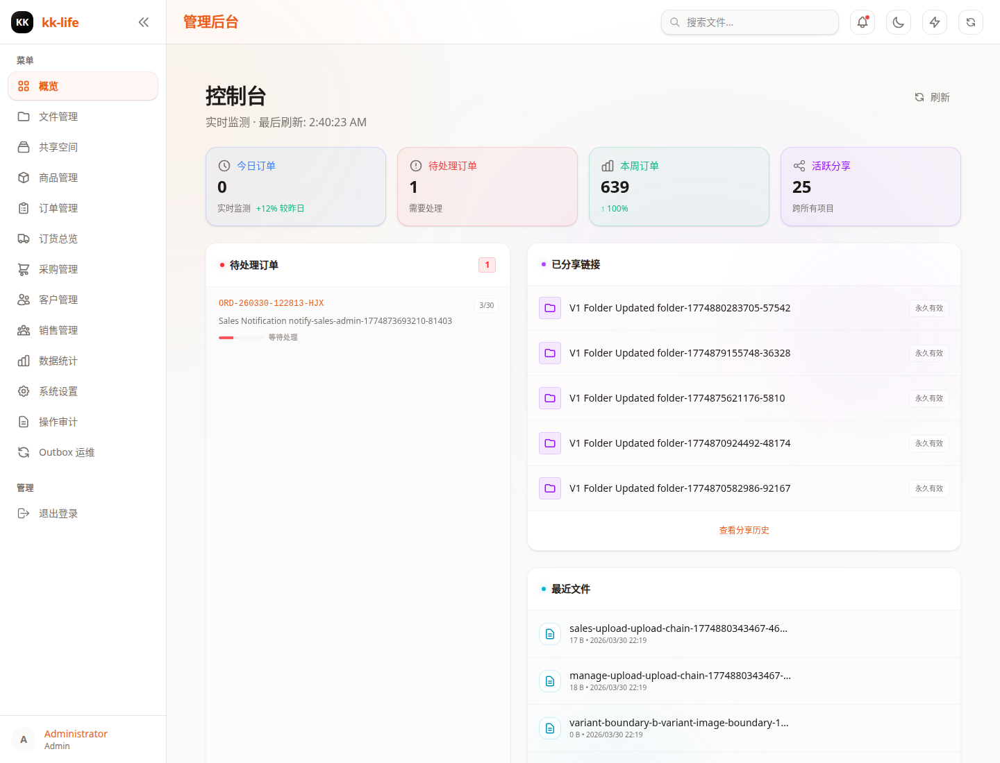

# 仪表盘页面教程

- 页面路由：`/admin/dashboard`
- 典型权限：`stats:read`

## 页面用途

仪表盘是管理后台的总览入口，适合每天开始处理工作时先看一遍。

当前页面主要聚合：

- 核心统计卡片
- 待处理订单
- 最近分享
- 最近文件

## 页面里可以做什么

- 点击刷新按钮重新拉取摘要数据
- 查看待处理订单数量和最近待办订单
- 点击某条待处理订单直接进入订单详情
- 查看最近生成的分享记录
- 复制最近分享的 token / 链接
- 打开分享管理弹窗查看历史分享
- 查看最近上传或更新的文件
- 跳转到文件管理页继续处理素材

## 推荐使用顺序

1. 先看顶部摘要卡片，判断今天的重点是订单、素材还是展示空间。
2. 再看待处理订单列表，优先进入最急的单。
3. 如需确认最近是否发过展示链接，再看最近分享区域。
4. 如果今天先做资料整理，再从最近文件跳转到文件页。

## 适合回答的问题

- 今天有没有待处理订单积压
- 最近有没有新分享发出
- 最近上传的素材是否正常入库
- 系统摘要是否整体正常

## 常见排查

### 仪表盘空白或提示无权限

先检查当前账号是否有 `stats:read`，再看登录状态是否失效。

### 待处理订单数量异常

直接进入 [订单管理](orders.md) 按状态复核，不要只凭仪表盘判断。

### 最近分享里链接不确定还能不能用

从这里先复制或查看，再去 [空间管理](spaces.md) 或专题文档确认分享配置。

## 关联页面

- [订单管理](orders.md)
- [文件管理](files.md)
- [空间管理](spaces.md)
- [管理端使用手册（带截图）](../admin-console-guide.md)
