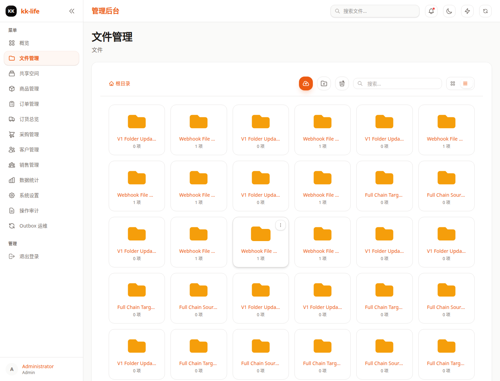

# 文件管理页面教程

- 页面路由：`/admin/files`
- 典型权限：`files:read`

## 页面用途

文件页负责管理原始资料本身，而不是对外展示结构。

当前页面适合做：

- 上传图片和文档
- 建文件夹和整理层级
- 搜索文件
- 批量移动、删除、打标签
- 单文件或单文件夹分享
- 回收站处理

## 页面里可以做什么

- 用工具栏上传文件
- 新建文件夹
- 通过面包屑在目录间切换
- 切换列表视图和网格视图
- 多选后批量移动、批量删除、批量打标签
- 右键或行内动作对单文件执行分享、重命名、下载、删除
- 对文件夹执行分享、移动、重命名、删除
- 打开回收站查看已删内容

## 推荐使用顺序

1. 先选对目录，再上传资料。
2. 目录结构稳定后，再做批量移动或打标签。
3. 需要展示给销售或客户时，不直接停在文件页，而是继续去 [空间管理](spaces.md)。

## 适合回答的问题

- 素材是否已经上传
- 原图或文档存在哪个目录
- 某批资料是否已经被误删或需要从回收站恢复
- 当前素材是否需要重新分组

## 常见排查

### 看得到文件但不能上传或删除

通常是缺少 `files:write` 或 `files:delete`，不是数据异常。

### 想发给销售，但只有原始文件没有展示页

文件页只负责资料管理。需要稳定分享时，继续去 [空间管理](spaces.md) 创建空间。

### 批量操作怕误删

先清空当前选择，再重新勾选目标文件，不要跨目录连续操作。

## 深入阅读

- [文件与空间管理](../files-and-spaces.md)
- [空间管理](spaces.md)
