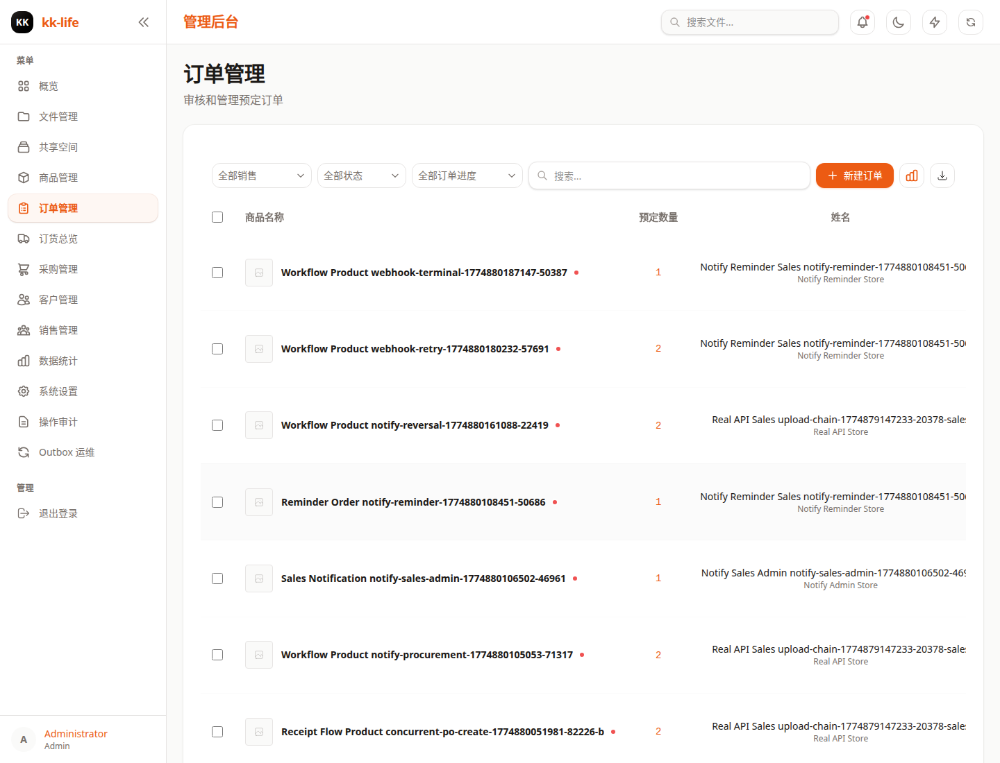

# 订单管理页面教程

- 页面路由：`/admin/orders`
- 典型权限：`orders:manage`

## 页面用途

订单页是履约处理主入口，适合筛单、看详情、改状态、写备注和执行行级动作。

## 页面里可以做什么

- 按销售员、订单状态、采购状态和关键字筛选
- 新建订单
- 在一个订单里维护多条订单行
- 导出订单
- 打开订单统计弹窗
- 点击订单进入详情
- 修改订单整体状态
- 添加管理员备注
- 编辑或删除订单
- 对订单行执行 `reserve`、`release`、`ship`

## 多行订单说明

- 新建和编辑订单时，支持在同一张订单里添加多条商品行。
- 旧的单行订单仍然兼容，系统会自动按统一结构保存。
- 如果订单行绑定了商品变体，编辑时会继续保留该绑定，不会因为补备注或改地址而自动丢失。

## 推荐使用顺序

1. 先筛出今天需要处理的订单。
2. 进入详情看时间线、订单行和采购进度。
3. 需要推动履约时，再执行行级动作。
4. 缺货或采购卡点时，转到 [订货总览](goods-overview.md) 和 [采购单管理](purchase-orders.md)。

## 常见排查

### 履约按钮不能点

先看该订单行是否还有可执行数量，再看是否已出货、已取消或未进入可出货阶段。

### 客户催单但看不出卡点

先看订单状态和订单行，再去 [商品与库存管理](../product-inventory.md) 对照采购、收货和库存链路。

### 一张订单里要同时改多个商品

直接进入编辑弹窗，逐行增删和调整数量；保存后系统会整体重写订单行，而不是只覆盖第一行。

### 需要导出一批订单

先缩小筛选范围再导出，避免把无关订单一并带出。

## 深入阅读

- [订单与客户操作手册](../order-and-customer-operations.md)
- [采购单管理](purchase-orders.md)
- [客户管理](customers.md)
