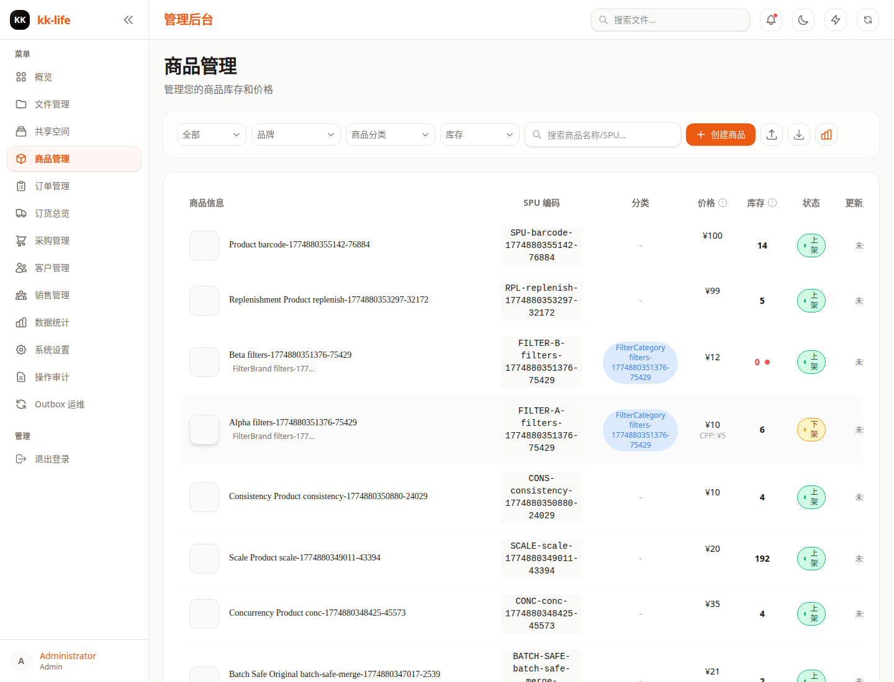
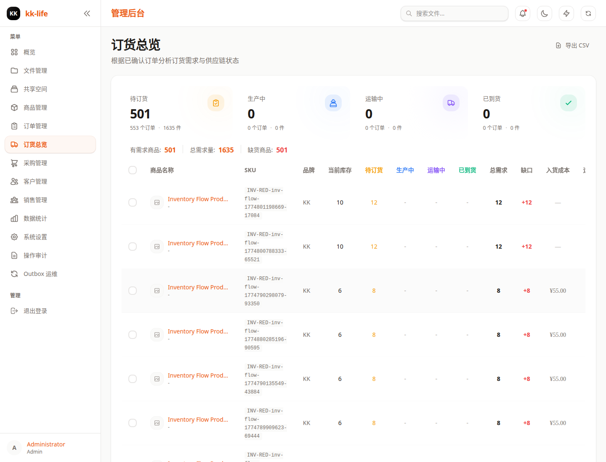
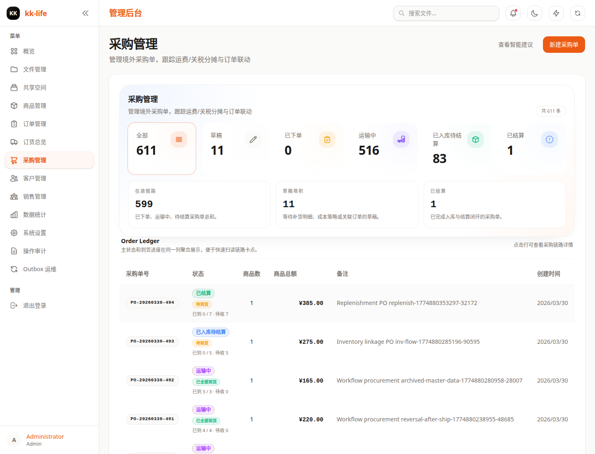

# 商品与库存管理

本文档面向管理员、采购和运营同事，说明商品、订货总览、采购单和库存联动的当前真实业务规则。

相关页面：

- 商品管理：`/admin/products`
- 订货总览：`/admin/goods-overview`
- 库存仪表盘：`/admin/inventory-dashboard`
- 采购单：`/admin/purchase-orders`
- 库存盘点：`/admin/stocktakes`

## 1. 建议的日常操作顺序

建议按下面的顺序处理商品和采购事务：

1. 先在商品页维护商品与规格数据。
2. 再到订货总览确认缺口和补货优先级。
3. 按缺口创建或更新采购单。
4. 到货后记录收货、处理部分到货或冲销。
5. 回到订单页确认行级履约进度是否已同步推进。
6. 库存异常时，用库存仪表盘定位 SKU，再用盘点单执行可审计调整。

这个顺序能减少“先建采购、后补商品资料”导致的数据不一致。

## 2. 商品管理模型

系统按两层管理商品：

- SPU
  - 管理商品名称、品牌、分类、描述等公共信息
- SKU / Variant
  - 管理具体规格、编码、图片、价格、库存和预警阈值

日常建议：

- 新建预订单前优先维护好商品与规格
- 采购单明细尽量绑定到具体 `variant`
- 缺货判断、采购建议和库存统计都以规格级口径为准

商品列表中的状态、价格、库存和库存筛选来自后台投影读模型。实际判断口径是：

- 只要一个商品仍有 active 规格，它在商品读模型中就是 active
- 所有规格都归档后，商品读模型会显示为 archived
- 库存变化、收货/冲销、批量规格上下架后，系统会刷新商品投影和相关缓存

因此，排查“商品状态不对”时，优先看规格状态和投影刷新，不要只看商品主表字段。

## 3. 订货总览怎么理解

订货总览不是简单按订单头数量汇总，而是基于订单行剩余需求计算。

当前口径大致为：

- 只统计仍有实际需求的订单行
- 对比现有可用库存
- 计算缺口、在途和优先补货对象

因此它比旧版“按订单张数/订单头数量”更准确，尤其适合：

- 同一订单只缺部分数量
- 已经部分发货或部分取消
- 某些需求已经被到货覆盖

使用建议：

- 采购前先看这页，不要直接凭感觉补货
- 同一商品多规格并行时，以缺口最大的规格优先
- 需要和采购同事沟通时，优先导出这页的结果

## 4. 采购单管理

采购单用于管理“要买什么、买了多少、收到了多少、成本如何拆分”。

### 4.1 状态流转

- 草稿 `draft`
  - 仅用于编辑明细和费用参数
- 已下单 `ordered`
  - 已向供应商下单
- 运输中 `shipping`
  - 在途阶段
- 已到货 `arrived`
  - 采购整体状态已推进到到货阶段
- 已完成 `completed`
  - 成本和业务流程完成
- 已取消 `cancelled`

重要说明：

- 采购单状态不再代表“每一件货是否都已全部入库”
- 真实到货事实来自收货记录 `receipts`
- 因此允许“采购单仍在运输/到货流程中，但已经发生部分到货”

### 4.2 明细与关联订单

采购单明细可以：

- 直接补库存
- 关联已确认的预订单

如果明细关联了预订单，后续收货与冲销会同步影响该订单的采购进度展示。

## 5. 收货、部分到货与冲销

### 5.1 收货

当前系统的正确理解是：

- 点击“记录收货”会生成一批收货事实 `purchase_receipts`
- 系统会同步写入库存流水
- 同时更新关联订单的行级进度

这意味着：

- 一张采购单可以多次收货
- 同一明细可以先到一部分，再到剩余部分
- 订单和库存会随着每次收货逐步推进，不需要等整单全部到齐

### 5.2 部分到货

部分到货时，业务侧通常会看到：

- 采购单详情里新增一条收货记录
- 关联订单显示“部分到货 / 部分完成”之类的中间进度
- 库存账本立刻出现对应入库流水

不要再把“采购单状态改到 arrived”理解为唯一入库动作。真正驱动库存与订单进度的是收货记录。

### 5.3 收货冲销

如果发现收货数量录错、收货对象错误或需要回滚，可执行“收货冲销”：

- 系统不会直接删除历史收货记录
- 会新增一条冲销事实 `purchase_receipt_reversals`
- 同步回退库存流水与关联订单进度投影

适用场景：

- 首批到货数量录多了
- 错把 A SKU 记到 B SKU
- 供应商退货或内部撤销收货确认

## 6. 订单行级履约动作

当采购到货开始覆盖订单行后，管理员可以在订单详情中按单行执行：

- 预留 `reserve`
- 释放 `release`
- 出货 `ship`

这些动作对应的后端接口是：

- `POST /api/manage/orders/:id/lines/:lineId/reserve`
- `POST /api/manage/orders/:id/lines/:lineId/release`
- `POST /api/manage/orders/:id/lines/:lineId/ship`

关键语义：

- `order_lines.reserved_qty` 表示“该订单行已经明确分配给履约动作的数量”
- 它和 `inventory_balances.reserved` 的需求侧预留不是一回事
- `reserve` / `release` 主要影响订单行分配与展示
- `ship` 才会真正扣减实物库存，并同步消耗需求侧预留

因此，看到“订单已确认、库存需求已预留”并不等于“订单行已经完成履约预留”。

## 7. 成本分摊

采购单支持在填写实际运费、关税后重新分摊成本。

常见流程：

1. 草稿阶段填写预计费用。
2. 收货或对账后补录实际运费 / 实际关税。
3. 手动执行“重新分摊成本”。
4. 系统按设定策略把费用分配到采购单明细。

这一步不会改写历史收货事实，只会刷新采购单读模型中的成本分摊结果。

## 8. 库存账本怎么理解

库存账本记录所有关键库存事实，例如：

- 采购收货入库
- 收货冲销回退
- 订单发货扣减
- 管理员直接调整

使用建议：

- 查库存异常先看账本，不要先看结果值
- 查订单采购进度异常，先对照最近收货/冲销流水
- 查订单行出货异常，先对照 `order_shipment` 与 `inventory_released`
- 对账时优先确认“事实流水是否正确”，再判断是否是展示投影问题

## 9. 库存仪表盘与盘点

库存仪表盘用于观察当前库存读模型：

- 低库存 / 零库存 SKU
- 库存总价值
- 近期库存变动
- 近 30 天出库排行

库存盘点用于把人工盘点结果落成可追溯调整：

1. 创建盘点单。
2. 系统按当前库存填充盘点明细。
3. 录入实际数量和差异原因。
4. 执行调整，调整结果进入库存事实链路。

不要直接把盘点单理解成“改库存表”。盘点调整仍应通过库存服务形成事实记录和后续读模型刷新。

## 10. 常见排查

### 为什么采购单已经到货了，但订单只显示部分到货？

因为订单进度现在按订单行和实际收货数量投影，不再只看采购单头状态。

### 为什么库存已经变化，但采购单状态还没变？

因为库存变化由收货记录驱动，采购单头状态是管理动作，不一定和每次收货完全同步。

### 为什么冲销后系统没有删除原收货记录？

因为系统采用“事实追加”模式，冲销会保留历史并新增回滚事实，方便审计和追溯。

## 11. 相关接口与页面

- 商品管理：`/admin/products`
- 订货总览：`/admin/goods-overview`
- 库存仪表盘：`/admin/inventory-dashboard`
- 采购单：`/admin/purchase-orders`
- 库存盘点：`/admin/stocktakes`
- 采购单详情：`GET /api/manage/purchase-orders/:id`
- 记录收货：`POST /api/manage/purchase-orders/:id/receipts`
- 收货冲销：`POST /api/manage/purchase-orders/:id/receipts/:receiptId/reversal`
- 重新分摊成本：`POST /api/manage/purchase-orders/:id/allocate`
- 库存仪表盘：`GET /api/manage/inventory-dashboard`
- 盘点单列表 / 创建：`GET /api/manage/stocktakes`、`POST /api/manage/stocktakes`
- 盘点明细更新：`POST /api/manage/stocktakes/:id/items`
- 盘点调整：`POST /api/manage/stocktakes/:id/adjust`
- 批量规格上下架：`POST /api/manage/products/batch/status`
- 订单行预留：`POST /api/manage/orders/:id/lines/:lineId/reserve`
- 订单行释放：`POST /api/manage/orders/:id/lines/:lineId/release`
- 订单行出货：`POST /api/manage/orders/:id/lines/:lineId/ship`
- 订货总览：`GET /api/manage/goods-overview`
- 当前库存能力主要通过商品、订货总览与采购单读模型体现，仓库中没有独立公开的 `GET /api/manage/inventory/ledger` 路由

如需看后台整体导航和其它关联模块，请回到 [管理端使用手册（带截图）](admin-console-guide.md)。
