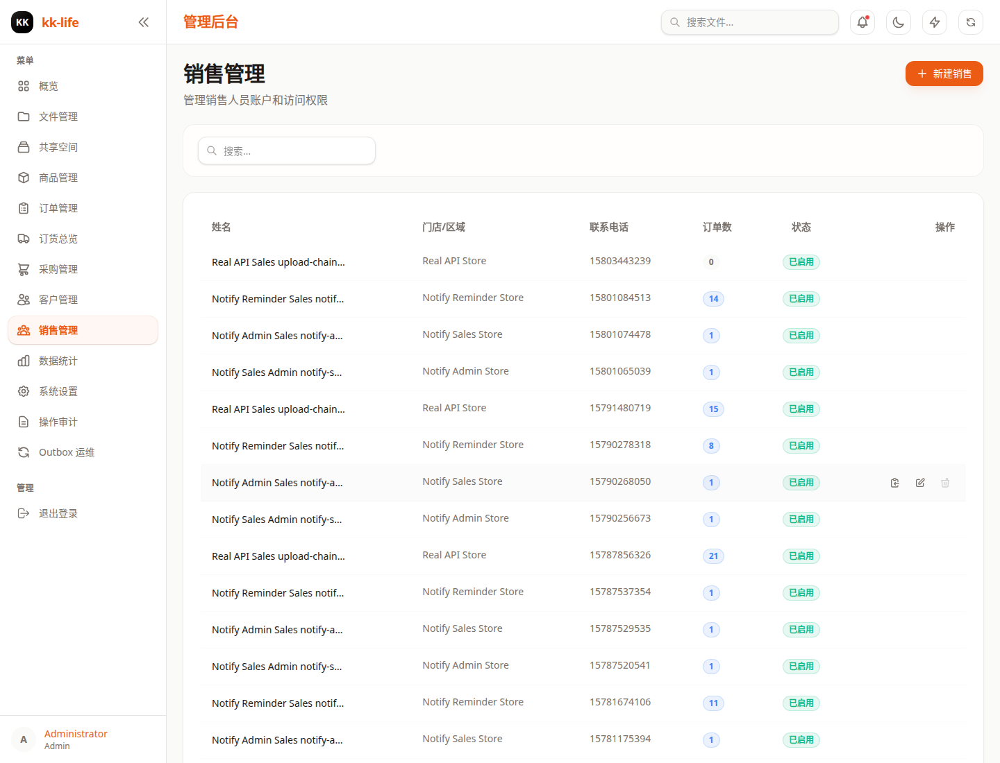

# 销售人员管理

本文档面向管理员和运营同事，说明如何在当前后台中创建、维护和停用销售人员账号，以及如何安全分发销售入口。

相关页面：

- 销售员管理：`/admin/salespersons`
- 销售入口：`/sales/:token`



## 1. 权限与页面职责

- 查看销售员列表需要 `users:read`
- 新建、编辑、删除、重置 token 需要 `users:write`
- 销售员页主要负责账号维护，不负责直接处理订单履约
- 如需看某个销售员名下订单，可从销售员页跳转到订单页并自动带上筛选条件

## 2. 页面里可以做什么

当前销售员管理页支持：

- 搜索销售员
- 新建销售员
- 编辑姓名、门店、电话、密码和启用状态
- 复制销售入口链接
- 查看某个销售员对应的订单
- 重置访问 token
- 在没有关联订单时删除销售员

## 3. 新建销售员

页面表单当前字段为：

- 姓名
- 门店
- 电话
- 登录密码

创建建议：

1. 先录入销售员姓名和门店，便于后续订单筛选与统计。
2. 初始密码只用于首次交付，正式使用前建议销售同事尽快改密。
3. 创建完成后，复制销售入口链接再发给对应人员。

对应接口：

- `POST /api/manage/salespersons`

示例请求：

```json
{
  "name": "张三",
  "store": "旗舰店",
  "phone": "13800000000",
  "password": "initial_password"
}
```

## 4. 编辑与停用

进入编辑后，当前支持维护：

- 姓名
- 门店
- 电话
- 密码
- 启用状态 `isActive`

实务建议：

- 人员还会继续使用原入口时，优先编辑信息，不要直接删除
- 人员暂时停用时，优先关闭启用状态，而不是立即删账号
- 只有确认该销售员没有关联订单时，再考虑删除

对应接口：

- `PUT /api/manage/salespersons/:id`
- `PATCH /api/manage/salespersons/:id`
- `DELETE /api/manage/salespersons/:id`

## 5. 复制销售入口链接

后台复制的是销售端入口：

- `/sales/:token`

使用建议：

- 把链接发给对应销售员本人，不要在公共群长期传播
- 发放链接时同时确认门店、姓名和是否启用，避免发错人
- 如果销售员反馈入口失效，先核对是否被停用、是否被重置 token

## 6. 重置 Access Token

重置 token 会生成新的销售入口，旧链接应视为失效。

适用场景：

- 销售员链接泄露
- 销售员离岗后重新分配
- 怀疑 token 被误转发或误公开

对应接口：

- `POST /api/manage/salespersons/:id/reset-token`

返回值会包含新的：

- `accessToken`

操作建议：

1. 先确认是否确实需要重置，不要频繁误操作。
2. 重置后只发放新的销售链接。
3. 通知原使用者旧链接不要再继续保存或传播。

## 7. 查看销售员相关订单

销售员页支持直接跳到订单页查看该销售员名下订单。

适合场景：

- 销售员反馈订单进度异常
- 需要核对某个门店近期下单情况
- 需要追踪某位销售员创建的预订单和后续履约进度

建议排查顺序：

1. 先从销售员页确认是否找对人。
2. 跳到订单页看订单状态和更新时间。
3. 如涉及采购或缺货，再转到订货总览和采购单页面。

## 8. 微信绑定

当前系统保留销售端微信绑定能力，但是否启用取决于环境配置。

当前能力：

1. 销售员先通过密码完成登录。
2. 前端如提供绑定入口，可调用 `POST /api/sales/:token/bind-wechat` 完成绑定。
3. 后端配置了 `WECHAT_APPID` / `WECHAT_SECRET` 后，可启用微信一键登录链路。

## 9. 安全要求

- Access Token 是销售员的实际入口凭据，泄露后请及时重置
- 重置 token 后，旧链接应视为立即失效
- 不建议把初始密码和访问链接长期放在同一条公开消息中
- 涉及离岗、交接或组织调整时，先停用或重置，再考虑删除

## 10. 相关接口

- 获取销售列表：`GET /api/manage/salespersons`
- 获取销售详情：`GET /api/manage/salespersons/:id`
- 创建销售员：`POST /api/manage/salespersons`
- 更新销售员：`PUT /api/manage/salespersons/:id`
- 删除销售员：`DELETE /api/manage/salespersons/:id`
- 重置访问 token：`POST /api/manage/salespersons/:id/reset-token`

如需看后台整体导航和其它关联模块，请回到 [管理端使用手册（带截图）](admin-console-guide.md)。
