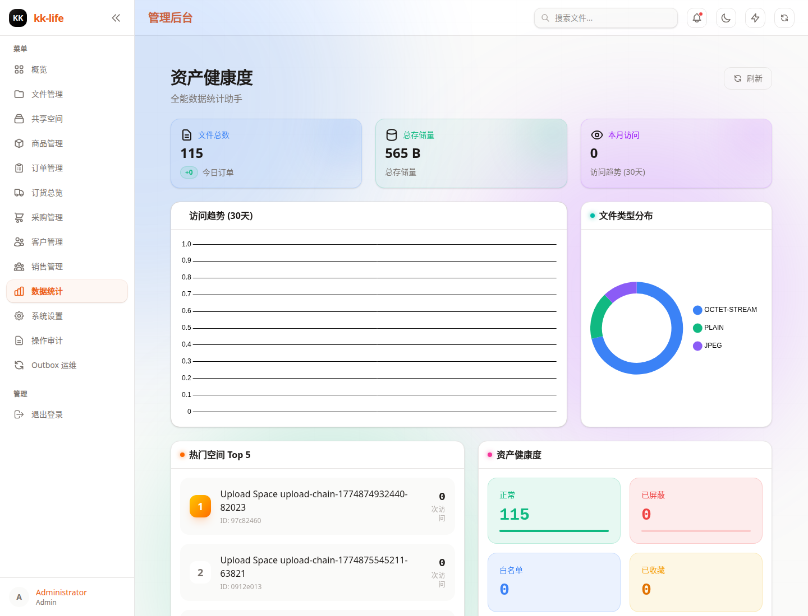
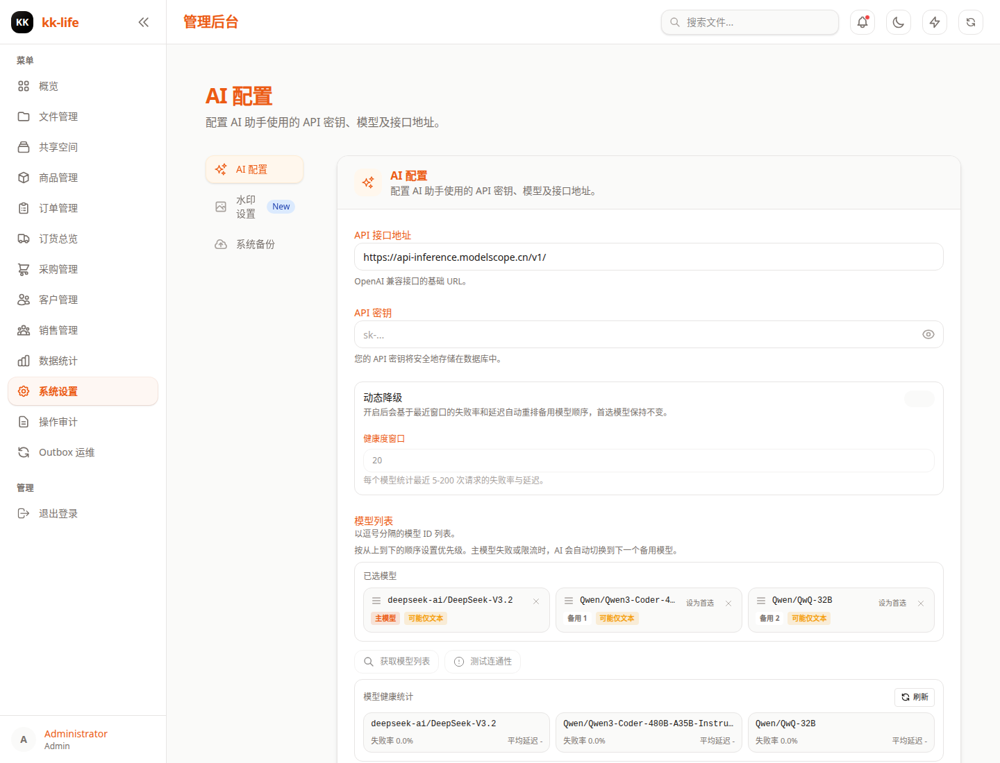

# 统计与系统设置

本文档面向管理员和运维人员，说明当前后台里的统计分析页与系统设置页如何使用。

相关页面：

- 统计分析：`/admin/stats`
- 系统设置：`/admin/settings`

## 1. 权限边界

统计页权限：

- `stats:read`

设置页权限：

- `admin:full`

也就是说：

- 大多数运营或经理角色可以看统计
- 只有管理员可以进入系统设置、保存配置和创建备份

## 2. 统计页适合做什么

当前统计页主要用于看趋势，而不是处理单笔业务。

页面会展示：

- 文件总量
- 总存储占用
- 当月访问量
- 流量趋势图
- 文件类型分布
- 热门空间排行
- 系统状态概览
- 大文件列表

推荐使用场景：

- 做周报、月报
- 看最近上传和访问变化
- 判断是否出现异常大文件或异常流量
- 识别哪些空间正在成为主要展示入口

## 3. 统计页的正确使用方式

建议顺序：

1. 先看顶部核心卡片，确认总体量级。
2. 再看趋势图，判断是短期波动还是持续变化。
3. 用热门空间列表确认最近主要曝光对象。
4. 最后看状态概览和大文件表，排查异常。

说明：

- 统计页有单独的“刷新”按钮
- 这是汇总视图，不适合替代订单、文件或空间详情页

## 4. 设置页的三个标签

当前设置页固定分为三个标签：

- AI
- Watermark
- Backups

这些配置都属于系统级设置，变更后建议马上去对应业务页做一次实际验证。

## 5. AI 设置

AI 标签当前支持：

- 配置 `AI_API_URL`
- 配置 `AI_API_KEY`
- 打开或关闭动态回退
- 设置模型健康窗口
- 抓取模型列表
- 选择并排序模型优先级
- 测试连接
- 查看模型健康统计

推荐操作顺序：

1. 先填 API 地址和 Key。
2. 点击“Fetch Models”拉取服务端可用模型。
3. 把主模型放在第一位，再排 fallback 顺序。
4. 需要时开启动态回退。
5. 保存前先做一次“Test Connectivity”。

注意：

- 当前“第一位模型”就是主模型
- 动态回退不会改变主模型，只会影响 fallback 排序
- 连接测试会检查 `/models`，并尽量测试 `/chat/completions`

## 6. 水印设置

Watermark 标签当前支持：

- 开关水印
- 设置水印文字
- 设置位置
- 设置透明度
- 设置颜色
- 设置字号比例

重要说明：

- 当前水印应用在浏览器端上传流程
- 它影响的是“新上传图片”
- 不会自动回写或重算已经存在的旧文件

因此，改完水印参数后，最好实际上传一张测试图确认效果。

## 7. 备份设置

Backups 标签当前支持：

- 查看备份列表
- 创建新备份
- 下载已有备份
- 校验备份是否可用于恢复规划
- 对备份执行 dry-run
- 在允许的非生产环境生成恢复执行摘要

后台存在删除备份接口，但删除不应作为日常操作；恢复相关按钮必须按环境和审计提示谨慎使用。

使用建议：

1. 重要配置变更前先创建备份。
2. 备份完成后确认列表里出现新文件。
3. 需要离线留档时再下载。
4. 恢复演练先跑 `Validate`，再跑 `Dry Run`。

环境要求：

- `R2_BACKUP_BUCKET` 必须正确绑定

安全边界：

- 生产环境允许 validate / dry-run，但不会直接执行破坏性恢复。
- 当前 restore 路径以审计摘要和受控恢复流程为主；任何执行前都要确认环境、分支和恢复模式。

## 8. 变更后的最小回归

修改统计无须业务回归，但修改设置后建议至少做下面检查：

### 改 AI 设置后

1. 再次执行连接测试。
2. 到实际 AI 功能页发起一次真实请求。

### 改水印设置后

1. 上传一张测试图片。
2. 检查水印位置、颜色和透明度是否符合预期。

### 创建备份后

1. 刷新列表确认备份文件存在。
2. 必要时下载一份做留档验证。

## 9. 相关文档

- [管理端使用手册（带截图）](admin-console-guide.md)
- [审计与 Outbox 运维手册](audit-operations.md)
