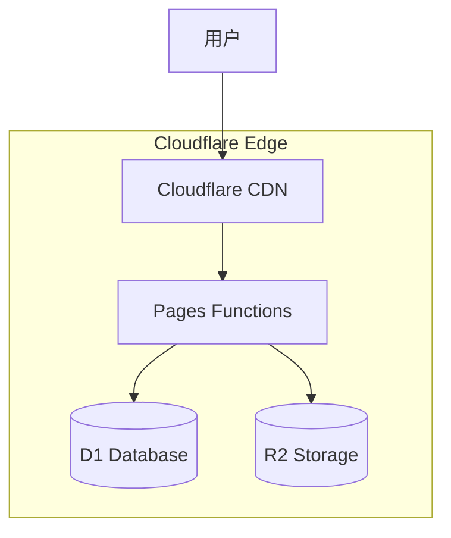

# 架构文档

欢迎来到 kk-life 架构文档中心！本文档提供了系统架构的完整说明。

## 📖 文档概览

**kk-life** 是一个基于 **Cloudflare Pages** 全栈架构的现代化应用，核心技术栈：
- **前端**: Vue 3 (Composition API) + Tailwind CSS v4
- **后端**: Cloudflare Pages Functions (Node.js Compat)
- **数据库**: Cloudflare D1 (SQLite)
- **存储**: Cloudflare R2 (对象存储)

## 🎯 适用对象

- **系统架构师** - 了解整体架构设计
- **高级开发者** - 深入理解系统实现
- **运维工程师** - 理解部署和运维要求

## 📚 架构文档

### [📊 系统概览](system-overview.md)
- 整体架构图和组件关系
- D1 + R2 存储架构
- 数据流程和处理逻辑

### [🛡️ 安全架构](security.md)
- JWT/Basic Auth 认证机制
- 多级权限模型 (Admin/Sales/Guest)
- 内容安全和审查
- 策略实现细节请参见 [授权策略系统（OPA/Rego）](../developer-guide/authz-policy-system.md)

---

## 📦 模块设计文档

详细模块设计文档位于 `modules/` 目录：

### 前端模块

| 文档 | 说明 |
|------|------|
| [前端组件库](modules/frontend-components.md) | 128个Vue组件，三层架构设计 |
| [页面视图](modules/frontend-views.md) | 路由结构、RBAC权限控制 |
| [组合式函数](modules/frontend-composables.md) | 36个composables，状态管理 |

### 后端模块

| 文档 | 说明 |
|------|------|
| [API路由](modules/api-routes.md) | Hono路由、中间件系统、RESTful设计 |
| [数据访问层](modules/repository-layer.md) | Repository模式、D1操作封装 |
| [存储层](modules/storage-layer.md) | R2/S3/Telegram存储、CAS去重 |
| [预订单创建链路](modules/preorder-creation-flow.md) | 销售端/管理端创建、校验、落库、通知与采购联动 |

---

## 🏗️ 架构特点

### 无服务器边缘架构



**核心优势**:
- **零运维** - 无需管理服务器
- **全球加速** - 边缘计算 + Smart Placement
- **低成本** - 按需付费，免费额度慷慨
- **高可用** - Cloudflare 全球网络

### 技术栈 (SOTA 2026)

| 层级 | 技术 | 说明 |
|------|------|------|
| **Frontend** | Vue 3.4+ | Composition API, `<script setup>` |
| **Styling** | Tailwind CSS v4 | Vite Plugin, 零运行时 |
| **Build** | Vite 5.x | 极速 HMR, Rollup 打包 |
| **Runtime** | Pages Functions | Node.js Compat Mode |
| **Database** | D1 (SQLite) | 关系型，支持 JOIN/事务 |
| **Storage** | R2 | S3 兼容，CAS 去重 |
| **Auth** | JWT (jose) | 无状态认证 |

### 分布式存储架构

```
文件上传流程:
┌──────────┐    ┌───────────────┐    ┌────────────┐
│  Client  │───>│ Pages Function│───>│ Cloudflare │
│          │    │   (upload.js) │    │     R2     │
└──────────┘    └───────────────┘    └────────────┘
                       │
                       v
                ┌───────────────┐
                │ Cloudflare D1 │
                │  (Metadata)   │
                └───────────────┘
```

**CAS (内容寻址存储)**:
- `files` 表: 用户可见的文件名和元数据
- `blobs` 表: 物理文件的哈希索引 (SHA-256)
- R2 Key = `content_hash` → 自动去重 + 秒传

---

## 📊 性能架构

### 缓存策略

```
浏览器缓存 (immutable, 1年)
    ↓
CDN 边缘缓存 (Cache-Control)
    ↓
D1 元数据查询
    ↓
R2 对象存储 (源数据)
```

### Smart Placement

```toml
# wrangler.toml
[placement]
mode = "smart"
```
自动将 Functions 部署到距离 D1/R2 最近的节点，减少冷启动延迟。

---

## 🔗 架构决策记录 (ADR)

### ADR-001: 选择 Cloudflare Pages
- **理由**: 一站式部署 (静态 + Functions + D1 + R2)，免费额度高，全球 CDN

### ADR-002: 从 Telegram 迁移到 R2
- **理由**: R2 无出站费用，支持更大文件，CAS 去重，企业级 SLA

### ADR-003: 采用 Tailwind CSS v4
- **理由**: 零运行时，Vite 原生插件，按需编译，现代化 utility-first

### ADR-004: 使用 D1 替代 KV
- **理由**: 关系型查询能力 (JOIN, WHERE, ORDER BY)，事务支持，更适合 OMS/CRM

---

## 🔗 相关文档

- **[开发者指南](../developer-guide/README.md)** - 开发规范
- **[API 文档](../api/README.md)** - 接口说明
- **[部署指南](../deployment/README.md)** - 生产环境部署

---

🏗️ kk-life 的架构设计充分体现了现代云原生应用的最佳实践。
