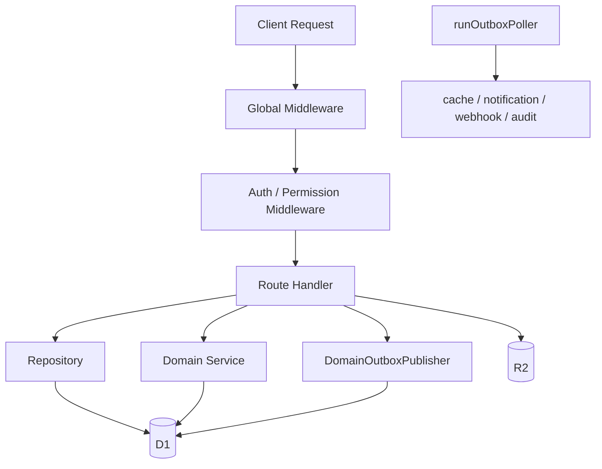

# Hono API 路由设计文档

## 1. 模块概述

项目后端统一由 `functions/lib/hono/app.js` 挂载，当前真实架构不是散落在 `functions/api/*` 下的直连处理器，而是：

- Hono 路由层
- 中间件层
- Repository / Domain Service
- Outbox 发布与消费者



## 2. 目录结构

```text
functions/lib/hono/
├── app.js
├── errors.js
├── middleware/
│   ├── auth.js
│   ├── sales-auth.js
│   ├── errorHandler.js
│   ├── rateLimit.js
│   └── cache.js
├── schemas/
└── routes/
    ├── manage/
    ├── sales/
    └── v1/
```

采购、订单和 outbox 运维相关路由集中在：

- `routes/manage/orders/`
- `routes/manage/purchase-orders.js`
- `routes/manage/outbox.js`
- `routes/manage/audit-replay.js`

## 3. 路由树

```text
/api
├── /v1
│   ├── /auth
│   ├── /health
│   ├── /files
│   ├── /folders
│   ├── /users
│   ├── /permissions
│   └── /webhooks
├── /manage
│   ├── /orders
│   ├── /products
│   ├── /goods-overview
│   ├── /purchase-orders
│   ├── /notifications
│   ├── /customers
│   ├── /salespersons
│   ├── /spaces
│   ├── /folders
│   ├── /files
│   ├── /tags
│   ├── /audit-logs
│   ├── /outbox
│   ├── /audit-replay
│   └── ...
└── /sales
    ├── /wechat-login
    └── /:token
        ├── /auth
        ├── /bind-wechat
        ├── /stats
        ├── /upload
        └── /orders
```

## 4. 中间件执行顺序

`app.js` 中全局顺序是：

1. `logger()`
2. `cors(...)`
3. `secureHeaders()`
4. `rateLimitMiddleware` for `/api/*`
5. `authMiddleware` for `/api/v1/*`, `/api/manage/*`, `/api/sales/*`
6. 具体路由里的权限控制，如 `requirePermission(...)`

销售业务路由在 `routes/sales.js` 下继续做 token 级别校验。

## 5. 请求/响应约定

### 5.1 成功响应

```json
{
  "success": true,
  "data": {}
}
```

分页场景通常返回：

```json
{
  "success": true,
  "data": {
    "items": [],
    "pagination": {
      "page": 1,
      "limit": 20,
      "total": 0,
      "totalPages": 0
    }
  }
}
```

### 5.2 错误响应

```json
{
  "success": false,
  "error": "Resource not found",
  "code": "NOT_FOUND"
}
```

## 6. 订单与采购路由模式

### 6.1 订单

订单模块的关键事实：

- 创建会落 `orders + order_lines + order_files + order_timeline`
- 详情查询会返回 `lines`
- 状态筛选优先用订单行聚合后的展示状态
- 创建、更新、状态变化、评论等副作用统一走 outbox

主要入口：

- `POST /api/manage/orders`
- `PATCH /api/manage/orders/:id`
- `PATCH /api/manage/orders/:id/status`
- `POST /api/manage/orders/:id/comment`
- `POST /api/sales/:token/orders`

### 6.2 采购

采购模块除了草稿、状态变更，还提供显式收货和冲销命令：

- `POST /api/manage/purchase-orders`
- `PUT /api/manage/purchase-orders/:id`
- `PATCH /api/manage/purchase-orders/:id/status`
- `POST /api/manage/purchase-orders/:id/receipts`
- `POST /api/manage/purchase-orders/:id/receipts/:receiptId/reversal`
- `POST /api/manage/purchase-orders/:id/allocate`

采购收货/冲销通过 `OrderProcurementDomainService` 等领域服务更新：

- `purchase_receipts`
- `purchase_receipt_reversals`
- `inventory_ledger`
- `order_lines`
- `orders.procurement_status`

## 7. Outbox 驱动的副作用模式

写接口若需要副作用，不直接在主流程里执行通知或 webhook，而是：

```javascript
const publisher = new DomainOutboxPublisher(env.DB);
await publisher.publish(events);

c.executionCtx.waitUntil(runOutboxPoller({
  env,
  requestUrl: c.req.url,
  workerId: 'some-worker-id',
}));
```

当前典型覆盖场景：

- 订单创建、更新、状态变化、评论
- 采购单缓存刷新
- 收货与冲销后的通知、Webhook、审计

## 8. 运维接口

为了支撑 durable outbox 运维，当前公开了两组管理接口：

- `/api/manage/outbox`
  - 查看 outbox 事件和事件详情
- `/api/manage/audit-replay`
  - `POST /dry-run`
  - `POST /execute`

这部分能力已经属于正式架构，不再只是内部脚本。

## 9. 最佳实践

1. 新写接口优先复用已有 `DomainOutboxPublisher` 模式。
2. 涉及订单/采购状态展示时，先确认应该读 `order_lines` 聚合还是兼容字段。
3. 批量 D1 写入注意 100 条上限，使用 chunked batch helper。
4. 路由文档和真实 `app.route(...)` 挂载要保持一致。
