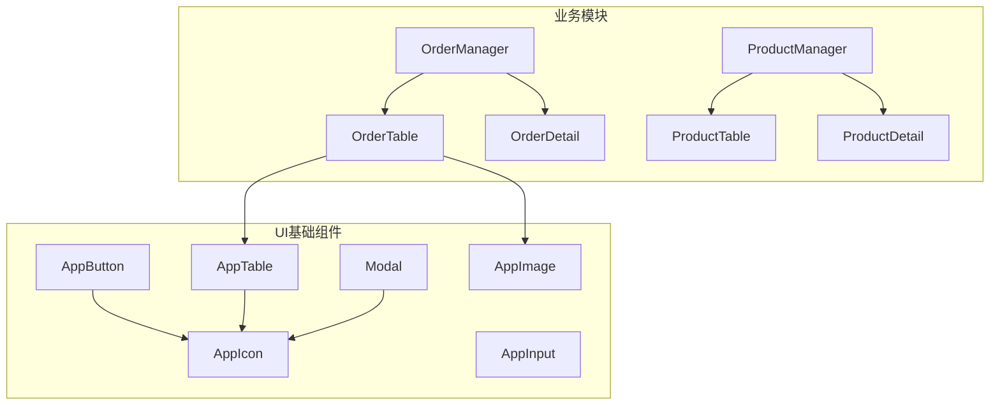

# kk-life 前端组件库设计文档

## 1. 模块概述

### 1.1 整体架构

kk-life 前端组件库基于 **Vue 3 Composition API** 构建，采用 **原子化设计** 理念，将组件分为三个层次：

```
┌─────────────────────────────────────────────────────────────────┐
│                        业务组件层                │
│  ProductManager / OrderManager / SpaceAnalytics / ...           │
├─────────────────────────────────────────────────────────────────┤
│                        功能组件层               │
│  ProductTable / OrderDetail / CustomerForm / SpaceMediaGrid     │
├─────────────────────────────────────────────────────────────────┤
│                        基础UI组件层                   │
│  AppButton / AppInput / Modal / AppTable / AppCard / ...        │
└─────────────────────────────────────────────────────────────────┘
```

### 1.2 设计理念

- **原子化组合**：基础组件高度可复用，业务组件通过组合基础组件实现
- **CSS变量驱动**：使用 CSS 变量实现主题切换（亮色/暗色模式）
- **Props驱动渲染**：组件通过 Props 控制状态，Emits 向上传递事件
- **插槽优先**：优先使用插槽提供扩展点，避免过度封装

---

## 2. 组件分类

### 2.1 目录结构

```
src/components/
├── ui/                     # 基础UI组件 (23个)
│   ├── AppButton.vue       # 按钮组件
│   ├── AppInput.vue        # 输入框组件
│   ├── AppTable.vue        # 表格组件 (支持虚拟滚动)
│   ├── AppCard.vue         # 卡片组件
│   ├── AppIcon.vue         # 图标组件 (70+图标)
│   ├── AppImage.vue        # 图片组件 (懒加载+Blurhash)
│   ├── Modal.vue           # 模态框组件
│   ├── ConfirmDialog.vue   # 确认对话框
│   ├── Lightbox.vue        # 图片灯箱
│   ├── Pagination.vue      # 分页组件
│   ├── StatusBadge.vue     # 状态徽章
│   └── ...                 # 更多组件
│
├── common/                 # 通用业务组件
│   ├── ImageUploader.vue   # 图片上传器 (CAS去重)
│   ├── NotificationList.vue# 通知列表
│   ├── AIChatWidget.vue    # AI助手悬浮窗
│   └── PasswordGate.vue    # 密码验证门
│
├── layout/                 # 布局组件
│   ├── Header.vue          # 顶部导航栏
│   └── Sidebar.vue         # 侧边栏菜单
│
├── order/                  # 订单模块组件 (16个)
├── product/                # 产品模块组件 (14个)
├── space/                  # 空间模块组件 (10个)
├── customer/               # 客户模块组件 (4个)
├── salesperson/            # 销售人员组件 (5个)
├── settings/               # 设置模块组件 (5个)
└── purchase-order/         # 采购订单组件 (2个)
```

**说明**：具体组件数量会随模块演进变化，当前以 `src/components/` 实际文件结构为准。

---

## 3. 核心组件详解

### 3.1 UI基础组件

#### AppButton 按钮组件

- **Props**: `variant` (primary/secondary/danger/ghost), `size` (sm/md/lg/xl), `loading`, `disabled`
- **Slots**: `default`, `icon-left`, `icon-right`
- **依赖**: `AppIcon`

#### AppInput 输入框组件

- **Props**: `modelValue`, `label`, `error`, `hint`, `required`, `textarea`
- **Emits**: `update:modelValue`, `blur`, `focus`
- **Expose**: `focus()`, `blur()`

#### Modal 模态框组件

- **Props**: `modelValue`, `title`, `size` (sm-full), `closable`, `closeOnBackdrop`
- **特性**: 多层级堆叠管理、ESC关闭、滚动锁定

#### AppTable 表格组件

- **Props**: `columns`, `data`, `virtual`, `loading`, `clickable`, `minRows`, `sparseThreshold`, `fillSparseSpace`
- **Slots**: `toolbar`, `cell-{key}`, `header-{key}`, `footer`, `empty`
- **依赖**: `@tanstack/vue-virtual` (虚拟滚动)
- **默认契约**:
  - 管理列表使用稳定列表舞台，默认 `minRows = 7`
  - 少量数据阈值默认 `sparseThreshold = 3`
  - 少量数据时默认开启 `fillSparseSpace`，用被动补全区维持舞台完整感
  - 标准业务列表优先分页，不默认启用内部纵向滚动
  - `virtual` 或弹窗等特殊场景才使用内部滚动例外

#### AppIcon 图标组件

- **Props**: `name`, `class`, `strokeWidth`
- **支持**: 70+ 内置SVG图标 (基于Heroicons)

#### AppImage 图片组件

- **Props**: `src`, `blurhash`, `lazy`, `aspectRatio`, `retryable`
- **特性**: 懒加载、Blurhash占位、错误回退

---

### 3.2 通用业务组件

#### ImageUploader 图片上传器

- **Props**: `modelValue`, `maxFiles`, `readonly`, `deferred`
- **特性**: CAS去重、原始Hash秒传、拖拽排序、自动压缩
- **Expose**: `uploadPendingFiles()`

#### AIChatWidget AI助手

- **特性**: 流式对话、路由感知、Markdown渲染、报告生成

---

### 3.3 布局组件

#### Header 顶部导航栏

- **功能**: 搜索、通知、主题切换、AI助手入口
- **响应式**: 移动端汉堡菜单

#### Sidebar 侧边栏

- **功能**: 折叠导航、权限过滤菜单
- **数据来源**: `src/config/admin-features.ts` 的 `getSidebarAdminFeatures()`，不要在组件内重新维护后台页面路径、权限或图标映射
- **Expose**: `openSidebar()`

---

## 4. 组件间关系图



---

## 5. 设计模式

| 模式     | 说明           | 示例                 |
| -------- | -------------- | -------------------- |
| 原子组件 | 最小可复用单元 | AppButton, AppInput  |
| 组合组件 | 组合原子组件   | ImageUploader, Modal |
| 容器组件 | 管理数据状态   | OrderManager         |
| 展示组件 | 纯Props渲染    | StatusBadge          |

---

## 6. CSS变量主题系统

```css
:root {
  --color-primary: #3b82f6;
  --color-danger: #ef4444;
  --bg-page: #f8fafc;
  --bg-card: #ffffff;
  --text-main: #1e293b;
}

:root.dark {
  --bg-page: #0f172a;
  --bg-card: #1e293b;
  --text-main: #f1f5f9;
}
```

---

## 7. 最佳实践

1. **优先使用基础组件**，避免重复造轮子
2. **遵循单向数据流**，通过 emit 向上传递事件
3. **大型组件懒加载**，使用 `defineAsyncComponent`
4. **虚拟滚动**处理大数据量列表
5. **使用 useI18n** 实现国际化
