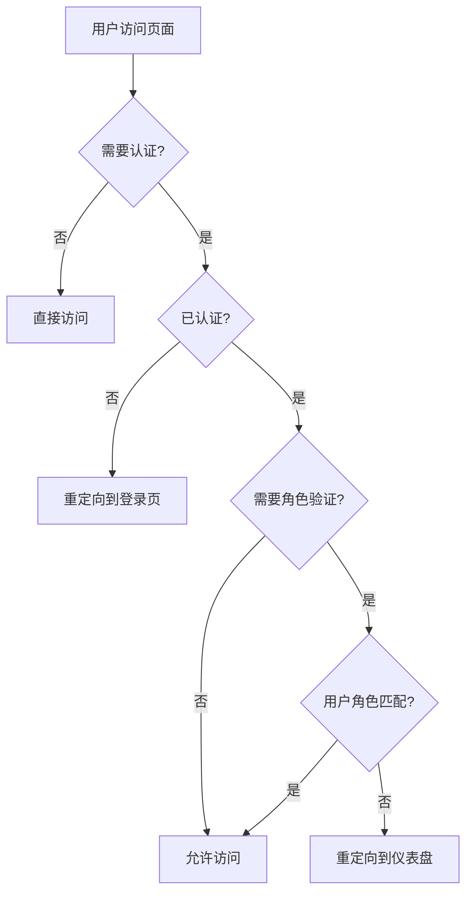
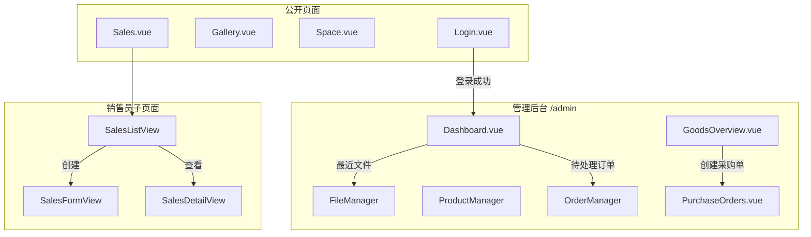

# KK-Image 页面视图设计文档

## 1. 模块概述

### 1.1 整体架构

`src/views` 目录包含 KK-Image 应用的所有页面视图组件，采用 Vue 3 Composition API 和 Vue Router 实现路由管理。

```
Router (src/router/index.js)
    │
    ├── Public Routes (无需认证)
    │   ├── Login.vue → 登录页面
    │   ├── Gallery.vue → 公开相册分享
    │   ├── Space.vue → 公开空间分享
    │   └── Sales.vue → 销售员门户入口
    │
    └── Protected Routes (/admin/*, 需要认证)
        └── AdminLayout.vue
            ├── Dashboard.vue → 管理仪表盘
            ├── FileManager/ → 文件管理模块
            ├── SpaceManager/ → 空间管理模块
            └── ... 更多管理页面
```

---

## 2. 页面分类

### 2.1 公开页面

| 页面 | 路径 | 功能描述 |
|------|------|----------|
| `Login.vue` | `/login` | 用户登录，支持 Turnstile 验证 |
| `Gallery.vue` | `/gallery/:token` | Token-based 相册分享 |
| `Space.vue` | `/space/:token` | Token-based 空间分享 |
| `Sales.vue` | `/sales/:token` | 销售员门户布局 |

### 2.2 管理后台页面

| 页面 | 路径 | 权限角色 | 功能描述 |
|------|------|----------|----------|
| `Dashboard.vue` | `/admin/dashboard` | all | 管理仪表盘 |
| `FileManager/` | `/admin/files` | admin, manager, sales, viewer | 文件管理 |
| `SpaceManager/` | `/admin/spaces` | admin, manager, sales, viewer | 空间管理 |
| `GoodsOverview.vue` | `/admin/goods-overview` | admin, manager | 商品库存概览 |
| `PurchaseOrders.vue` | `/admin/purchase-orders` | admin, manager | 采购单管理 |
| `Customers.vue` | `/admin/customers` | admin, manager | 客户管理 |
| `Stats.vue` | `/admin/stats` | admin, manager, viewer | 统计分析 |
| `Settings.vue` | `/admin/settings` | admin | 系统设置 |
| `AuditLogs.vue` | `/admin/audit-logs` | admin | 审计日志 |

### 2.3 销售员门户子页面

| 页面 | 路径 | 功能描述 |
|------|------|----------|
| `SalesListView.vue` | `/sales/:token` | 订单列表 |
| `SalesFormView.vue` | `/sales/:token/create` | 创建订单 |
| `SalesDetailView.vue` | `/sales/:token/detail/:id` | 订单详情 |
| `SalesStatsView.vue` | `/sales/:token/stats` | 个人统计 |
| `SalesSpacesView.vue` | `/sales/:token/spaces` | 关联空间 |

---

## 3. 核心页面详解

### 3.1 Dashboard.vue - 管理仪表盘

**功能说明**:
- 核心数据指标展示（今日订单、待处理、本周订单、活跃分享）
- 待处理订单列表
- 最近分享链接
- 最近文件列表
- Chart.js 图表可视化

**使用的 Composables**:
- `useAuth()` - 认证和 API 请求
- `useI18n()` - 国际化
- `useOrders()` - 订单管理
- `useClipboard()` - 剪贴板操作

---

### 3.2 FileManager/index.vue - 文件管理

**功能说明**:
- 文件和文件夹的 CRUD 操作
- 拖拽上传支持
- 批量操作（移动、删除、标签）
- 列表/网格视图切换
- 右键上下文菜单
- 回收站管理

**子组件**:
- `FileManagerToolbar.vue` - 工具栏
- `FileManagerModals.vue` - 弹窗集合
- `FileTable.vue` - 列表视图
- `FileCards.vue` - 卡片视图（移动端）
- `FolderGrid.vue` - 文件夹网格
- `TrashModal.vue` - 回收站弹窗

**使用的 Composables**:
- `useFileManager()` - 文件管理核心逻辑
- `useSearch()` - 搜索功能
- `useUploadQueue()` - 上传队列
- `useFileDrag()` - 拖拽处理
- `useFileSelection()` - 选择状态

---

### 3.3 Sales.vue - 销售员门户布局

**功能说明**:
- 销售员登录验证
- 作为嵌套路由的布局容器
- 通知系统（轮询 + 推送）
- 底部导航栏

**依赖注入**:
```javascript
provide('salesContext', {
  orders, loading, salesperson, accessToken,
  loadOrders, pagination, prefillData, setPrefillData, searchQuery
});
```

---

### 3.4 GoodsOverview.vue - 商品概览

**功能说明**:
- 商品库存管道可视化（待订货、生产中、运输中、已到货）
- 缺货预警
- 批量创建采购单
- CSV 导出

**使用的 Composables**:
- `useGoodsOverview()` - 商品概览核心逻辑

---

### 3.5 PurchaseOrders.vue - 采购单管理

**功能说明**:
- 采购单列表和详情
- 状态流转（草稿→已下单→运输中→已到货→已结算）
- 费用分摊计算
- 关联订单和商品

**状态配置**:
```javascript
const statusConfig = {
  draft: { label: '草稿', color: 'var(--text-secondary)' },
  ordered: { label: '已下单', color: 'var(--color-warning)' },
  shipping: { label: '运输中', color: 'var(--color-info)' },
  arrived: { label: '已到货', color: 'var(--color-success)' },
  settled: { label: '已结算', color: 'var(--color-primary)' },
};
```

---

## 4. 路由结构

### 4.1 完整路由配置

```javascript
const routes = [
  // 根路径重定向
  { path: '/', redirect: '/login' },
  
  // 公开路由
  { path: '/login', name: 'Login', component: Login, meta: { guest: true } },
  { path: '/gallery/:token', name: 'Gallery', component: Gallery },
  { path: '/space/:token', name: 'Space', component: Space },
  
  // 销售员门户（嵌套路由）
  { 
    path: '/sales/:token', 
    component: Sales, 
    children: [
      { path: '', name: 'SalesList', component: SalesListView },
      { path: 'create', name: 'SalesCreate', component: SalesFormView },
      { path: 'detail/:id', name: 'SalesDetail', component: SalesDetailView },
      { path: 'stats', name: 'SalesStats', component: SalesStatsView },
      { path: 'spaces', name: 'SalesSpaces', component: SalesSpacesView },
    ]
  },
  
  // 管理后台（需要认证）
  { 
    path: '/admin', 
    component: AdminLayout, 
    meta: { requiresAuth: true },
    children: [/* 管理页面 */]
  },
];
```

### 4.2 路由守卫逻辑

```javascript
router.beforeEach(async (to, from, next) => {
  // 1. 需要认证的页面
  if (to.matched.some(record => record.meta.requiresAuth)) {
    if (!isAuth) {
      next({ path: '/login', query: { redirect: to.fullPath } });
    } else {
      // RBAC 角色验证
      const requireRoles = to.meta.roles;
      if (requireRoles && !requireRoles.includes(userRole)) {
        return next({ name: 'Dashboard' });
      }
      next();
    }
  }
  // 2. 仅访客页面
  else if (to.matched.some(record => record.meta.guest)) {
    if (isAuth) next({ path: '/admin/dashboard' });
    else next();
  }
});
```

---

## 5. 权限控制

### 5.1 RBAC 角色定义

| 角色 | 权限范围 |
|------|----------|
| `admin` | 所有功能 |
| `manager` | 文件、空间、产品、订单、商品、采购、客户、统计 |
| `sales` | 文件、空间、产品、订单 |
| `viewer` | 文件、空间、产品、统计（只读） |

### 5.2 权限检查流程



---

## 6. 页面间导航关系



---

## 7. 最佳实践

### 7.1 组件拆分原则
- 主视图保持简洁，将复杂逻辑拆分到 composables
- 子组件按功能划分
- 共享状态通过 provide/inject

### 7.2 状态管理
```javascript
// 推荐：使用 composables 管理状态
const { orders, loading, loadOrders } = useOrders();

// 推荐：通过 provide/inject 共享上下文
provide('salesContext', { orders, loading, accessToken });
```

### 7.3 响应式设计
```vue
<!-- 使用 Tailwind 响应式类 -->
<div class="grid grid-cols-1 gap-4 md:grid-cols-2 lg:grid-cols-3">
</div>
```

### 7.4 性能优化
- 路由懒加载
- 组件懒加载
- 图表销毁
- 防抖搜索
