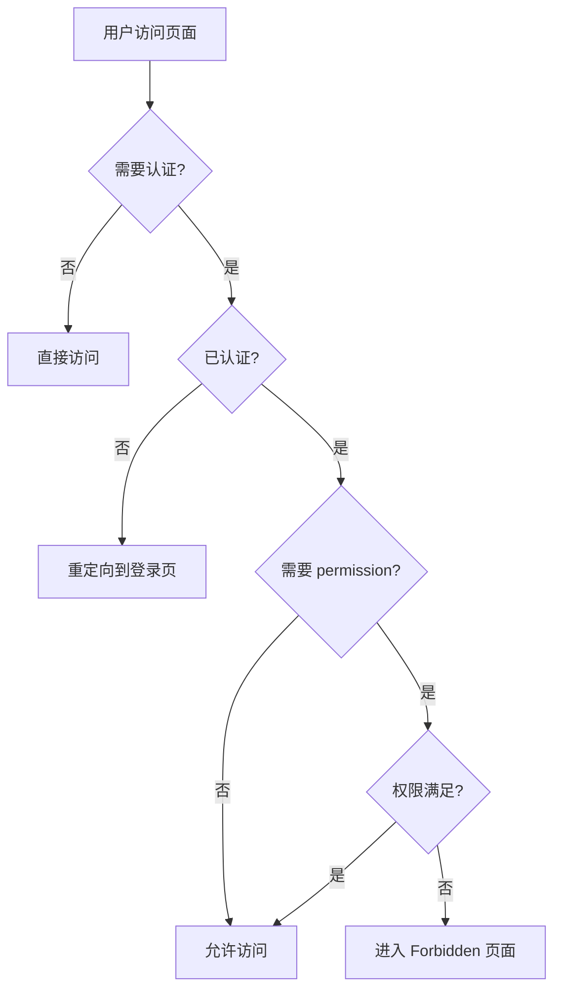
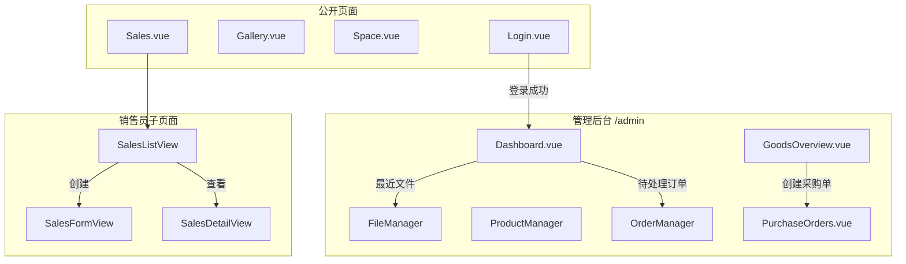

# kk-life 页面视图设计文档

## 1. 模块概述

### 1.1 整体架构

`src/views` 目录包含 kk-life 应用的主要页面视图组件，采用 Vue 3 Composition API 和 Vue Router 实现路由管理。

```
Router (src/router/index.ts)
    │
    ├── Public Routes (无需认证)
    │   ├── Login.vue → 登录页面
    │   ├── Gallery.vue → 公开相册分享
    │   ├── Space.vue → 公开空间分享
    │   └── Sales.vue → 销售员门户入口
    │
    └── Protected Routes (/admin/*, 需要认证)
        └── AdminLayout.vue
            ├── Dashboard.vue → 管理仪表盘
            ├── FileManager/ → 文件管理模块
            ├── SpaceManager/ → 空间管理模块
            └── ... 更多管理页面
```

管理端页面入口元数据不再全部手写在 `src/router/index.ts`。当前使用
`src/config/admin-features.ts` 作为管理端 feature manifest，集中维护：

- 路由 `path` / `name` / `component`
- 页面标题 `titleKey`
- 权限 `permission`
- 侧边栏与命令面板图标、标签、搜索关键词
- 最近访问实体类型到管理页面的映射

`src/router/index.ts` 通过 `createAdminFeatureRoutes()` 生成 admin child routes；
`Sidebar.vue`、`useCommandPalette.ts`、`RecentViews.vue` 和 AI context inference 通过
manifest helper 消费同一份 feature 元数据。

新增或调整管理端页面时，优先修改 `src/config/admin-features.ts`。不要在 router、
sidebar、command palette、recent-view 或 AI context inference 中再维护第二份 route/path/icon
映射；这些消费者应只通过 manifest helper 读取。

---

## 2. 页面分类

### 2.1 公开页面

| 页面          | 路径              | 功能描述                      |
| ------------- | ----------------- | ----------------------------- |
| `Login.vue`   | `/login`          | 用户登录，支持 Turnstile 验证 |
| `Gallery.vue` | `/gallery/:token` | Token-based 相册分享          |
| `Space.vue`   | `/space/:token`   | Token-based 空间分享          |
| `Sales.vue`   | `/sales/:token`   | 销售员门户布局                |

### 2.2 管理后台页面

当前后台页面主要通过路由 `meta.permission` 做权限控制，而不是旧文档中的固定角色表。

| Manifest key          | 路径                         | 主要权限             | 功能描述                     |
| --------------------- | ---------------------------- | -------------------- | ---------------------------- |
| `dashboard`           | `/admin/dashboard`           | `stats:read`         | 管理仪表盘                   |
| `files`               | `/admin/files`               | `files:read`         | 文件管理                     |
| `spaces`              | `/admin/spaces`              | `spaces:read`        | 空间管理                     |
| `salespersons`        | `/admin/salespersons`        | `users:read`         | 销售人员管理                 |
| `products`            | `/admin/products`            | `products:manage`    | 商品管理                     |
| `orders`              | `/admin/orders`              | `orders:manage`      | 订单管理                     |
| `goods-overview`      | `/admin/goods-overview`      | `products:manage`    | 缺口与订货总览               |
| `inventory-dashboard` | `/admin/inventory-dashboard` | `products:manage`    | 库存仪表盘                   |
| `purchase-orders`     | `/admin/purchase-orders`     | `products:manage`    | 采购单管理                   |
| `stocktakes`          | `/admin/stocktakes`          | `products:manage`    | 库存盘点                     |
| `customers`           | `/admin/customers`           | `orders:manage`      | 客户管理                     |
| `stats`               | `/admin/stats`               | `stats:read`         | 统计分析                     |
| `receivables`         | `/admin/receivables`         | `orders:read`        | 应收看板                     |
| `reminders`           | `/admin/reminders`           | `notifications:read` | 提醒中心，默认不进 sidebar   |
| `settings`            | `/admin/settings`            | `admin:full`         | 系统设置                     |
| `audit-logs`          | `/admin/audit-logs`          | `audit:read`         | 审计日志                     |
| `outbox-ops`          | `/admin/outbox-ops`          | `audit:read`         | Outbox / Replay 运维         |
| `erp-sync`            | `/admin/erp-sync`            | `admin:full`         | ERP 同步，默认隐藏导航入口   |
| `oauth-apps`          | `/admin/oauth-apps`          | `admin:full`         | OAuth 应用，默认隐藏导航入口 |

### 2.3 销售员门户子页面

| 页面                       | 路径                       | 功能描述       |
| -------------------------- | -------------------------- | -------------- |
| `SalesListView.vue`        | `/sales/:token`            | 订单列表       |
| `SalesFormView.vue`        | `/sales/:token/create`     | 创建订单       |
| `SalesDetailView.vue`      | `/sales/:token/detail/:id` | 订单详情       |
| `SalesStatsView.vue`       | `/sales/:token/stats`      | 个人统计       |
| `SalesSpacesView.vue`      | `/sales/:token/spaces`     | 关联空间       |
| `SalesSpaceDetailView.vue` | `/sales/:token/spaces/:id` | 销售端空间详情 |

---

## 3. 核心页面详解

### 3.1 Dashboard.vue - 管理仪表盘

**功能说明**:

- 核心数据指标展示（今日订单、待处理、本周订单、活跃分享）
- 待处理订单列表
- 最近分享链接
- 最近文件列表
- Chart.js 图表可视化

**使用的 Composables**:

- `useAuth()` - 认证和 API 请求
- `useI18n()` - 国际化
- `useOrders()` - 订单管理
- `useClipboard()` - 剪贴板操作

---

### 3.2 FileManager/index.vue - 文件管理

**功能说明**:

- 文件和文件夹的 CRUD 操作
- 拖拽上传支持
- 批量操作（移动、删除、标签）
- 列表/网格视图切换
- 右键上下文菜单
- 回收站管理

**子组件**:

- `FileManagerToolbar.vue` - 工具栏
- `FileManagerModals.vue` - 弹窗集合
- `FileTable.vue` - 列表视图
- `FileCards.vue` - 卡片视图（移动端）
- `FolderGrid.vue` - 文件夹网格
- `TrashModal.vue` - 回收站弹窗

**使用的 Composables**:

- `useFileManager()` - 文件管理核心逻辑
- `useSearch()` - 搜索功能
- `useUploadQueue()` - 上传队列
- `useFileDrag()` - 拖拽处理
- `useFileSelection()` - 选择状态

---

### 3.3 Sales.vue - 销售员门户布局

**功能说明**:

- 销售员登录验证
- 作为嵌套路由的布局容器
- 通知系统（轮询 + 推送）
- 底部导航栏

**依赖注入**:

```javascript
provide('salesContext', {
  orders,
  loading,
  salesperson,
  accessToken,
  loadOrders,
  pagination,
  prefillData,
  setPrefillData,
  searchQuery,
});
```

---

### 3.4 GoodsOverview.vue - 商品概览

**功能说明**:

- 商品库存管道可视化（待订货、生产中、运输中、已到货）
- 缺货预警
- 批量创建采购单
- CSV 导出

**使用的 Composables**:

- `useGoodsOverview()` - 商品概览核心逻辑

---

### 3.5 PurchaseOrders.vue - 采购单管理

**功能说明**:

- 采购单列表和详情
- 状态流转（草稿→已下单→运输中→已到货→已结算）
- 费用分摊计算
- 关联订单和商品

**当前主要状态**:

- `draft`
- `ordered`
- `shipping`
- `arrived`
- `completed`
- `cancelled`

---

## 4. 路由结构

### 4.1 完整路由配置

```javascript
const adminFeatureRoutes = createAdminFeatureRoutes();

const routes = [
  // 根路径重定向
  { path: '/', redirect: '/login' },

  // 公开路由
  { path: '/login', name: 'Login', component: Login, meta: { guest: true } },
  { path: '/gallery/:token', name: 'Gallery', component: Gallery },
  { path: '/space/:token', name: 'Space', component: Space },

  // 销售员门户（嵌套路由）
  {
    path: '/sales/:token',
    component: Sales,
    children: [
      { path: '', name: 'SalesList', component: SalesListView },
      { path: 'create', name: 'SalesCreate', component: SalesFormView },
      { path: 'detail/:id', name: 'SalesDetail', component: SalesDetailView },
      { path: 'stats', name: 'SalesStats', component: SalesStatsView },
      { path: 'spaces', name: 'SalesSpaces', component: SalesSpacesView },
      { path: 'spaces/:id', name: 'SalesSpaceDetail', component: SalesSpaceDetailView },
    ],
  },

  // 管理后台（需要认证）
  {
    path: '/admin',
    component: AdminLayout,
    meta: { requiresAuth: true },
    children: [
      { path: '', redirect: getAdminFeaturePath('dashboard') },
      ...adminFeatureRoutes,
      { path: 'forbidden', name: 'Forbidden', component: Forbidden },
    ],
  },
];
```

### 4.2 路由守卫逻辑

```javascript
router.beforeEach(async (to, from, next) => {
  if (to.matched.some((record) => record.meta.requiresAuth)) {
    if (!isAuth) {
      next({ path: '/login', query: { redirect: to.fullPath } });
    } else {
      const requiredPermission = to.meta.permission;
      if (requiredPermission && !(await can(requiredPermission))) {
        return next({ name: 'Forbidden' });
      }
      next();
    }
  } else if (to.matched.some((record) => record.meta.guest)) {
    if (isAuth) next({ path: '/admin/dashboard' });
    else next();
  }
});
```

---

## 5. 权限控制

### 5.1 当前权限模型

当前 Web 管理端不再推荐按固定角色表理解页面访问，而是：

- 登录态由 `requiresAuth` 控制
- 页面访问由 `meta.permission` 控制
- 无权限时进入 `/admin/forbidden`

### 5.2 权限检查流程



---

## 6. 页面间导航关系



---

## 7. 最佳实践

### 7.1 组件拆分原则

- 主视图保持简洁，将复杂逻辑拆分到 composables
- 子组件按功能划分
- 共享状态通过 provide/inject

### 7.2 状态管理

```javascript
// 推荐：使用 composables 管理状态
const { orders, loading, loadOrders } = useOrders();

// 推荐：通过 provide/inject 共享上下文
provide('salesContext', { orders, loading, accessToken });
```

### 7.3 响应式设计

```vue
<!-- 使用 Tailwind 响应式类 -->
<div class="grid grid-cols-1 gap-4 md:grid-cols-2 lg:grid-cols-3">
</div>
```

### 7.4 性能优化

- 路由懒加载
- 组件懒加载
- 图表销毁
- 防抖搜索
