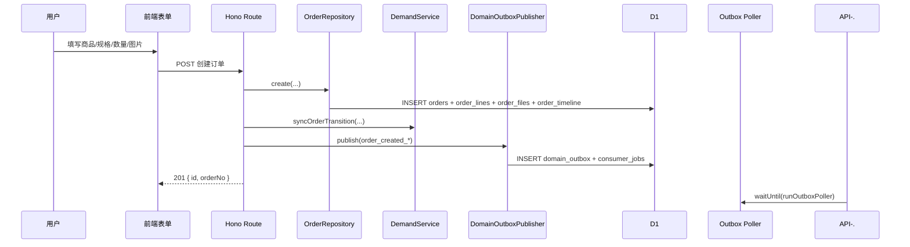
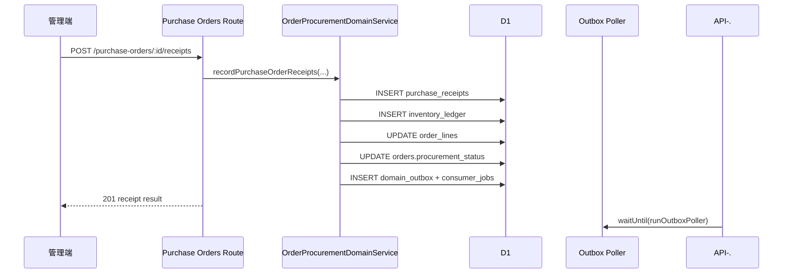

# 预订单创建与采购联动全链路

## 1. 文档目标

本文档说明当前“预订单”从创建、落库、读模型投影到采购联动的真实链路。

需要先明确一个架构变化：

- 过去可以把预订单理解为一条 `orders` 记录
- 现在订单模块的真实语义是 `orders` 头记录 + `order_lines` 行级履约/采购模型

现有销售端和管理端创建入口仍默认创建单行兼容订单，但采购、部分到货、冲销和展示状态都已经基于 `order_lines` 推进。

## 2. 术语与边界

- 预订单
  - 业务口径上的客户需求单
  - 后端表现为 `orders` + 至少 1 条 `order_lines`
- 订单头
  - `orders` 表记录
  - 负责客户、销售、审批主状态、兼容性采购状态
- 订单行
  - `order_lines` 表记录
  - 负责商品/变体、数量与履约进度
- 本文只覆盖创建和创建后的订单/采购联动，不展开前端 UI 细节

## 3. 入口与主文件

### 3.1 前端入口

- 销售端创建页：`src/views/sales/SalesFormView.vue`
- 销售端表单：`src/components/order/OrderForm.vue`
- 管理端创建弹窗：`src/components/OrderCreateModal.vue`

### 3.2 后端入口

- Hono 总入口：`functions/lib/hono/app.js`
- 销售端创建：`functions/lib/hono/routes/sales/orders.js`
- 管理端创建：`functions/lib/hono/routes/manage/orders/create.js`
- 订单写模型：`functions/repositories/order/mutations.js`

## 4. 销售端创建流程

### 4.1 提交流程

1. 用户进入 `/sales/:token/create`
2. `OrderForm` 收集基础字段、商品/变体、数量和图片
3. 待上传图片先通过 `POST /api/sales/:token/upload` 获取 `fileIds`
4. `POST /api/sales/:token/orders` 调用创建接口

关键业务校验：

- `productId` 与 `variantId` 必须成对出现
- `variantId` 必须真实属于该 `productId`
- 创建默认需要至少 1 张图片

### 4.2 路由处理

销售创建路由会：

1. 解析 `CreateOrderSchema`
2. 校验商品/变体绑定
3. 调用 `OrderRepository.create(...)`
4. 调用 `DemandService.syncOrderTransition(...)`
5. 将上传文件归档到订单目录
6. 发布 `order_created_by_sales` outbox 事件
7. `waitUntil(runOutboxPoller(...))`

返回值仍然很轻量：

```json
{
  "success": true,
  "data": {
    "id": "ord_xxx",
    "orderNo": "SO-20260330-001"
  }
}
```

## 5. 管理端创建流程

管理端 `POST /api/manage/orders` 和销售端共用相同的订单持久化思路：

1. 参数清洗与权限校验
2. 商品/变体绑定校验
3. 调用 `createManagedOrder(...)`
4. 最终进入 `OrderRepository.create(...)`
5. 发布 `order_created_by_admin`
6. 调度 outbox poller

区别主要在：

- 可以指定销售员
- 可以设置初始状态
- 通知目标通常是对应销售，而不是管理员

## 6. 落库行为

### 6.1 创建时真实写入

当前创建一张兼容性单行订单时，会写入：

1. `orders`
   - 订单号、销售归属、主状态、兼容性采购状态
   - `current_data` / `original_data`
   - `product_id` / `variant_id` / `quantity`
2. `order_lines`
   - 1 条默认订单行
   - 记录商品/变体、快照、`ordered_qty`
   - 初始化 `procured_qty` / `received_qty` / `shipped_qty` / `cancelled_qty`
   - 计算初始 `display_status`
3. `order_files`
   - 订单附件映射
4. `order_timeline`
   - 创建时间轴

旧文档里“创建只写 `orders + order_files + order_timeline`”已经不成立。

### 6.2 为什么要有 `order_lines`

原因不是为了当前 UI 多行展示，而是为了让下面这些行为有准确事实来源：

- 采购单关联订单后按行推进 `procured_qty`
- 部分到货推进 `received_qty`
- 冲销回滚行级到货事实
- 管理端列表按行级聚合状态展示 `display_status`

## 7. 读模型

### 7.1 订单详情

订单详情查询已经默认返回：

- 订单头字段
- `files`
- `timeline`
- `lines`

其中 `lines` 才是后续采购/履约进度的核心展示来源。

### 7.2 采购兼容状态

`orders.procurement_status` 仍然保留，但它现在是兼容性聚合投影，不再是唯一事实源。

管理端列表和筛选会优先读取：

```sql
COALESCE(order_line_agg.display_status, o.procurement_status, 'none')
```

## 8. 创建后的副作用

### 8.1 当前模式

订单创建后的通知、缓存、Webhook 已经不是“接口里同步调用”。

当前真实模式：

1. 创建接口写完主数据
2. `DomainOutboxPublisher` 写入 `domain_outbox` 和 `outbox_consumer_jobs`
3. `runOutboxPoller` 在 `waitUntil` 中异步执行消费者

### 8.2 订单创建事件

常见事件：

- `order_created_by_sales`
- `order_created_by_admin`

主要消费者：

- `cache`
- `notification`
- `webhook`

因此如果创建成功，通知或 webhook 稍后才完成是正常的，业务一致性由 outbox 保证。

## 9. 与采购链路的关系

### 9.1 哪些订单会进入采购

- 只有 `orders.status = confirmed` 的订单会进入采购建议
- 创建采购单时仍要求订单绑定了有效商品/变体

### 9.2 采购单创建后的联动

采购单创建或状态推进时：

- 采购单与 `pre_order_id` 建立关联
- 采购单状态推进可发布 `order_procurement_progressed`
- 采购单到货通过 `purchase_receipts` 更新 `order_lines`
- 聚合结果再回写 `orders.procurement_status`

### 9.3 部分到货与冲销

这部分是当前架构最重要的变化之一：

- 部分到货不会直接把整个订单粗暴改成“已到货”
- 系统先记录收货事实，再更新具体 `order_lines`
- 冲销不会删历史，而是写 `purchase_receipt_reversals`
- 然后重新投影订单行与兼容性采购状态

## 10. 时序图

### 10.1 创建



### 10.2 收货



## 11. 排查要点

1. 创建成功但没有消息提醒

- 先查 `domain_outbox` / `outbox_consumer_jobs`，不要再假设是同步通知失败。

2. 采购建议里看不到订单

- 先确认订单是否 `confirmed`
- 再确认是否绑定商品/变体

3. 部分到货后订单状态看起来不对

- 先查 `order_lines` 的 `received_qty` / `display_status`
- 再看 `orders.procurement_status` 是否只是兼容性聚合结果

4. 冲销后进度没有回退

- 先查 `purchase_receipt_reversals`
- 再查是否发布了 `order_procurement_reversed`

## 12. 关键源码索引

- `functions/lib/hono/routes/sales/orders.js`
- `functions/lib/hono/routes/manage/orders/create.js`
- `functions/repositories/order/mutations.js`
- `functions/repositories/order/queries.js`
- `functions/services/DemandService.js`
- `functions/services/OrderProcurementDomainService.js`
- `functions/services/OrderProcurementReceiptReversalService.js`
- `functions/services/DomainOutboxPublisher.js`
- `functions/services/DomainOutboxConsumers.js`
