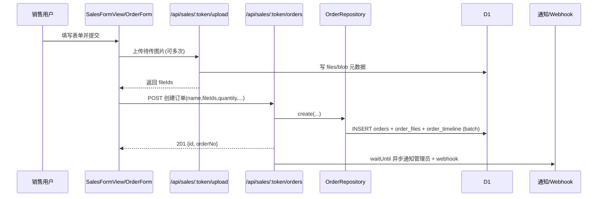

# 预订单创建全链路详解

## 1. 文档目标

本文档说明项目中“预订单”的创建流程、核心校验、落库行为和后续联动逻辑，便于开发、排查和后续重构时快速定位。

在当前代码里，“预订单”对应数据库 `orders` 表中的订单记录。

## 2. 术语与边界

- 预订单: `orders` 表记录，初始通常为 `pending`。
- 销售端创建: 从 `/sales/:token/create` 提交。
- 管理端创建: 从 `/admin/orders` 的创建弹窗提交。
- 本文仅覆盖“创建”与创建后直接联动，不展开编辑、删除、批量操作细节。

## 3. 整体架构入口

### 3.1 前端路由入口

- 销售端创建页路由: `src/router/index.js`
  - `path: '/sales/:token'`
  - 子路由 `path: 'create'` -> `SalesFormView.vue`
- 管理端订单页路由: `src/router/index.js`
  - `/admin/orders` -> `OrderManager.vue`

### 3.2 后端 API 入口

- 总挂载: `functions/lib/hono/app.js`
  - `app.route('/api/sales', salesRoutes)`
  - `app.route('/api/manage/orders', manageOrdersRoutes)`
- 销售端分组路由: `functions/lib/hono/routes/sales.js`
  - 受保护业务路由挂在 `/:token/*` 下
  - 订单路由: `protectedSales.route('/orders', ordersRoutes)`

## 4. 销售端创建流程（主流程）

### 4.1 页面到提交

1. 用户进入 `/sales/:token/create`，渲染 `src/views/sales/SalesFormView.vue`。
2. 表单组件 `src/components/order/OrderForm.vue` 负责收集字段与图片。
3. 提交时先调用 `ImageUploader.uploadPendingFiles()` 上传本地待传图片，再组装 `fileIds`。
4. `SalesFormView` 调 `useOrders.createSalesOrder(token, formData)`。

相关前端关键点:
- API 常量:
  - `SALES_ORDER_CREATE: /api/sales/{token}/orders`
  - `SALES_UPLOAD: /api/sales/{token}/upload`
- 表单有效性最小要求:
  - `name` 非空
  - 至少 1 张图片（`uploadedFiles.length > 0`）

### 4.2 文件上传与去重

销售端上传接口: `functions/lib/hono/routes/sales/files.js`

- 路径: `POST /api/sales/:token/upload`
- 支持参数:
  - `contentHash`
  - `originalHash`
  - `orderId`（可选，用于归档到订单目录）
- 调用 `storeFile(...)`，实现内容寻址与秒传能力（CAS 体系）。

前端 `ImageUploader` 使用 `deferred=true` 模式时，图片先留在本地列表，提交订单前统一上传并换成服务端文件 ID。

### 4.3 鉴权链路

请求进入后会经过两层校验:

1. `authMiddleware`（全局 `/api/sales/*`）
2. `salesAuthMiddleware`（`/:token` 保护组）

`salesAuthMiddleware` 要求同时满足:
- JWT 有效且 `payload.type === 'salesperson'`
- 路径 token 与销售员 `access_token` 一致
- 销售员处于启用状态

通过后，`salesperson` 对象会挂到 `context`，供创建接口使用。

### 4.4 创建接口与参数校验

销售创建接口: `functions/lib/hono/routes/sales/orders.js` 的 `POST /`

基础 JSON 校验（zod）来自 `functions/lib/hono/schemas/sales.js` 的 `CreateOrderSchema`。

关键业务校验:
- 当传 `productId` 时，必须同时传 `variantId`
- 当传 `variantId` 时，必须同时传 `productId`
- `variantId` 必须真实归属于该 `productId`（查 `ProductVariantRepository`）

### 4.5 落库行为（Repository）

创建调用 `OrderRepository.create(...)`，最终进入 `functions/repositories/order/mutations.js#create`，一次 batch 完成三类写入:

1. `orders` 主表
  - 写入: `id`, `order_no`, `salesperson_id`
  - `original_data` 与 `current_data` 初始化一致
  - `status` 默认 `pending`
  - `main_image_id` 取首图
  - `quantity`, `product_id`, `variant_id`
  - 未读标记: `unread_by_admin = 1`, `unread_by_sales = 0`
2. `order_files`
  - 按顺序写入关联图片（`section='product'`）
3. `order_timeline`
  - 写入 `created` 时间轴记录（操作者为销售）

接口成功返回:
- `201`
- `{ id, orderNo }`

### 4.6 创建后异步联动

接口返回前不会阻塞通知/回调，使用 `waitUntil` 异步执行:
- 创建管理员通知（`ORDER_CREATED`）
- 触发 webhook: `order.created`

## 5. 管理端创建流程（次流程）

管理端入口:
- 视图组件 `src/components/OrderManager.vue`
- 弹窗 `src/components/OrderCreateModal.vue`
- 提交逻辑 `src/composables/order/useOrderModals.js#handleCreateOrder`

请求:
- `POST /api/manage/orders`
- 前端会把 `name` 映射成 `productName`（兼容后端当前接口字段）

后端接口:
- `functions/lib/hono/routes/manage/orders/create.js`

管理端创建特点:
- 必填 `productName` + `salespersonId`
- 可设置初始 `status`
- 同样支持 `productId/variantId` 绑定校验
- 创建后异步通知对应销售员

## 6. 数据模型与状态基础

核心表（创建直接相关）:
- `orders`
- `order_files`
- `order_timeline`

历史迁移可参考:
- `migrations/0009_order_system.sql`（订单系统初始结构）
- `migrations/0010_add_void_status.sql`（新增 `void` 状态）
- 后续迁移补充了 `product_id`、`variant_id`、`quantity`、unread 字段等能力

## 7. 与采购链路的关系

创建后的预订单并不会自动进入采购建议，前置条件是状态变为 `confirmed`。

采购服务 `functions/services/PurchaseOrderService.js` 中:
- `getSuggestions()` 仅统计 `o.status = 'confirmed'` 的订单
- `createFromOrders()` 仅允许从 `confirmed` 且已绑定变体的订单生成采购单
- 采购单状态会级联回写预订单状态（`ordered/shipping/arrived` -> `production/shipping/arrived`）

## 8. 时序图（销售端创建）

## 9. 常见问题与排查要点

1. 创建时报 `variantId is required when productId is provided`
- 提交了 `productId` 但未提交 `variantId`。

2. 创建时报 `variantId does not belong to productId`
- 变体不属于该商品，或前端绑定态脏数据。

3. 提交按钮不可用
- `name` 为空，或图片列表为空（前端校验未通过）。

4. 创建成功但采购建议看不到
- 订单还在 `pending`，采购建议只看 `confirmed`。

5. 销售端 401/404
- JWT 失效，或 URL token 与销售员 `access_token` 不匹配，或账号被禁用。

## 10. 关键源码索引

- 前端销售创建页: `src/views/sales/SalesFormView.vue`
- 前端表单逻辑: `src/components/order/OrderForm.vue`
- 前端订单 API 封装: `src/composables/useOrders.js`
- API 常量: `src/utils/constants.js`
- 销售端订单路由: `functions/lib/hono/routes/sales/orders.js`
- 销售端上传路由: `functions/lib/hono/routes/sales/files.js`
- 销售端鉴权中间件: `functions/lib/hono/middleware/sales-auth.js`
- 管理端创建路由: `functions/lib/hono/routes/manage/orders/create.js`
- Repository Facade: `functions/repositories/OrderRepository.js`
- 创建落库实现: `functions/repositories/order/mutations.js`
- 采购联动服务: `functions/services/PurchaseOrderService.js`

## 11. V2 重构补充 (2026-03-01)

销售端订单模块已切换到 V2 默认路径，架构由原来的“页面直连 API”升级为：

- API 层: `src/composables/sales/useSalesOrderApi.js`
  - 统一返回 `{ ok, data, error, status }`
  - 覆盖 list/detail/create/comment/stats/products
- 状态机层: `src/composables/sales/useSalesOrderStateMachine.js`
  - 状态: `idle/loading/ready/empty/error/recovering`
  - 动作: `loadOrders/createOrder/loadDetail/comment/retry`
- 视图层:
  - `src/views/Sales.vue`
  - `src/views/sales/SalesListView.vue`
  - `src/views/sales/SalesFormView.vue`
  - `src/views/sales/SalesDetailView.vue`

同时新增页面级错误边界与异步状态面板：

- `src/components/common/AppErrorBoundary.vue`
- `src/components/common/AsyncStatePanel.vue`

后端销售路由也已统一错误契约：

- 错误返回: `{ success: false, error, code }`
- 关键文件:
  - `functions/lib/hono/routes/sales/orders.js`
  - `functions/lib/hono/routes/sales/products.js`

完整切换策略、监控阈值和 5 分钟回滚步骤见：

- `docs/architecture/modules/sales-order-module-v2.md`
- `docs/plans/2026-03-01-sales-order-module-rollout-checklist.md`
