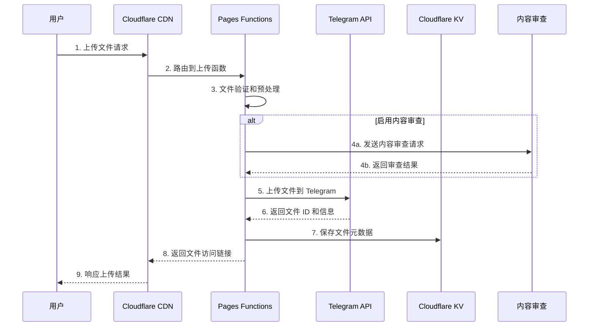
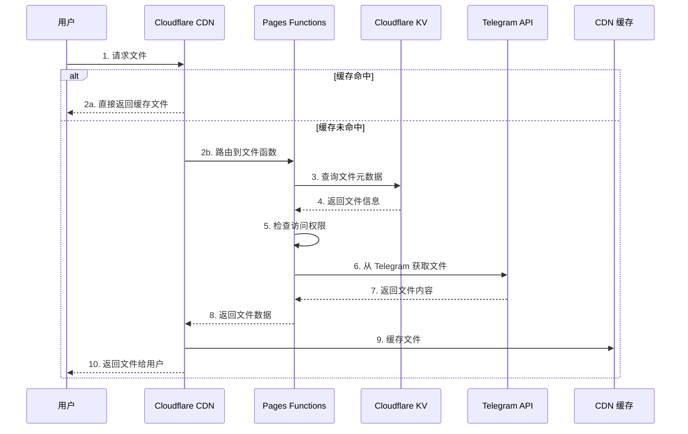

# 系统概览

本文档提供 Telegraph-Image 系统的整体架构概览，帮助您快速理解系统的核心组件和工作原理。

## 🏗️ 系统架构图

```mermaid
graph TB
    subgraph "用户层"
        U1[Web 用户]
        U2[API 用户]
        U3[管理员用户]
    end
    
    subgraph "Cloudflare 全球网络"
        CDN[Cloudflare CDN]
        CF[Cloudflare Pages]
        KV[Cloudflare KV]
    end
    
    subgraph "应用服务层"
        subgraph "Pages Functions"
            UF[上传函数<br/>upload.js]
            FF[文件访问函数<br/>file/[id].js]
            MF[管理函数<br/>api/manage/*]
        end
        
        subgraph "静态资源"
            HTML[前端页面<br/>index.html, admin.html]
            CSS[样式文件]
            JS[JavaScript 脚本]
        end
    end
    
    subgraph "存储层"
        TG[Telegram Bot API<br/>文件存储]
        TGCH[Telegram Channel<br/>文件托管]
    end
    
    subgraph "外部服务"
        MC[ModerateContent API<br/>内容审查]
        ST[Sentry<br/>错误监控]
    end
    
    U1 --> CDN
    U2 --> CDN
    U3 --> CDN
    CDN --> CF
    CF --> HTML
    CF --> UF
    CF --> FF
    CF --> MF
    UF --> TG
    FF --> TG
    MF --> KV
    FF --> KV
    UF --> MC
    FF --> MC
    TG --> TGCH
    CF --> ST
    
    classDef userClass fill:#e1f5fe
    classDef cloudflareClass fill:#fff3e0
    classDef appClass fill:#f3e5f5
    classDef storageClass fill:#e8f5e8
    classDef externalClass fill:#fce4ec
    
    class U1,U2,U3 userClass
    class CDN,CF,KV cloudflareClass
    class UF,FF,MF,HTML,CSS,JS appClass
    class TG,TGCH storageClass
    class MC,ST externalClass
```

## 🔧 核心组件

### 1. 用户接入层

**Web 用户**:
- 通过浏览器访问图床服务
- 上传和管理图片文件
- 使用响应式 Web 界面

**API 用户**:
- 通过 REST API 集成服务
- 程序化上传和管理文件
- 支持批量操作

**管理员用户**:
- 访问后台管理界面
- 监控系统状态和使用情况
- 管理用户和内容

### 2. Cloudflare 基础设施

**Cloudflare CDN**:
- 全球 200+ 节点分发
- 智能缓存和加速
- DDoS 防护和安全过滤
- 自动 HTTPS 和 SSL 证书

**Cloudflare Pages**:
- 静态网站托管
- Serverless Functions 运行环境
- 自动部署和版本管理
- 边缘计算能力

**Cloudflare KV**:
- 全球分布式键值存储
- 文件元数据存储
- 配置信息管理
- 毫秒级读取性能

### 3. 应用服务层

**Pages Functions**:
```
functions/
├── upload.js              # 处理文件上传请求
├── file/[id].js           # 处理文件访问请求
├── api/manage/            # 管理 API 接口
│   ├── list.js           # 文件列表查询
│   ├── delete.js         # 文件删除操作
│   └── stats.js          # 统计信息获取
└── utils/
    └── middleware.js      # 通用中间件
```

**静态资源**:
- **index.html** - 主上传页面
- **admin.html** - 管理后台界面
- **admin-imgtc.html** - 网格视图管理页面
- **admin-waterfall.html** - 瀑布流视图管理页面

### 4. 存储层

**Telegram Bot API**:
- 作为文件存储后端
- 支持多种文件格式
- 提供稳定的 API 接口
- 全球分布式存储

**Telegram Channel**:
- 实际文件托管位置
- 无限存储容量
- 高可用性保证
- 全球 CDN 分发

### 5. 外部服务

**ModerateContent API**:
- 智能内容审查
- 不当内容识别
- 自动化审核流程
- 可配置审查策略

**Sentry 监控**:
- 错误追踪和分析
- 性能监控
- 用户会话记录
- 实时告警通知

## 🔄 数据流程

### 文件上传流程



### 文件访问流程



## 🔒 安全架构

### 网络安全

**传输层安全**:
- 强制 HTTPS 连接
- TLS 1.3 加密协议
- HTTP 严格传输安全 (HSTS)
- 自动证书管理

**应用层防护**:
- 跨域资源共享 (CORS) 配置
- 内容安全策略 (CSP)
- 输入验证和输出编码
- SQL 注入防护

### 访问控制

**认证机制**:
- Basic Authentication 保护管理接口
- 可选的 API 密钥验证
- IP 白名单支持
- 会话管理

**权限管理**:
- 基于角色的访问控制
- 功能级权限划分
- 资源级访问控制
- 操作审计日志

### 内容安全

**内容审查**:
- 自动内容检测
- 人工审核流程
- 黑白名单机制
- 违规内容处理

## 📈 性能特性

### 全球分发

**CDN 加速**:
- 200+ 全球节点
- 智能路由选择
- 边缘缓存优化
- 带宽自动优化

**缓存策略**:
- 静态资源长期缓存
- 动态内容智能缓存
- 边缘计算优化
- 缓存失效管理

### 弹性扩展

**自动扩容**:
- 基于负载的自动扩展
- 无服务器架构优势
- 零运维成本
- 按需付费模式

**高可用性**:
- 多区域部署
- 故障自动转移
- 服务降级策略
- 99.9% 可用性保证

## 🔍 监控体系

### 应用监控

**性能指标**:
- 响应时间监控
- 错误率统计
- 吞吐量分析
- 用户体验指标

**业务监控**:
- 上传成功率
- 文件访问量
- 存储使用情况
- 用户活跃度

### 基础设施监控

**资源监控**:
- CPU 和内存使用率
- 网络带宽使用
- 存储空间监控
- 函数执行统计

**告警机制**:
- 实时错误告警
- 性能阈值告警
- 资源使用告警
- 自定义业务告警

## 🚀 技术优势

### 现代化架构

**无服务器优势**:
- 零服务器管理
- 自动扩展能力
- 按使用量付费
- 高可用性保证

**云原生设计**:
- 微服务架构
- 容器化部署
- 服务网格支持
- DevOps 友好

### 开发效率

**快速部署**:
- 一键部署到生产
- 自动化 CI/CD
- 版本回滚支持
- 蓝绿部署

**开发友好**:
- 本地开发环境
- 热重载支持
- 完整的开发工具链
- 丰富的文档和示例

## 🔗 相关文档

- **[架构详解](architecture.md)** - 深入的技术架构说明
- **[数据流程](data-flow.md)** - 详细的数据处理流程
- **[安全架构](security.md)** - 完整的安全设计方案
- **[开发者指南](../developer-guide/README.md)** - 开发和集成指南

---

📊 **系统概览**: 这个架构设计确保了 Telegraph-Image 的高性能、高可用性、安全性和可扩展性。
