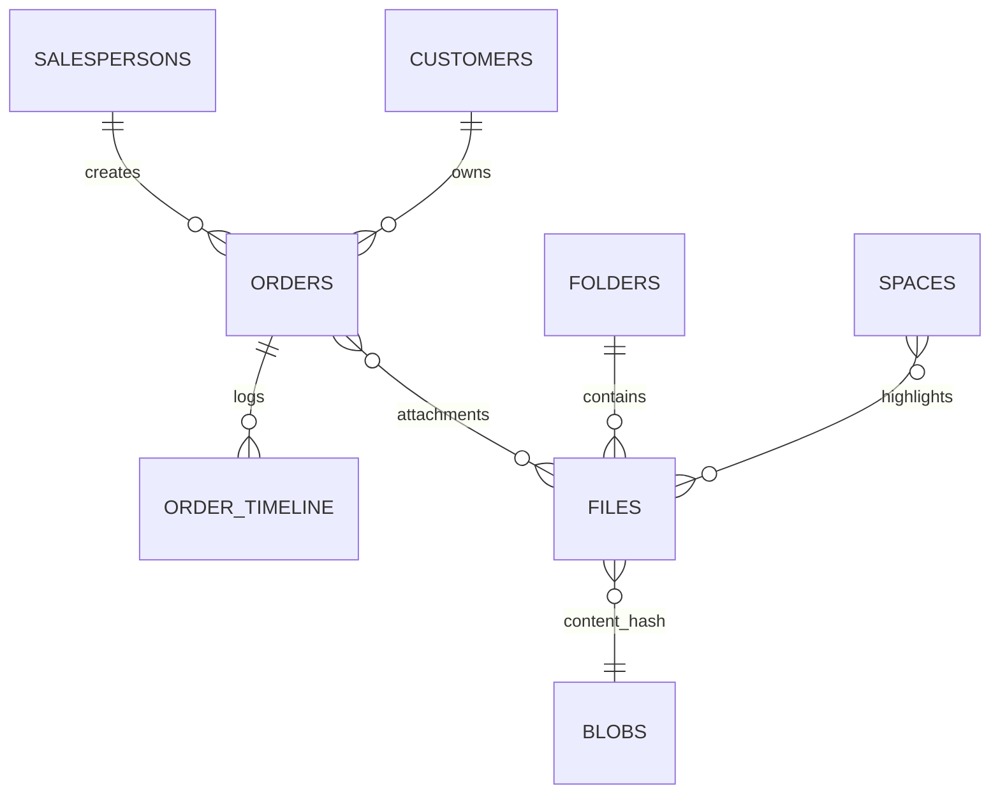
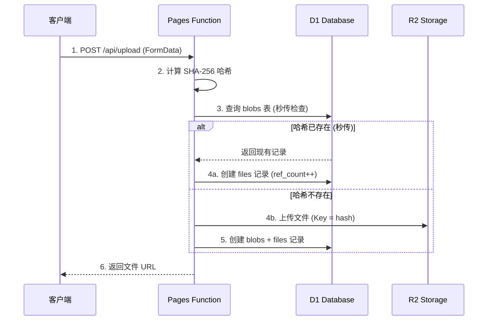
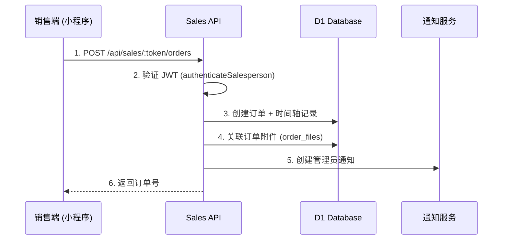

# 系统概览

本文档提供 kk-life 系统的整体架构概览。

## 🏗️ 系统架构图

```mermaid
graph TB
    subgraph "用户层"
        U1[Web 用户]
        U2[API 用户]
        U3[管理员]
        U4[销售人员]
    end
    
    subgraph "Cloudflare 边缘网络"
        CDN[Cloudflare CDN]
        Pages[Cloudflare Pages]
    end
    
    subgraph "应用服务层 (Pages Functions)"
        subgraph "API 路由"
            ManageAPI[/api/manage/*<br/>管理端]
            SalesAPI[/api/sales/*<br/>销售端]
            SpaceAPI[/api/space/*<br/>访客端]
        end
        
        subgraph "静态资源"
            Admin[admin.html<br/>Vue 3 SPA]
            Sales[sales.html<br/>销售后台]
            Space[space.html<br/>公开画廊]
        end
    end
    
    subgraph "数据层"
        D1[(D1 Database<br/>SQLite)]
        R2[(R2 Storage<br/>对象存储)]
    end
    
    subgraph "外部服务"
        MC[ModerateContent API<br/>内容审查]
        Sentry[Sentry<br/>错误监控]
        WeChat[微信 API<br/>小程序登录]
    end
    
    U1 --> CDN
    U2 --> CDN
    U3 --> CDN
    U4 --> CDN
    CDN --> Pages
    Pages --> ManageAPI
    Pages --> SalesAPI
    Pages --> SpaceAPI
    Pages --> Admin
    ManageAPI --> D1
    ManageAPI --> R2
    SalesAPI --> D1
    SalesAPI --> WeChat
    SpaceAPI --> D1
    SpaceAPI --> R2
    ManageAPI --> MC
    Pages --> Sentry
```

## 🔧 核心组件

### 1. 用户角色

| 角色 | 入口 | 认证方式 |
|------|------|----------|
| **管理员** | `/admin` | JWT (Basic Auth 登录) |
| **销售人员** | `/order/:token` | Access Token + JWT |
| **访客** | `/space/:token` | Share Token + 密码 (可选) |
| **API 用户** | `/api/*` | X-API-Key 或 JWT |

### 2. Cloudflare 基础设施

**Pages Functions (Serverless)**:
```
functions/
├── api/
│   ├── manage/         # 需要 Admin JWT
│   │   ├── orders/     # 订单管理
│   │   ├── customers/  # CRM
│   │   ├── salespersons/
│   │   └── dashboard/
│   ├── sales/          # 需要 Sales Token + JWT
│   │   ├── [token]/    # 动态路由
│   │   └── wechat-login.js  # 微信登录
│   └── space/          # 公开/密码访问
├── file/               # 文件服务
└── _middleware.js      # 全局中间件
```

**D1 Database (SQLite)**:
- 核心业务数据: `orders`, `customers`, `salespersons`
- 文件元数据: `files`, `blobs`, `folders`
- 系统配置: `users`, `webhooks`, `notifications`

**R2 Storage**:
- 对象存储 (图片、视频、文档)
- Key = SHA-256 哈希 (CAS 去重)
- 支持 Signed URL 临时访问

### 3. 数据模型


```mermaid
erDiagram
    SALESPERSONS ||--o{ ORDERS : creates
    CUSTOMERS ||--o{ ORDERS : owns
    ORDERS ||--o{ ORDER_TIMELINE : logs
    ORDERS }o--o{ FILES : attachments
    
    FILES }o--|| BLOBS : "content_hash"
    FOLDERS ||--o{ FILES : contains
    SPACES }o--o{ FILES : highlights
```

## 🔄 数据流程

### 文件上传流程


```mermaid
sequenceDiagram
    participant Client as 客户端
    participant Pages as Pages Function
    participant D1 as D1 Database
    participant R2 as R2 Storage
    
    Client->>Pages: 1. POST /api/upload (FormData)
    Pages->>Pages: 2. 计算 SHA-256 哈希
    Pages->>D1: 3. 查询 blobs 表 (秒传检查)
    
    alt 哈希已存在 (秒传)
        D1-->>Pages: 返回现有记录
        Pages->>D1: 4a. 创建 files 记录 (ref_count++)
    else 哈希不存在
        Pages->>R2: 4b. 上传文件 (Key = hash)
        Pages->>D1: 5. 创建 blobs + files 记录
    end
    
    Pages-->>Client: 6. 返回文件 URL
```

### 订单创建流程


```mermaid
sequenceDiagram
    participant Sales as 销售端 (小程序)
    participant API as Sales API
    participant D1 as D1 Database
    participant Notify as 通知服务
    
    Sales->>API: 1. POST /api/sales/:token/orders
    API->>API: 2. 验证 JWT (authenticateSalesperson)
    API->>D1: 3. 创建订单 + 时间轴记录
    API->>D1: 4. 关联订单附件 (order_files)
    API->>Notify: 5. 创建管理员通知
    API-->>Sales: 6. 返回订单号
```

## 🔒 安全架构

### 认证机制

```
┌───────────────────────────────────────────────────────┐
│                    认证层级                           │
├───────────────────────────────────────────────────────┤
│  Level 3: Admin JWT                                   │
│  - 完全控制 (订单/CRM/销售管理)                        │
│  - 获取方式: POST /api/auth/login                     │
├───────────────────────────────────────────────────────┤
│  Level 2: Sales JWT                                   │
│  - 受限访问 (个人订单/上传)                            │
│  - 获取方式: POST /api/sales/:token/auth              │
│  - 或: POST /api/sales/wechat-login (微信)            │
├───────────────────────────────────────────────────────┤
│  Level 1: Share Token (Guest)                         │
│  - 只读访问 (公开空间)                                 │
│  - 可选密码保护                                        │
└───────────────────────────────────────────────────────┘
```

### D1 安全规范

**强制参数绑定 (防 SQL 注入)**:
```javascript
// ❌ 错误
await env.DB.prepare(`SELECT * FROM users WHERE id = '${id}'`).run();

// ✅ 正确
await env.DB.prepare('SELECT * FROM users WHERE id = ?').bind(id).run();
```

## 📈 性能优化

### Smart Placement

```toml
# wrangler.toml
[placement]
mode = "smart"
```
Cloudflare 自动将 Functions 部署到距离 D1/R2 最近的节点。

### Batch API (批量写入)

```javascript
// ✅ SOTA: 使用 Batch 减少网络往返
const statements = files.map(f => env.DB.prepare('INSERT...').bind(...));
await env.DB.batch(statements);
```

### CAS 去重

相同内容的文件只存储一份，通过 `ref_count` 管理引用。

## 🔗 相关文档

- **[安全架构](security.md)** - 详细安全设计
- **[开发者指南](../developer-guide/README.md)** - 开发规范
- **[API 文档](../api/README.md)** - 接口说明

---

📊 **系统概览**: kk-life 采用 Cloudflare 全栈 Serverless 架构，确保了高性能、高可用性和低成本。
