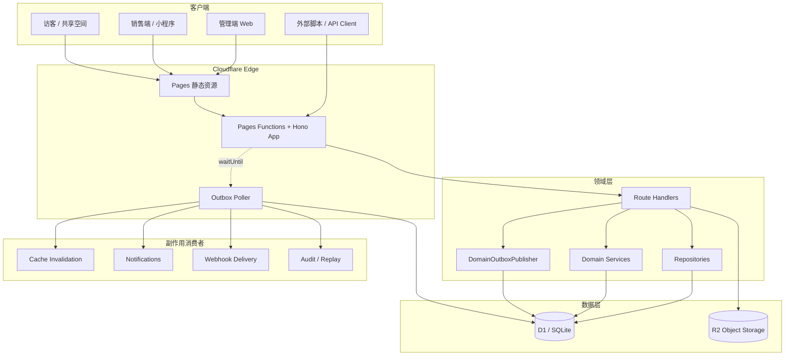
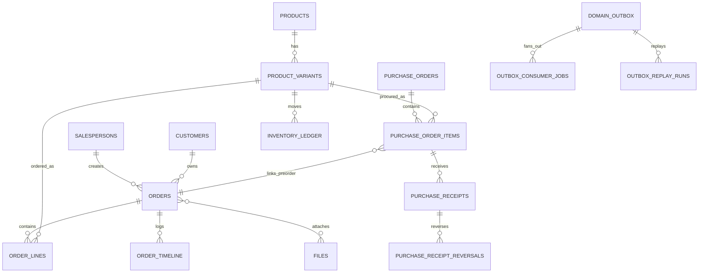
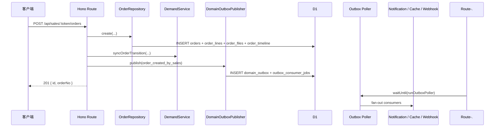

# 系统概览

本文档说明 kk-life 当前线上架构，重点覆盖订单模块已经完成的两项核心演进：

- 订单数据从“仅 `orders` 单记录驱动”升级为“`orders` 头信息 + `order_lines` 行级履约/采购模型”
- 通知、缓存失效、Webhook 等副作用从同步直调升级为 durable outbox 驱动

## 1. 整体架构


```mermaid
graph TB
    subgraph Client["客户端"]
        Admin[管理端 Web]
        Sales[销售端 / 小程序]
        Guest[访客 / 共享空间]
        Script[外部脚本 / API Client]
    end

    subgraph Edge["Cloudflare Edge"]
        Pages[Pages 静态资源]
        Hono[Pages Functions + Hono App]
        Poller[Outbox Poller]
    end

    subgraph Domain["领域层"]
        Routes[Route Handlers]
        Repo[Repositories]
        Services[Domain Services]
        Outbox[DomainOutboxPublisher]
    end

    subgraph Data["数据层"]
        D1[(D1 / SQLite)]
        R2[(R2 Object Storage)]
    end

    subgraph Consumers["副作用消费者"]
        Cache[Cache Invalidation]
        Notify[Notifications]
        Webhook[Webhook Delivery]
        Audit[Audit / Replay]
    end

    Admin --> Pages
    Sales --> Pages
    Guest --> Pages
    Script --> Hono

    Pages --> Hono
    Hono --> Routes
    Routes --> Repo
    Routes --> Services
    Repo --> D1
    Services --> D1
    Routes --> R2
    Routes --> Outbox
    Outbox --> D1
    Hono -. waitUntil .-> Poller
    Poller --> D1
    Poller --> Cache
    Poller --> Notify
    Poller --> Webhook
    Poller --> Audit
```

## 2. 核心组件

### 2.1 用户角色

| 角色 | 入口 | 认证方式 |
|------|------|----------|
| 管理员 | `/admin` / `/api/manage/*` | Admin JWT / Basic Auth / `X-API-Key` |
| 销售 | `/sales/:token` / `/api/sales/:token/*` | Sales JWT + access token |
| 访客 | `/space/:token` | Share token + 密码（可选） |
| 外部系统 | `/api/manage/*`, `/api/v1/*` | `X-API-Key` / Bearer Token |

### 2.2 运行时结构

当前后端不是旧文档中的 `functions/api/...` 直连路由结构，而是以 Hono 应用为中心：

```text
functions/
├── lib/hono/app.js                 # Hono 应用与路由挂载入口
├── lib/hono/routes/manage/         # 管理端路由
├── lib/hono/routes/sales/          # 销售端路由
├── lib/hono/routes/v1/             # 标准 / 运维接口
├── repositories/                   # 数据访问层
├── services/                       # 领域服务、outbox、通知、库存、采购
└── api/cron/outbox.js              # outbox poller / 恢复入口
```

### 2.3 数据存储职责

- `D1`：业务真相与读模型
  - 订单：`orders`, `order_lines`, `order_timeline`, `order_files`
  - 采购：`purchase_orders`, `purchase_order_items`, `purchase_receipts`, `purchase_receipt_reversals`
  - 库存：`inventory_ledger`, `inventory_balances`
  - durable outbox：`domain_outbox`, `outbox_consumer_jobs`, `outbox_replay_runs`
- `R2`：原始文件对象存储，CAS 去重

## 3. 订单与采购数据模型

### 3.1 模型定位

- `orders`
  - 订单头信息、客户/销售归属、兼容性状态字段、主要读模型入口
- `order_lines`
  - 采购/履约的核心粒度
  - 持有商品/变体、快照、订购量、已采购量、已到货量、已发货量、取消量、展示状态
- `orders.procurement_status`
  - 兼容性聚合字段
  - 由 `order_lines` 聚合结果投影而来，用于旧筛选器和轻量读模型
- `purchase_receipts` / `purchase_receipt_reversals`
  - 不可变事实层，记录到货与冲销

### 3.2 关系图


```mermaid
erDiagram
    SALESPERSONS ||--o{ ORDERS : creates
    CUSTOMERS ||--o{ ORDERS : owns
    ORDERS ||--o{ ORDER_LINES : contains
    ORDERS ||--o{ ORDER_TIMELINE : logs
    ORDERS }o--o{ FILES : attaches

    PURCHASE_ORDERS ||--o{ PURCHASE_ORDER_ITEMS : contains
    PURCHASE_ORDER_ITEMS }o--|| ORDERS : links_preorder
    PURCHASE_ORDER_ITEMS ||--o{ PURCHASE_RECEIPTS : receives
    PURCHASE_RECEIPTS ||--o{ PURCHASE_RECEIPT_REVERSALS : reverses

    PRODUCTS ||--o{ PRODUCT_VARIANTS : has
    PRODUCT_VARIANTS ||--o{ ORDER_LINES : ordered_as
    PRODUCT_VARIANTS ||--o{ PURCHASE_ORDER_ITEMS : procured_as
    PRODUCT_VARIANTS ||--o{ INVENTORY_LEDGER : moves

    DOMAIN_OUTBOX ||--o{ OUTBOX_CONSUMER_JOBS : fans_out
    DOMAIN_OUTBOX ||--o{ OUTBOX_REPLAY_RUNS : replays
```

## 4. 核心数据流

### 4.1 订单创建

当前销售端和管理端创建入口都会：

1. 校验商品/变体绑定
2. 写入 `orders`
3. 写入 1 条兼容性 `order_lines`
4. 写入 `order_files` / `order_timeline`
5. 同步需求侧读模型（`DemandService`）
6. 发布 `order_created_by_sales` 或 `order_created_by_admin` 到 `domain_outbox`
7. 通过 `waitUntil(runOutboxPoller)` 异步驱动通知、缓存失效、Webhook


```mermaid
sequenceDiagram
    participant Client as 客户端
    participant Route as Hono Route
    participant Repo as OrderRepository
    participant Demand as DemandService
    participant Outbox as DomainOutboxPublisher
    participant D1 as D1
    participant Poller as Outbox Poller
    participant SideFx as Notification / Cache / Webhook

    Client->>Route: POST /api/sales/:token/orders
    Route->>Repo: create(...)
    Repo->>D1: INSERT orders + order_lines + order_files + order_timeline
    Route->>Demand: syncOrderTransition(...)
    Route->>Outbox: publish(order_created_by_sales)
    Outbox->>D1: INSERT domain_outbox + outbox_consumer_jobs
    Route-->>Client: 201 { id, orderNo }
    Route-.->>Poller: waitUntil(runOutboxPoller)
    Poller->>SideFx: fan-out consumers
```

### 4.2 采购收货 / 冲销

采购链路已经不再只靠采购单状态粗暴回写订单状态。当前真实链路是：

1. 采购收货写入 `purchase_receipts`
2. 库存流水写入 `inventory_ledger`
3. 关联 `order_lines` 的 `procured_qty` / `received_qty` / `display_status` 更新
4. 聚合投影回 `orders.procurement_status`
5. 发布 `purchase_receipt_recorded`、`inventory_received`、`order_procurement_progressed`
6. 由 outbox 消费者生成通知、Webhook、缓存失效、审计记录

冲销时对称写入 `purchase_receipt_reversals`，并发布 `purchase_receipt_reversed`、`inventory_receipt_reversed`、`order_procurement_reversed`。

## 5. Outbox 架构

### 5.1 为什么引入 outbox

旧模型中，订单创建后会直接调用通知/Webhook 逻辑，容易出现：

- 主事务成功但副作用失败
- 缓存失效和通知时序不一致
- 无法重放或审计副作用

当前设计中，路由或领域服务只负责：

1. 写入领域真相
2. 在同一个写模型边界内写入 outbox 事件
3. 调度 poller

副作用由消费者从 `outbox_consumer_jobs` 读取并幂等执行。

### 5.2 当前主要消费者

- `cache`：失效订单、采购单、通知、商品、销售端读模型缓存
- `notification`：生成管理员或销售端站内通知
- `webhook`：向外部订阅端投递领域事件
- `audit`：为收货/冲销等高风险动作补充审计与重放能力

## 6. 安全与一致性约束

- 认证分层：`/api/manage/*` 与 `/api/sales/:token/*` 分别走 Admin/Sales 权限链
- D1 查询统一使用参数绑定，避免拼接 SQL
- 高风险写接口普遍声明审计路由契约
- 收货/冲销命令使用幂等键，避免重复提交
- Cloudflare D1 batch 上限通过 chunked batch helper 处理，避免大批量写入失败

## 7. 相关文档

- [架构文档首页](/home/bjw/Code/KK-Image/docs/architecture/README.md)
- [开发者架构指南](/home/bjw/Code/KK-Image/docs/developer-guide/architecture.md)
- [预订单创建链路](/home/bjw/Code/KK-Image/docs/architecture/modules/preorder-creation-flow.md)
- [管理端 API](/home/bjw/Code/KK-Image/docs/api/management.md)
