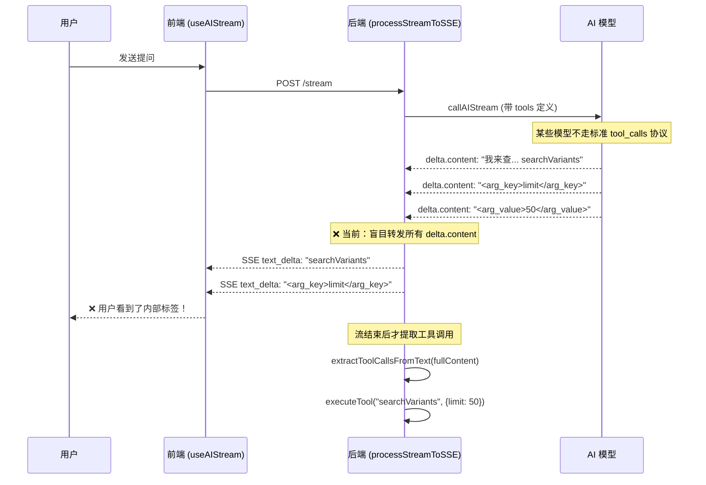

# AI 工具调用全面增强计划

> **For Claude:** REQUIRED SUB-SKILL: Use superpowers:executing-plans to implement this plan task-by-task.

**Goal:** 彻底解决 AI 助手将内部工具调用标签泄露到用户界面的问题，同时增强工具调用的可靠性和覆盖面。

**Architecture:** 采用三层防御策略 — 后端流级内容门控（拦截）→ 前端流内容净化（过滤）→ 渲染层兜底清洗（保险）。同时增强系统提示词和支持多轮工具调用。

**Tech Stack:** Cloudflare Workers (Hono), Vue 3 Composition API, SSE Streaming

---

## 根因分析



**核心缺陷:** `processStreamToSSE` 将 `delta.content` 实时推送到前端，但某些推理模型以纯文本输出工具调用参数，导致内部标签在前端可见。

---

## Proposed Changes

## SOTA 修订（审查后）

> 以下修订用于避免线上误杀、漏拦和多轮协议错位，建议并入执行标准。

### A. 后端门控升级为“状态机 + 置信度门控”

- 不要仅靠 `TOOL_NAMES` 命中即阻断（用户可能正常提及函数名）。
- `ContentGate` 推荐三态：`PASS_THROUGH` / `SUSPECT` / `BLOCKING`。
- 阻断要按“可恢复片段”设计，避免一次误判后永久吞掉后续正常文本。
- `safeText` 保留原始空白，避免 `.trim()` 导致语义拼接。

### B. 多轮工具调用遵循严格消息协议

- 每轮先写入一条 `assistant(tool_calls[])`（包含该轮全部 tool calls）。
- 再写入多条 `tool(tool_call_id=...)` 消息。
- 增加 `MAX_TOOLS_PER_ROUND`（例如 8）防止工具风暴。

### C. 前端净化要支持跨 chunk

- `sanitizeStreamChunk` 需要 `carryBuffer`（如 256 chars）处理被 SSE 分片截断的标签。
- 单 chunk 正则不足以覆盖 `<arg_` / `key>` 这种分片情况。

### D. 验证从“可选”升级为“必测”

- `ContentGate` 单测必须覆盖：正常文本、标签文本、分片文本、恢复行为。
- SSE 多轮单测必须覆盖：2+ 轮、轮次上限、assistant/tool 顺序合法性。
- 增加可观测指标：`tool_leak_block_count`、`tool_round_count`、`tool_leak_false_positive_count`。

### E. 上线与回滚

- 新增运行时开关：`AI_STREAM_GATE_ENABLED`、`AI_STREAM_GATE_STRICT_MODE`。
- 最终提交禁止 `git add -A`，只显式添加相关文件，避免夹带无关改动。

### Task 1: 后端流内容门控 — 最核心的修复

> 在 `processStreamToSSE` 中实现实时内容过滤，检测疑似工具调用的文本并阻止其推送到前端。

#### [MODIFY] [ai.js](file:///o:/Code/KK-Image/functions/lib/hono/routes/manage/ai.js)

重写 `processStreamToSSE` 函数，增加"内容门控缓冲区"：

**Step 1: 创建内容门控工具函数**

> [!WARNING]
> 下方代码为“示意实现”。生产实现必须遵循上文 **SOTA 修订 A**（状态机、可恢复阻断、避免函数名误杀、保留空白）。

在 [ai-stream-helpers.js](file:///o:/Code/KK-Image/functions/utils/ai-stream-helpers.js) 中新增 `ContentGate` 类：

```javascript
/**
 * 流式内容门控器
 * ================
 * 在 SSE 推送前检测并拦截文本中的工具调用模式。
 * 
 * 工作原理：
 * 1. 累积文本块到缓冲区
 * 2. 当缓冲区达到阈值或检测到"安全断点"时，释放干净文本
 * 3. 如果检测到工具调用模式，标记并阻止后续内容
 */
export class ContentGate {
    constructor() {
        this.buffer = '';        // 待释放的文本缓冲
        this.blocked = false;    // 是否检测到工具调用，进入阻断模式
        this.toolContent = '';   // 被阻断的工具调用原始内容

        // 已知的工具函数名列表（与 AI_TOOLS 同步）
        this.TOOL_NAMES = [
            'searchVariants', 'getOrderStats', 'getRecentPendingOrders',
            'getCustomerStats', 'getSpaceStats', 'getSalespersonStats',
            'getFileStats', 'searchOrders', 'searchProducts',
            'searchCustomers', 'getOrderDetail', 'getProductDetail',
            'getVariantDetail', 'getCustomerDetail',
            'getGoodsOverviewSummary', 'getGoodsOverviewList'
        ];

        // 危险标签列表
        this.DANGER_TAGS = [
            'tools', 'call', 'arg_key', 'arg_value',
            'function_name', 'parameters', 'tool_code',
            'thought', 'think'
        ];
    }

    /**
     * 推入新文本块，返回可安全推送到前端的文本
     * @param {string} chunk - delta.content 片段
     * @returns {{ safeText: string, blocked: boolean }}
     */
    push(chunk) {
        if (this.blocked) {
            // 已经进入阻断模式，所有后续内容都归入工具调用
            this.toolContent += chunk;
            return { safeText: '', blocked: true };
        }

        this.buffer += chunk;

        // 检查是否包含危险模式
        if (this._detectToolCallPattern(this.buffer)) {
            this.blocked = true;
            // 分离出干净文本和工具调用文本
            const { clean, tool } = this._splitAtToolBoundary(this.buffer);
            this.toolContent = tool;
            this.buffer = '';
            return { safeText: clean, blocked: true };
        }

        // 检查缓冲区是否安全可释放
        // 策略：保留最后 60 个字符作为"前瞻窗口"以防工具名被截断
        const LOOKAHEAD = 60;
        if (this.buffer.length > LOOKAHEAD) {
            const safeText = this.buffer.slice(0, -LOOKAHEAD);
            this.buffer = this.buffer.slice(-LOOKAHEAD);
            return { safeText, blocked: false };
        }

        return { safeText: '', blocked: false };
    }

    /**
     * 流结束时释放剩余安全文本
     */
    flush() {
        if (this.blocked) {
            this.toolContent += this.buffer;
            this.buffer = '';
            return '';
        }
        // 最后一次检查缓冲区
        if (this._detectToolCallPattern(this.buffer)) {
            const { clean, tool } = this._splitAtToolBoundary(this.buffer);
            this.toolContent += tool;
            this.buffer = '';
            return clean;
        }
        const remaining = this.buffer;
        this.buffer = '';
        return remaining;
    }

    /** 检测文本中是否包含工具调用模式 */
    _detectToolCallPattern(text) {
        // 1. 检测已知函数名（独立出现，不在引号或反引号内）
        for (const name of this.TOOL_NAMES) {
            // 匹配不在反引号内的函数名
            const regex = new RegExp(`(?<!\`)\\b${name}\\b(?!\`)`, '');
            if (regex.test(text)) return true;
        }
        // 2. 检测 XML 标签
        for (const tag of this.DANGER_TAGS) {
            if (text.includes(`<${tag}`) || text.includes(`</${tag}`)) return true;
        }
        // 3. 检测 <tools JSON 格式
        if (text.includes('<tools')) return true;
        // 4. 检测 {"name": "xxx", "arguments": 格式
        if (/\{"name"\s*:\s*"/.test(text)) return true;

        return false;
    }

    /** 在工具调用边界处分割文本 */
    _splitAtToolBoundary(text) {
        // 优先按函数名分割
        for (const name of this.TOOL_NAMES) {
            const idx = text.indexOf(name);
            if (idx !== -1) {
                // 向前回溯到最近的换行符或句号
                let splitPoint = idx;
                const beforeTool = text.slice(0, idx);
                const lastNewline = Math.max(
                    beforeTool.lastIndexOf('\n'),
                    beforeTool.lastIndexOf('。'),
                    beforeTool.lastIndexOf('：')
                );
                if (lastNewline !== -1) splitPoint = lastNewline + 1;
                return {
                    clean: text.slice(0, splitPoint).trim(),
                    tool: text.slice(splitPoint)
                };
            }
        }
        // 按 XML 标签分割
        for (const tag of this.DANGER_TAGS) {
            const idx = text.indexOf(`<${tag}`);
            if (idx !== -1) {
                return {
                    clean: text.slice(0, idx).trim(),
                    tool: text.slice(idx)
                };
            }
        }
        return { clean: '', tool: text };
    }
}
```

**Step 2: 在 `processStreamToSSE` 中集成 ContentGate**

```javascript
async function processStreamToSSE(aiStream, sseStream) {
    const reader = aiStream.getReader();
    const decoder = new TextDecoder();
    let fullContent = '';
    let toolCalls = [];
    let buffer = '';
    const gate = new ContentGate(); // 新增：内容门控

    while (true) {
        const { done, value } = await reader.read();
        if (done) break;

        buffer += decoder.decode(value, { stream: true });
        const parts = buffer.split('\n');
        buffer = parts.pop();

        for (const part of parts) {
            const chunks = parseSSEChunk(part + '\n');
            for (const chunk of chunks) {
                if (chunk.done) continue;
                const delta = chunk.choices?.[0]?.delta;
                if (!delta) continue;

                if (delta.content) {
                    fullContent += delta.content;
                    // 新增：通过门控过滤后再推送
                    const { safeText } = gate.push(delta.content);
                    if (safeText) {
                        await sseStream.writeSSE({
                            event: 'text_delta',
                            data: JSON.stringify({ content: safeText })
                        });
                    }
                }

                if (delta.tool_calls) {
                    for (const tc of delta.tool_calls) {
                        if (tc.index !== undefined) {
                            if (!toolCalls[tc.index]) toolCalls[tc.index] = { id: '', name: '', arguments: '' };
                            if (tc.id) toolCalls[tc.index].id = tc.id;
                            if (tc.function?.name) toolCalls[tc.index].name = tc.function.name;
                            if (tc.function?.arguments) toolCalls[tc.index].arguments += tc.function.arguments;
                        }
                    }
                }
            }
        }
    }

    // 流结束：释放门控缓冲区剩余文本
    const remaining = gate.flush();
    if (remaining) {
        await sseStream.writeSSE({
            event: 'text_delta',
            data: JSON.stringify({ content: remaining })
        });
    }

    // 文本工具调用检测（门控 + 后置双重保障）
    if (toolCalls.length === 0 && fullContent) {
        const { cleanText, toolCalls: textToolCalls } = extractToolCallsFromText(fullContent);
        if (textToolCalls.length > 0) {
            console.log(`[AI Stream] Detected ${textToolCalls.length} text-based tool calls`);
            toolCalls = textToolCalls;
            fullContent = cleanText;
        }
    }

    return { fullContent, toolCalls };
}
```

**Step 3: 运行现有测试确保无回归**

```bash
pnpm test:unit functions/lib/hono/routes/manage/__tests__/ai-routes.test.js
pnpm test:unit functions/utils/__tests__/ai-stream-helpers.test.js
```

**Step 4: Commit**

```bash
git add functions/utils/ai-stream-helpers.js functions/lib/hono/routes/manage/ai.js
git commit -m "feat(ai): add ContentGate to prevent tool-call tags from leaking to frontend stream"
```

---

### Task 2: 前端流净化层 — 纵深防御

> 即使后端门控有漏网之鱼，前端也应该过滤掉内部标签。

#### [MODIFY] [useAIStream.js](file:///o:/Code/KK-Image/src/composables/useAIStream.js)

**Step 1: 在 `text_delta` 处理中增加前端净化**

在将内容推入打字机之前，检查并清洗 chunk 中的危险标签片段：

```javascript
// 内部工具调用标签的前端净化函数
function sanitizeStreamChunk(text) {
    if (!text) return text;
    // 移除完整的 XML 标签对
    let cleaned = text.replace(/<(tools|call|arg_key|arg_value|function_name|parameters|tool_code|thought|think)[^>]*>[\s\S]*?<\/\1>/gi, '');
    // 移除残留的开/闭标签
    cleaned = cleaned.replace(/<\/?(tools|call|arg_key|arg_value|function_name|parameters|tool_code|thought|think)[^>]*>/gi, '');
    return cleaned;
}

// 在事件处理中使用
if (event.type === 'text_delta' && event.data?.content) {
    const cleaned = sanitizeStreamChunk(event.data.content);
    if (cleaned) {
        pushToTypewriter(cleaned);
    }
}
```

**Step 2: Commit**

```bash
git add src/composables/useAIStream.js
git commit -m "feat(ai): add frontend stream sanitizer as defense-in-depth"
```

---

### Task 3: 系统提示词加固 — 从源头减少泄露

> 加强系统提示词中关于工具调用协议的指令，明确告知模型禁止以文本方式输出工具调用。

#### [MODIFY] [ai-prompts.js](file:///o:/Code/KK-Image/functions/api/utils/ai-prompts.js)

**Step 1: 在 `<core_rules>` 中添加强化指令**

在现有规则 4 之后增加：

```javascript
5. **严格工具调用协议 (Strict Tool Protocol)**:
   - 你**必须**且**只能**通过系统原生的 'function calling' / 'tool_calls' 接口来调用工具。
   - **绝对禁止**将函数名、参数名或参数值以纯文本、XML 标签、Markdown 代码块等任何文本形式输出到回复内容中。
   - 如果你需要调用工具，直接发起 tool_call 即可，不要在文本中描述你将要调用什么工具。
   - ❌ 错误示例："让我来调用 searchVariants..." / "<arg_key>limit</arg_key>"
   - ✅ 正确示例：直接发起 tool_call，然后在获得结果后输出人类可读的分析文本。
6. **思考链隔离 (Chain-of-Thought Isolation)**:
   - 禁止输出 \`<thought>\`, \`<think>\`, \`<reasoning>\` 等任何思维过程标签。你的输出必须是面向最终用户的干净文本。
```

**Step 2: Commit**

```bash
git add functions/api/utils/ai-prompts.js
git commit -m "feat(ai): strengthen system prompt to prevent text-based tool call leaks"
```

---

### Task 4: 多轮工具调用支持 — 让 AI 更全面

> 当前 `handleToolCallsToSSE` 在执行完一轮工具调用后，直接进行最终回复。但某些复杂查询需要 AI 先搜索、再获取详情、最后汇总，需要支持多轮工具调用。

#### [MODIFY] [ai.js](file:///o:/Code/KK-Image/functions/lib/hono/routes/manage/ai.js)

**Step 1: 将 `handleToolCallsToSSE` 改造为递归/循环结构**

```javascript
const MAX_TOOL_ROUNDS = 3; // 最大工具调用轮数，防止无限循环
const MAX_TOOLS_PER_ROUND = 8; // 每轮工具调用数量上限，防止风暴

async function handleToolCallsToSSE(toolCalls, fullContent, messages, executeTool, sseStream, env) {
    let currentToolCalls = toolCalls;
    let currentContent = fullContent;
    let round = 0;

    while (currentToolCalls.length > 0 && round < MAX_TOOL_ROUNDS) {
        round++;
        currentToolCalls = currentToolCalls.slice(0, MAX_TOOLS_PER_ROUND);
        console.log(`[AI Stream] Tool call round ${round}, ${currentToolCalls.length} calls`);

        messages.push({
            role: 'assistant',
            content: currentContent || null,
            tool_calls: currentToolCalls.map(tc => ({
                id: tc.id,
                type: 'function',
                function: { name: tc.name, arguments: tc.arguments }
            }))
        });

        for (const tc of currentToolCalls) {
            if (!tc.name) continue;

            await sseStream.writeSSE({
                event: 'tool_call',
                data: JSON.stringify({ name: tc.name, status: 'started' })
            });

            let args = {};
            try {
                args = tc.arguments ? JSON.parse(tc.arguments) : {};
            } catch (_parseErr) {
                console.warn(`[AI Stream] Failed to parse tool arguments: ${tc.arguments}`);
            }
            const result = await executeTool(tc.name, args);

            await sseStream.writeSSE({
                event: 'tool_result',
                data: JSON.stringify({ name: tc.name, summary: MSG.AI.TOOLS.RESULT_READY })
            });

            messages.push({
                role: 'tool',
                tool_call_id: tc.id,
                content: JSON.stringify(result)
            });

            // 清空 content，避免重复传入
            currentContent = null;
        }

        // 发起下一轮 AI 调用（带上工具结果）
        const nextResult = await callAIStream(messages, AI_TOOLS, env); // ← 关键：传入 AI_TOOLS 而非空数组
        const { fullContent: nextContent, toolCalls: nextToolCalls } = await processStreamToSSE(nextResult.body, sseStream);

        currentToolCalls = nextToolCalls;
        currentContent = nextContent;
    }

    if (round >= MAX_TOOL_ROUNDS && currentToolCalls.length > 0) {
        console.warn(`[AI Stream] Reached max tool call rounds (${MAX_TOOL_ROUNDS}), stopping`);
    }
}
```

> [!IMPORTANT]
> **关键变化:** 最终回复时传入 `AI_TOOLS` 而非空数组 `[]`，允许 AI 在获得工具结果后继续调用更多工具。同时增加 `MAX_TOOL_ROUNDS` 限制防止无限循环。

**Step 2: Commit**

```bash
git add functions/lib/hono/routes/manage/ai.js
git commit -m "feat(ai): support multi-round tool calls for complex queries"
```

---

### Task 5: 清理前端 ai-markdown.js 和 useAIStream.js 中的临时补丁

> 在 Task 1-2 完成后，前面会话中紧急添加的正则过滤可以精简，只保留渲染层的最终兜底。

#### [MODIFY] [ai-markdown.js](file:///o:/Code/KK-Image/src/utils/ai-markdown.js)

**Step 1: 保留简洁的兜底过滤**

把当前 30+ 行的标签过滤逻辑精简为一个统一的、可维护的正则：

```javascript
// === 预处理 0：移除报告标记与内部 AI 标签（兜底） ===
processed = processed.replace(/\[REPORT_AVAILABLE\]/g, '');
// 移除所有已知的内部 XML 标签及其内容
const AI_INTERNAL_TAG = /<\/?(tools|call|arg_key|arg_value|function_name|parameters|tool_code|thought|think)[^>]*>/gi;
processed = processed.replace(AI_INTERNAL_TAG, '');
```

#### [MODIFY] [useAIStream.js](file:///o:/Code/KK-Image/src/composables/useAIStream.js)

**Step 2: 精简 `isThinking` 中的可见性检测**

在 Task 2 的净化器到位后，`isThinking` 不再需要在 computed 中做重复的标签过滤。回归简洁逻辑：

```javascript
const isThinking = computed(() => {
    if (isLoading.value) return true;
    if (isStreaming.value) {
        if (toolStatus.value) return true;
        if (!displayedContent.value?.trim()) return true;
        if (!isTyping.value) return true;
    }
    return false;
});
```

**Step 3: Commit**

```bash
git add src/utils/ai-markdown.js src/composables/useAIStream.js
git commit -m "refactor(ai): simplify frontend tag filtering after backend gate implementation"
```

---

### Task 6: 端到端验证

**Step 1: 测试用例矩阵**

| 测试场景 | 输入 | 预期结果 |
|----------|------|----------|
| 基本统计 | "今日数据日报" | 调用多个工具，返回格式化的统计数据，无标签泄露 |
| 商品搜索 | "帮我搜一下 Scale Product 的变体" | 正确调用 `searchVariants`，返回结果 |
| 多轮查询 | "这个商品有多少变体？详细列出" | 先 `searchProducts`，再 `searchVariants` |
| 上下文感知 | 在商品详情页问"这个商品怎么样" | 自动使用当前 ID 调用 `getProductDetail` |
| 空结果 | "搜索一个不存在的商品" | 友好的空场景提示，无标签泄露 |

**Step 2: 在浏览器中实际测试**

启动开发服务器，在 AI 聊天窗口中执行以上测试用例。

```bash
pnpm run dev:all
```

**Step 3: 最终 Commit**

```bash
git add functions/lib/hono/routes/manage/ai.js functions/utils/ai-stream-helpers.js src/composables/useAIStream.js src/utils/ai-markdown.js functions/api/utils/ai-prompts.js
git commit -m "feat(ai): comprehensive tool calling enhancement - complete"
```

---

## Verification Plan

### Automated Tests
- `pnpm test:unit functions/lib/hono/routes/manage/__tests__/ai-routes.test.js`
- `pnpm test:unit functions/utils/__tests__/ai-stream-helpers.test.js`（新增，必需）
- `pnpm test:unit src/composables/__tests__/useAIStream.test.js`（新增，覆盖分片净化）

### Manual Verification
- 在本地开发环境中使用 AI 聊天窗口测试上述 6 个场景
- 检查浏览器 DevTools Network 面板，确认 SSE 事件流中无工具调用标签泄露
- 检查浏览器控制台，确认工具调用日志正常输出
