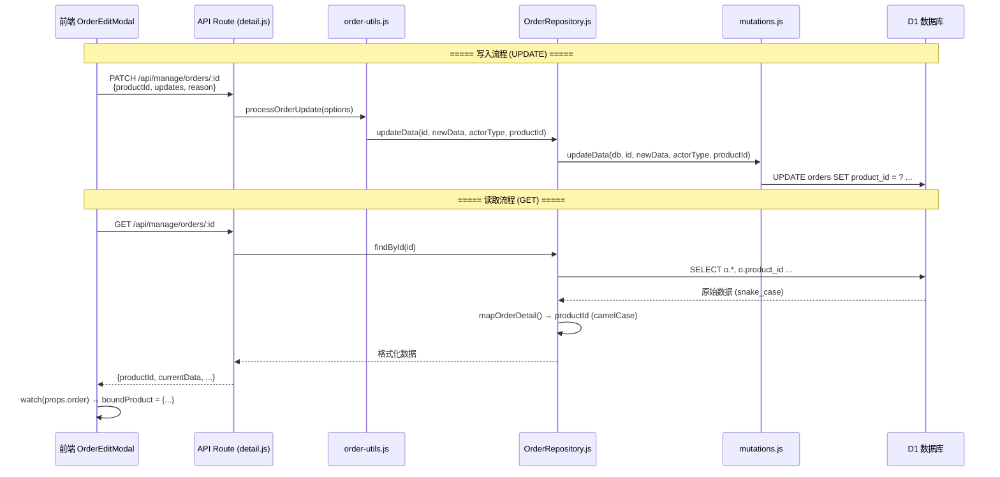

# 订单商品绑定逻辑审计报告

> **审计日期**: 2026-01-27  
> **审计范围**: 订单与商品绑定功能的完整数据流（从前端提交 → 后端处理 → 数据库存储 → 前端读取）  
> **修复状态**: ✅ 已完成

---

## 1. 功能概述

当管理员在编辑订单时选择绑定某个商品，系统应该：
1. 将 `product_id` 存入订单表
2. 锁定订单中与商品关联的字段（名称、品牌、系列、SKU）
3. 再次打开编辑弹窗时，锁定状态应保持

**问题描述**: 绑定商品后关闭弹窗再打开，锁定状态丢失，字段变为可编辑。

---

## 2. 数据流架构图



---

## 3. 关键文件审计

### 3.1 前端组件

| 文件 | 路径 | 职责 | 状态 |
|------|------|------|------|
| OrderEditModal.vue | `src/components/OrderEditModal.vue` | 编辑弹窗，处理表单与锁定逻辑 | ✅ 正确 |
| ProductBindingSection.vue | `src/components/order/ProductBindingSection.vue` | 商品选择UI组件 | ✅ 正确 |
| OrderManager.vue | `src/components/OrderManager.vue` | 管理端订单列表 | ✅ 正确 |

**核心逻辑** (`OrderEditModal.vue:272-331`):
```javascript
watch(
  () => props.order,
  (newOrder) => {
    if (newOrder && newOrder.id !== initializedId.value) {
      // ...
      if (newOrder.productId) {
        selectedProductId.value = newOrder.productId;
        boundProduct.value = { id: newOrder.productId, ... };
      } else {
        boundProduct.value = null;
      }
    }
  },
  { immediate: true }
);

const disabledFields = computed(() => boundProduct.value ? LOCKED_FIELDS : []);
```

**结论**: 前端逻辑正确，只要 `props.order.productId` 存在，锁定即生效。

---

### 3.2 API 路由层

| 文件 | 路径 | 职责 |
|------|------|------|
| detail.js | `functions/lib/hono/routes/manage/orders/detail.js` | 订单详情 GET/PATCH 路由 |

**PATCH 路由关键代码** (line 54-92):
```javascript
const { updates: updatesFromBody, reason, fileIds, productId } = body;
// ...
const _result = await processOrderUpdate({
  env, orderId, orderNo, currentData, updates, fileIds,
  productId, // ✅ 正确传递
  allowedFields, actor, reason, salespersonId
});
```

**结论**: API 层正确提取并传递 `productId`。

---

### 3.3 工具函数层

| 文件 | 路径 | 职责 |
|------|------|------|
| order-utils.js | `functions/api/utils/order-utils.js` | 订单更新核心逻辑 |

**关键代码** (line 324):
```javascript
await orderRepo.updateData(orderId, newData, actorTypeStr, options.productId);
```

**结论**: 工具函数正确调用 Repository 并传递 `productId`。

---

### 3.4 Repository 层 (🔴 问题根因)

| 文件 | 路径 | 职责 |
|------|------|------|
| OrderRepository.js | `functions/repositories/OrderRepository.js` | 订单数据库操作门面 |

**修复前** (❌ 错误):
```javascript
async updateData(id, newData, actorType) {
  return mutations.updateData(this.db, id, newData, actorType);
  // productId 被丢弃！
}
```

**修复后** (✅ 已修复):
```javascript
async updateData(id, newData, actorType, productId) {
  return mutations.updateData(this.db, id, newData, actorType, productId);
}
```

---

### 3.5 Mutation 层

| 文件 | 路径 | 职责 |
|------|------|------|
| mutations.js | `functions/repositories/order/mutations.js` | 订单 SQL 变更操作 |

**关键代码** (line 71-92):
```javascript
export async function updateData(db, id, newData, actorType, productId = undefined) {
  let query = `UPDATE orders SET current_data = ?, ${updateField} = 1, updated_at = ?`;
  const params = [JSON.stringify(newData), timestamp];

  if (productId !== undefined) {
    query += `, product_id = ?`;
    params.push(productId);
  }
  // ...
}
```

**结论**: Mutation 层已正确支持 `productId` 参数。

---

### 3.6 Query 层

| 文件 | 路径 | 职责 |
|------|------|------|
| queries.js | `functions/repositories/order/queries.js` | 订单 SQL 查询操作 |
| helpers.js | `functions/repositories/order/helpers.js` | 数据映射工具 |

**查询语句** (queries.js:22):
```sql
SELECT o.*, o.product_id, o.quantity, f.storage_key as main_image_key ...
```

**映射逻辑** (helpers.js:60):
```javascript
return {
  // ...
  productId: order.product_id,  // ✅ snake_case → camelCase
  // ...
};
```

**结论**: 查询和映射层均正确处理 `product_id`。

---

## 4. 修复总结

| 层级 | 文件 | 问题 | 修复 |
|------|------|------|------|
| Repository | `OrderRepository.js` | 方法签名缺少 `productId` 参数 | 添加第4个参数并透传 |

**修改差异**:
```diff
- async updateData(id, newData, actorType) {
-   return mutations.updateData(this.db, id, newData, actorType);
+ async updateData(id, newData, actorType, productId) {
+   return mutations.updateData(this.db, id, newData, actorType, productId);
  }
```

---

## 5. 验证清单

- [x] `queries.js` SELECT 语句包含 `product_id`
- [x] `helpers.js` 正确映射 `product_id` → `productId`
- [x] `OrderRepository.updateData` 签名包含 `productId`
- [x] `mutations.updateData` 支持条件更新 `product_id`
- [x] API 路由正确提取并传递 `productId`
- [x] `order-utils.js` 正确调用 Repository
- [x] 前端 watch 逻辑根据 `productId` 初始化 `boundProduct`

---

## 6. 测试步骤

1. 创建一个新订单
2. 打开编辑弹窗，绑定一个商品
3. 保存并关闭弹窗
4. 再次打开编辑弹窗
5. **预期**: 商品绑定区域显示已绑定商品，名称/品牌/系列/SKU 字段锁定

---

## 附录: 相关文件索引

```
src/components/
├── OrderEditModal.vue              # 编辑弹窗主组件
├── OrderManager.vue                # 管理端订单列表
└── order/
    ├── ProductBindingSection.vue   # 商品绑定UI

functions/
├── api/utils/
│   └── order-utils.js              # 订单更新工具函数
├── lib/hono/routes/manage/orders/
│   └── detail.js                   # 订单详情API路由
└── repositories/
    ├── OrderRepository.js          # Repository门面 (已修复)
    └── order/
        ├── queries.js              # SQL查询
        ├── mutations.js            # SQL变更
        └── helpers.js              # 数据映射
```
