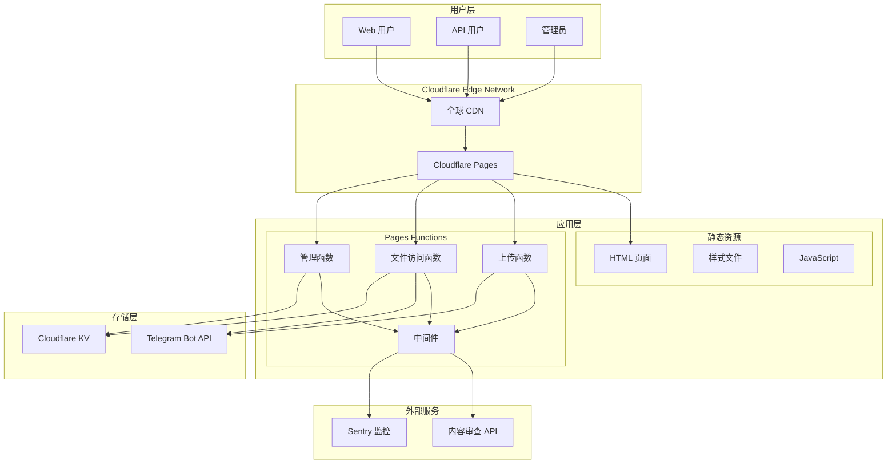
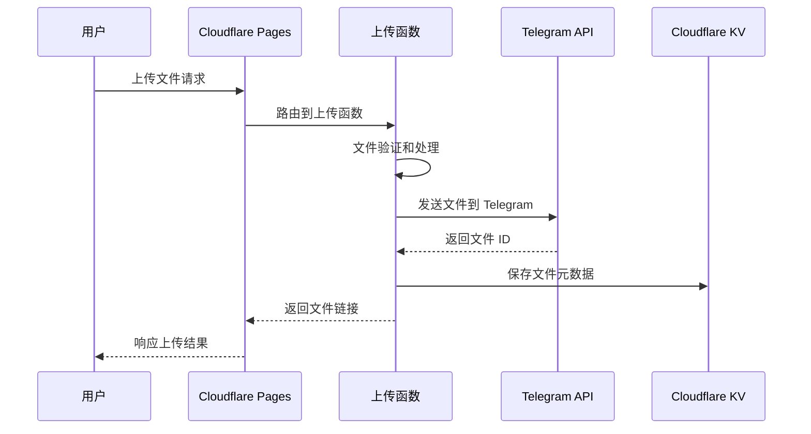
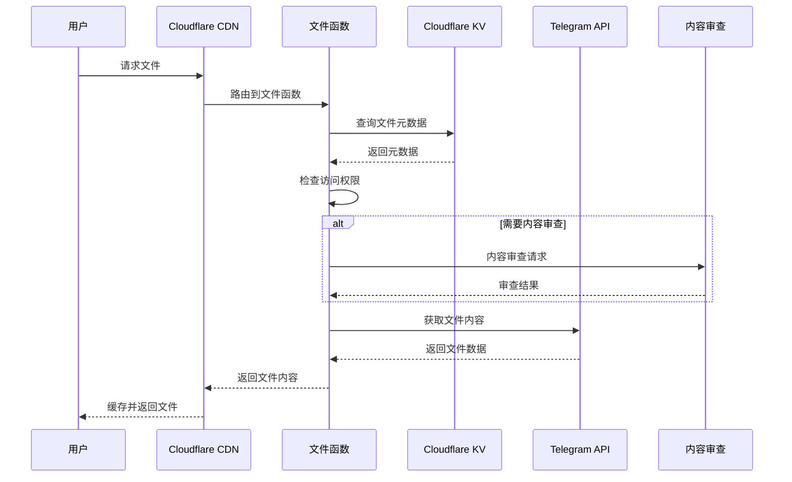

# 系统架构详解

本文档详细介绍 Telegraph-Image 的系统架构设计、技术选型和核心组件。

## 🏗️ 架构概览

Telegraph-Image 采用现代化的无服务器架构，充分利用 Cloudflare 生态系统和 Telegram Bot API，实现高可用、低成本的图片托管服务。

## 📊 系统架构图



## 🔧 技术栈详解

### 前端技术栈

**核心框架**:
- **Vue.js 3.x** - 现代响应式前端框架，采用 Composition API
- **Element Plus** - Vue 3 兼容的组件库
- **Vite** - 现代构建工具，提供快速开发体验

**样式和布局**:
- **CSS3** - 现代样式特性
- **响应式设计** - 支持多设备访问
- **Element Plus 主题** - 统一的视觉风格

**JavaScript 功能**:
- **ES6+ Modules** - 现代 JavaScript 模块系统
- **Composition API** - Vue 3 组合式 API
- **Fetch API** - 网络请求处理
- **File API** - 文件上传处理

### 后端技术栈

**运行环境**:
- **Cloudflare Pages Functions** - 基于 V8 引擎的 JavaScript 运行时
- **Web Workers API** - 标准的 Web Workers 接口
- **ES Modules** - 现代模块系统

**核心依赖**:
```json
{
  "@cloudflare/pages-plugin-sentry": "^1.1.3",
  "@sentry/tracing": "^7.114.0"
}
```

**开发工具**:
```json
{
  "wrangler": "^3.63.0",
  "mocha": "^10.6.0",
  "concurrently": "^8.2.2"
}
```

## 🏛️ 架构层次

### 1. 接入层（Edge Layer）

**Cloudflare CDN**:
- **全球节点** - 200+ 个数据中心
- **智能路由** - 自动选择最优路径
- **DDoS 防护** - 自动防护攻击
- **SSL/TLS** - 自动 HTTPS 加密

**功能特性**:
- 静态资源缓存
- 动态内容加速
- 地理位置优化
- 带宽优化

### 2. 应用层（Application Layer）

**Pages Functions 架构**:
```
functions/
├── upload.js              # 文件上传处理
├── file/[id].js           # 文件访问处理
├── api/
│   ├── manage/            # 管理 API
│   └── bing/              # 扩展 API
└── utils/
    └── middleware.js      # 通用中间件
```

**请求处理流程**:
1. **路由匹配** - 根据 URL 路径匹配对应函数
2. **中间件处理** - 执行认证、日志、错误处理
3. **业务逻辑** - 执行具体的业务功能
4. **响应返回** - 格式化响应并返回

### 3. 存储层（Storage Layer）

**Telegram Bot API**:
- **主存储** - 文件内容存储
- **多媒体支持** - 图片、视频、文档
- **全球分发** - Telegram 的全球网络
- **高可用性** - 99.9% 可用性保证

**Cloudflare KV**:
- **元数据存储** - 文件信息、状态、配置
- **全球同步** - 边缘节点数据同步
- **高性能** - 毫秒级读取延迟
- **最终一致性** - 分布式一致性模型

## 🔄 数据流架构

### 上传流程



### 访问流程



## 🔐 安全架构

### 网络安全

**传输层安全**:
- **HTTPS 强制** - 所有连接强制使用 HTTPS
- **TLS 1.3** - 使用最新的 TLS 协议
- **HSTS** - HTTP 严格传输安全
- **证书管理** - 自动证书更新

**应用层安全**:
- **CORS 配置** - 跨域请求控制
- **CSP 策略** - 内容安全策略
- **输入验证** - 严格的输入验证
- **输出编码** - 防止 XSS 攻击

### 访问控制

**认证机制**:
- **Basic Auth** - 后台管理认证
- **Token 验证** - API 访问控制
- **IP 白名单** - 可选的 IP 限制

**权限管理**:
- **角色分离** - 用户、管理员角色
- **功能权限** - 细粒度权限控制
- **资源隔离** - 多租户资源隔离

### 内容安全

**内容审查**:
- **第三方 API** - ModerateContent 集成
- **自动检测** - 不当内容自动识别
- **人工审核** - 支持人工审核流程

**访问控制**:
- **黑名单机制** - 阻止特定内容访问
- **白名单模式** - 仅允许审核通过的内容
- **动态策略** - 可配置的访问策略

## 📈 性能架构

### 缓存策略

**多层缓存**:
```
用户请求 → CDN 缓存 → 边缘缓存 → 源站处理
```

**缓存配置**:
- **静态资源** - 长期缓存（1年）
- **动态内容** - 短期缓存（1小时）
- **API 响应** - 按需缓存（5分钟）

### 性能优化

**前端优化**:
- **资源压缩** - Gzip/Brotli 压缩
- **代码分割** - 按需加载
- **图片优化** - WebP 格式支持
- **懒加载** - 图片懒加载

**后端优化**:
- **函数预热** - 减少冷启动时间
- **并发处理** - 支持高并发请求
- **资源复用** - 连接池和对象复用
- **异步处理** - 非阻塞 I/O 操作

## 🔍 监控架构

### 应用监控

**Sentry 集成**:
- **错误追踪** - 自动错误收集和分析
- **性能监控** - 请求性能和响应时间
- **用户会话** - 用户行为分析
- **自定义指标** - 业务指标监控

**日志系统**:
- **结构化日志** - JSON 格式日志
- **日志级别** - 分级日志记录
- **日志聚合** - 集中日志管理
- **实时监控** - 实时日志分析

### 基础设施监控

**Cloudflare Analytics**:
- **流量统计** - 请求量和带宽使用
- **性能指标** - 响应时间和错误率
- **地理分布** - 用户地理位置分析
- **安全事件** - 安全威胁监控

## 🚀 扩展架构

### 水平扩展

**无状态设计**:
- **函数无状态** - 每个函数调用独立
- **会话外部化** - 状态存储在 KV 中
- **负载均衡** - 自动负载分发

**弹性伸缩**:
- **自动扩容** - 根据负载自动扩展
- **资源隔离** - 函数间资源隔离
- **故障隔离** - 单点故障不影响整体

### 功能扩展

**插件架构**:
- **中间件系统** - 可插拔的中间件
- **钩子机制** - 生命周期钩子
- **配置驱动** - 通过配置启用功能

**API 扩展**:
- **RESTful API** - 标准的 REST 接口
- **Webhook 支持** - 事件通知机制
- **SDK 支持** - 多语言 SDK

## 🔗 相关文档

- **[本地开发环境](local-development.md)** - 开发环境搭建
- **[代码结构说明](code-structure.md)** - 代码组织和模块
- **[API 文档](../api-docs/README.md)** - API 接口详解
- **[部署指南](../deployment/README.md)** - 生产环境部署

---

📚 **深入了解**: 这个架构设计确保了 Telegraph-Image 的高性能、高可用性和可扩展性。
