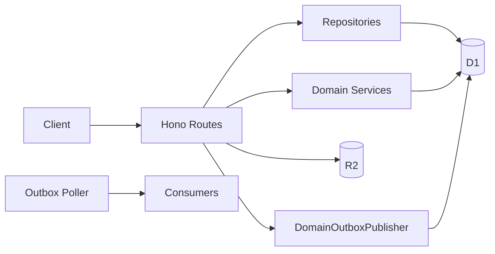

# 系统架构设计

本文档面向开发者，说明当前代码库真实采用的模块边界、数据建模规则和副作用处理方式。

## 1. 总体架构

kk-life 基于 Cloudflare Pages Functions + Hono 构建，分为四层：

1. 路由层
   - `functions/lib/hono/app.js`
   - 负责挂载 `/api/manage`、`/api/sales`、`/api/v1`
2. 领域服务层
   - `functions/services/`
   - 负责采购收货、库存、需求聚合、outbox 消费等跨仓储业务逻辑
3. 仓储层
   - `functions/repositories/`
   - 负责 D1 读写与结果映射
4. 副作用层
   - `DomainOutboxPublisher` + `runOutboxPoller`
   - 负责通知、缓存失效、Webhook、重放


```mermaid
graph LR
    Client[Client] --> Route[Hono Routes]
    Route --> Repo[Repositories]
    Route --> Service[Domain Services]
    Repo --> D1[(D1)]
    Service --> D1
    Route --> R2[(R2)]
    Route --> Outbox[DomainOutboxPublisher]
    Outbox --> D1
    Poller[Outbox Poller] --> Consumer[Consumers]
```

## 2. 请求处理约定

### 2.1 管理端与销售端

- `/api/manage/*`
  - `authMiddleware`
  - `requirePermission(...)`
- `/api/sales/*`
  - `authMiddleware`
  - 销售 Token 路由下再走 `salesAuthMiddleware`

### 2.2 写接口的一致性约定

除极少量纯 CRUD 接口外，核心业务写路径遵循下面模式：

1. 路由层解析参数、做权限校验
2. Repository / Domain Service 写入主业务数据
3. 若会影响外部副作用，发布领域事件到 outbox
4. `waitUntil(runOutboxPoller(...))` 异步拉起消费者

不要在路由里重新引入“主事务后同步发通知/同步打 webhook”的旧做法。

订单行履约是一个明确的例外说明案例：

- 不要把 `reserve` / `release` / `ship` 塞回 `PATCH /api/manage/orders/:id/status`
- 应保持在 `/api/manage/orders/:id/lines/:lineId/*` 的专用命令路由里

## 3. 订单与采购的当前建模

### 3.1 订单不是单表模型

当前订单模块的真实语义是：

- `orders`
  - 订单头、归属关系、兼容性字段
- `order_lines`
  - 履约和采购的核心粒度
  - 管理商品/变体、快照、数量和进度

虽然现有销售端/管理端创建 UI 仍默认创建“单行兼容订单”，但后续采购、到货、部分到货、冲销、展示状态都以 `order_lines` 为准。

新增的行级履约命令同样以 `order_lines` 为核心：

- `reserved_qty`：订单行内部的履约预留
- `shipped_qty`：订单行内部的已发货量
- `order_line_allocations`：履约预留事实

### 3.2 采购进度

- `orders.status`
  - 业务审批 / 交付主状态，如 `pending`、`confirmed`、`delivered`
- `orders.procurement_status`
  - 兼容性采购聚合字段
- `order_lines.display_status`
  - 更细粒度的展示状态，来源于行级数量投影

管理端列表查询已经优先使用：

```sql
COALESCE(order_line_agg.display_status, o.procurement_status, 'none')
```

而不是只看 `orders.procurement_status`。

### 3.3 采购事实层

- `purchase_receipts`
  - 记录到货事实
- `purchase_receipt_reversals`
  - 记录冲销事实
- `inventory_ledger`
  - 记录库存事实

这三层都属于不可变事实，读模型通过投影生成，不在原记录上“覆盖式改历史”。

## 4. Outbox 设计

### 4.1 核心表

- `domain_outbox`
- `outbox_consumer_jobs`
- `outbox_replay_runs`

### 4.2 事件目录

事件类型统一声明在：

- `functions/services/DomainEventCatalog.js`

订单与采购当前主要事件包括：

- `order_created_by_admin`
- `order_created_by_sales`
- `order_updated_by_admin`
- `order_status_changed_by_admin`
- `purchase_receipt_recorded`
- `order_procurement_progressed`
- `order_line_fulfillment_updated`
- `purchase_receipt_reversed`
- `order_procurement_reversed`

### 4.3 消费者

消费者实现位于：

- `functions/services/DomainOutboxConsumers.js`

当前职责：

- 缓存失效
- 通知生成
- Webhook 投递
- 收货/冲销补充审计

## 5. 目录结构

```text
functions/
├── lib/hono/
│   ├── app.js
│   ├── middleware/
│   ├── routes/manage/
│   ├── routes/sales/
│   └── routes/v1/
├── repositories/
├── services/
├── api/cron/
└── api/utils/
```

前端主结构：

```text
src/
├── components/
├── composables/
├── modules/
├── pages/
├── router/
└── views/
```

## 6. 前端对接约定

- 订单详情读模型默认包含 `lines`
- 采购单详情读模型默认包含 `items` 与 `receipts`
- 采购收货与冲销通过显式命令接口提交，不通过“修改采购单状态”隐式表达
- 若后端接口发布 durable outbox 事件，前端只依赖最终返回值和后续读模型刷新，不依赖同步副作用是否已完成

## 7. 开发建议

- 订单/采购相关需求优先检查 `order_lines` 是否已经是正确事实来源
- 新副作用优先接入 outbox，而不是在路由中直接调用
- 大批量 D1 写入优先使用 chunked batch helper
- 收货 / 冲销命令幂等优先使用 `CommandIdempotencyRepository` 的原子占位逻辑，不要回退到“先查再插”的竞争窗口实现
- 本地真实链路联调优先跑 `pnpm dev:all` 和 `pnpm test:real-api:full-chain`
- 文档、测试、API 示例必须与 Hono 当前真实路由保持一致
