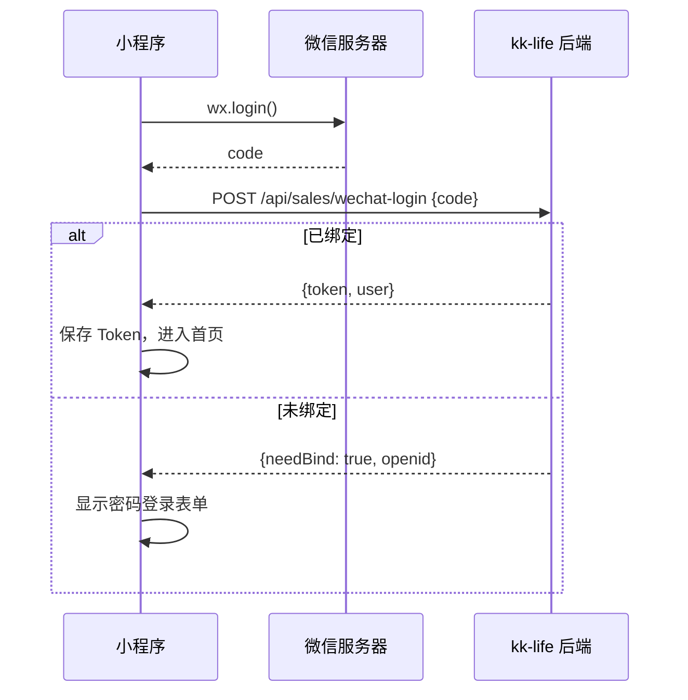
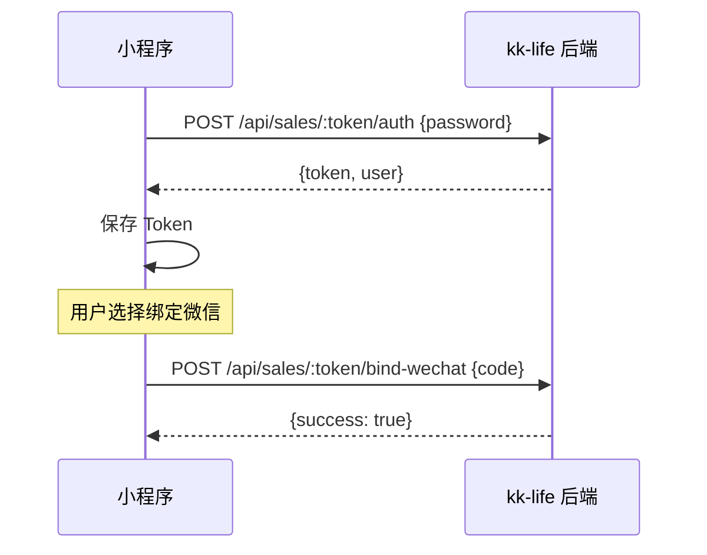

# 销售端微信小程序 (minisales)

> **目录**: `minisales/`
> **技术栈**: TypeScript + SCSS + 微信小程序
> **渲染引擎**: Skyline + glass-easel

本文档介绍如何开发、配置和部署 kk-life 销售端微信小程序。

## 1. 项目结构

```
minisales/
├── miniprogram/
│   ├── app.ts                 # 应用入口
│   ├── app.json               # 小程序配置
│   ├── app.scss               # 全局样式
│   ├── pages/
│   │   ├── index/             # 订单列表 (首页)
│   │   ├── form/              # 创建订单
│   │   ├── detail/            # 订单详情
│   │   ├── stats/             # 业绩统计
│   │   └── login/             # 登录页
│   ├── components/            # 公共组件
│   ├── utils/
│   │   ├── api.ts             # 网络请求封装
│   │   ├── auth.ts            # 认证逻辑
│   │   └── constants.ts       # 常量定义
│   └── assets/                # 图标资源
├── project.config.json        # 微信开发者工具配置
└── tsconfig.json              # TypeScript 配置
```

## 2. 开发环境配置

### 前置要求
- **微信开发者工具** (最新稳定版)
- **Node.js 18+** (用于 npm 依赖)

### 初始化项目
```bash
cd minisales
npm install
```

### 打开项目
1. 打开微信开发者工具
2. 选择 **导入项目**
3. 选择 `minisales/` 目录
4. AppID 使用 `project.config.json` 中的 `appid`

### 配置 API 地址
编辑 `miniprogram/utils/constants.ts`:
```typescript
// 替换为您的实际后端域名
export const API_BASE_URL = 'https://your-kk-life-domain.pages.dev';
```

## 3. 认证流程

### 3.1 微信一键登录


### 3.2 密码登录 + 绑定微信


## 4. 核心功能

### 4.1 订单列表 (`pages/index`)
- 显示当前销售员的所有订单
- 支持状态筛选 (待确认/已确认/生产中...)
- 下拉刷新 + 触底加载更多

### 4.2 创建订单 (`pages/form`)
- 填写客户信息、商品信息
- **输入商品数量** (quantity)
- 上传附件 (调用 `wx.chooseImage` + 后端 upload API)
- 提交后自动跳转到订单详情

### 4.3 订单详情 (`pages/detail`)
- 查看完整订单数据
- 添加留言/评论
- 查看时间轴 (状态变更历史)

### 4.4 业绩统计 (`pages/stats`)
- 本周/本月订单数
- 状态分布图表

## 5. API 接口映射

| 小程序功能 | API 端点 |
|-----------|----------|
| 微信登录 | `POST /api/sales/wechat-login` |
| 密码登录 | `POST /api/sales/:token/auth` |
| 获取用户信息 | `GET /api/sales/:token/auth` |
| 绑定微信 | `POST /api/sales/:token/bind-wechat` |
| 订单列表 | `GET /api/sales/:token/orders` |
| 创建订单 | `POST /api/sales/:token/orders` (Body: `{..., quantity}`) |
| 订单详情 | `GET /api/sales/:token/orders/:id` |
| 添加留言 | `POST /api/sales/:token/orders/:id/comment` |
| 上传文件 | `POST /api/sales/:token/upload` |
| 业绩统计 | `GET /api/sales/:token/stats` |

## 6. 后端配置

确保 kk-life 后端已配置以下环境变量：
- `WECHAT_APPID`: 小程序 AppID
- `WECHAT_SECRET`: 小程序 Secret

```toml
# wrangler.toml (生产环境)
[env.production.vars]
WECHAT_APPID = "wxc6042576446db9bc"
WECHAT_SECRET = "your-app-secret"
```

> ⚠️ **安全提示**: `WECHAT_SECRET` 应通过 Cloudflare Dashboard 设置，不要提交到代码库。

## 7. 发布上线

### 7.1 上传代码
1. 在微信开发者工具中点击 **上传**
2. 填写版本号和备注
3. 登录 [微信公众平台](https://mp.weixin.qq.com) 提交审核

### 7.2 配置服务器域名
在微信公众平台 -> 开发管理 -> 服务器域名：
- **request 合法域名**: `https://your-kk-life-domain.pages.dev`
- **uploadFile 合法域名**: `https://your-kk-life-domain.pages.dev`

## 8. 常见问题

### Q: 微信登录失败？
A: 检查后端 `WECHAT_APPID` 和 `WECHAT_SECRET` 是否正确配置。

### Q: 上传图片失败？
A: 确保 uploadFile 合法域名已添加，且后端 R2 存储正常。

### Q: 页面白屏？
A: 检查 Skyline 渲染是否兼容，可尝试在 `app.json` 中禁用 Skyline。

---

📱 如有问题，请参考 [API 文档](api/sales.md) 或联系管理员。
