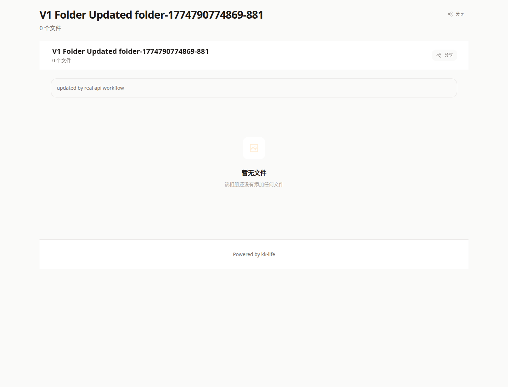

# 公开相册页教程

- 页面路由：`/gallery/:token`

## 页面用途

公开相册页用于查看通过文件夹分享生成的公开相册链接。

## 页面里可以做什么

- 通过分享 token 打开相册
- 在有密码保护时先输入密码
- 浏览图片、PDF 和其他文件
- 点击文件打开灯箱预览
- 使用页面上的分享按钮复制或调用系统分享

## 页面结构

当前公开相册页通常包含：

- 顶部标题和文件数量
- 可选说明文字
- 文件网格
- 灯箱预览

如果当前分享没有文件，页面会显示空状态，而不是报错。

## 常见排查

### 链接打不开

先确认 `:token` 是否完整，再确认该分享是否仍然有效。

### 页面要求输入密码

这是分享创建时启用了密码保护，需要向分享方重新确认密码。

### 打开后没有文件

这通常表示当前分享内容为空，或源文件夹暂时没有可展示文件，不一定是系统故障。

## 关联文档

- [文件上传与附件管理](../uploading-images.md)
- [公开空间页](space-share.md)
