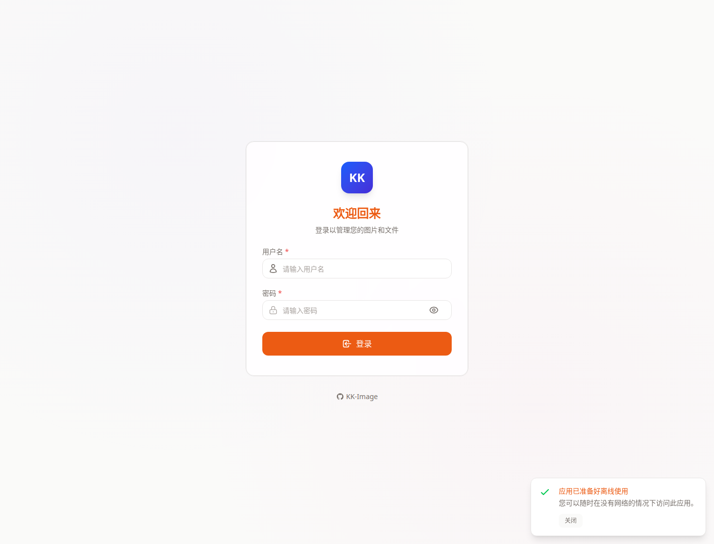

# 管理登录页教程

- 页面路由：`/login`

## 页面用途

这是管理后台统一登录入口。

登录成功后会跳转到 `/admin`，再由权限决定默认进入的后台页面。

## 页面里可以做什么

- 输入用户名
- 输入密码
- 显示或隐藏密码
- 在启用 Turnstile 的环境中完成人机验证
- 登录后自动跳转到后台

## 推荐使用顺序

1. 输入管理员或后台用户账号。
2. 如果页面启用了 Turnstile，先完成验证。
3. 登录成功后等待页面平滑跳转。

## 常见排查

### 提示账号或密码错误

先确认当前环境的后台账号是否正确，不要混用销售端密码。

### 登录按钮不可点

通常是必填项未完成，或者启用了 Turnstile 但还没验证。

### 登录成功后还是回到登录页

先检查 Cookie、代理和同域配置，再看账号是否确实有后台访问权限。

## 关联文档

- [用户手册总览](../README.md)
- [管理端使用手册（带截图）](/home/bjw/Code/KK-Image/docs/admin-manual/admin-console-guide.md)
