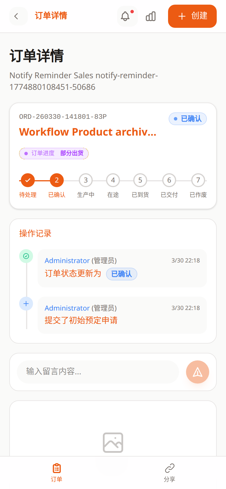

# 销售端订单详情教程

- 页面路由：`/sales/:token/detail/:id`
- 截图说明：以下示例按手机竖屏视口采集

## 页面用途

订单详情页用于查看单笔订单的完整进度，并和后台协同沟通。

## 页面里可以做什么

- 查看订单基础信息
- 查看时间线和状态变化
- 添加评论
- 刷新详情
- 复制一单并带入“新建订单”
- 返回订单列表

## 推荐使用顺序

1. 先看当前状态和时间线。
2. 有补充说明时直接写评论。
3. 需要复用同一客户需求时，使用“复制订单”进入新建页。

## 常见排查

### 订单详情加载失败

先点重试，再确认当前订单是否仍属于这个销售员。

### 评论发不出去

页面会保留待发送内容并允许重试，先不要重复输入多次。

### 想基于当前订单再建一单

直接使用复制功能，不要回列表手动重填。

## 关联文档

- [销售端订单列表](sales-orders.md)
- [销售端新建订单](sales-create.md)
