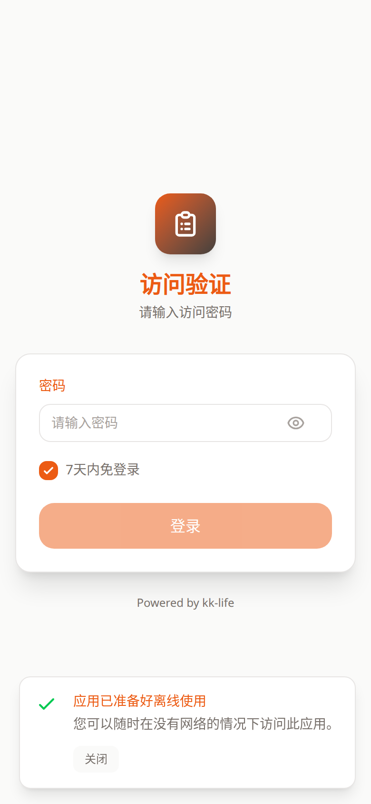

# 销售端登录页教程

- 页面路由：`/sales/:token`
- 截图说明：以下示例按手机竖屏视口采集

## 页面用途

这是销售端入口链接的首屏登录状态。

销售同事通常通过管理员分发的专属链接进入这里，再输入密码完成登录。

## 页面里可以做什么

- 输入销售密码
- 勾选“7 天内免登录”
- 显示或隐藏密码
- 登录成功后进入订单列表

## 推荐使用顺序

1. 使用管理员分发的 `/sales/:token` 专属链接打开页面。
2. 输入密码完成登录。
3. 登录成功后进入订单列表页继续操作。

## 常见排查

### 提示密码错误

先确认是不是被管理员重置过密码。

### 链接可以打开，但总提示未授权

先确认这个 `:token` 是否仍属于当前销售员，或是否已被重置。

### 反复要求重新登录

优先检查浏览器是否阻止了 Cookie，或当前环境是否清理了登录态。

## 关联文档

- [销售端使用手册](../sales-guide.md)
- [销售端订单列表](sales-orders.md)
