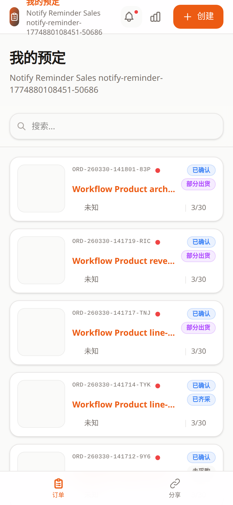

# 销售端订单列表教程

- 页面路由：`/sales/:token`
- 截图说明：以下示例按手机竖屏视口采集

## 页面用途

登录后的默认首页就是销售端订单列表。

它负责查看自己名下订单、搜索订单和进入订单详情。

## 页面里可以做什么

- 搜索订单号、商品名或客户名
- 下拉刷新
- 滚动加载更多
- 点击订单进入详情
- 使用顶部按钮跳到新建订单、个人统计
- 使用底部导航切换到共享空间页
- 查看通知红点和通知面板

## 推荐使用顺序

1. 先搜索或浏览自己的订单。
2. 需要跟进某个客户时，进入订单详情查看时间线。
3. 需要新建需求时，点击右上角“新建订单”。

## 常见排查

### 列表为空

先确认当前销售员是否确实还没有订单；空列表不一定代表异常。

### 搜不到订单

先清空搜索词，再确认订单号、商品名或客户名是否输入正确。

### 有红点但找不到更新

打开通知面板或进入订单详情后，相关更新通常会被标记为已读。

## 关联文档

- [销售端订单详情](sales-detail.md)
- [销售端新建订单](sales-create.md)
