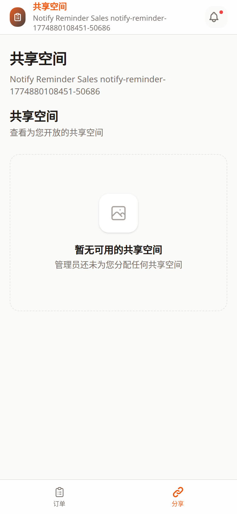

# 销售端共享空间教程

- 页面路由：`/sales/:token/spaces`
- 截图说明：以下示例按手机竖屏视口采集

## 页面用途

这个页面用于查看分配给当前销售员的共享空间列表。

点击卡片后会进入销售端内部的空间详情页，再继续查看内容或进入下级空间。

## 页面里可以做什么

- 查看自己可访问的空间卡片
- 看空间封面、模板类型和文件数
- 点击卡片进入 `/sales/:token/spaces/:id`

## 页面结构

页面通常有两种状态：

- 有空间
  - 看到空间卡片列表
- 没有空间
  - 显示空状态，提示当前没有可用展示空间

## 常见排查

### 页面是空的

通常表示后台还没把任何空间分配给当前销售员，不一定是故障。

### 点开空间后没内容

需要回后台确认该空间是否已发布、文件是否已绑定完整。

### 客户看到的内容不对

联系管理员检查空间模板、封面和绑定文件。

## 关联文档

- [销售端空间详情页](sales-space-detail.md)
- [公开空间页](space-share.md)
- [销售端订单列表](sales-orders.md)
