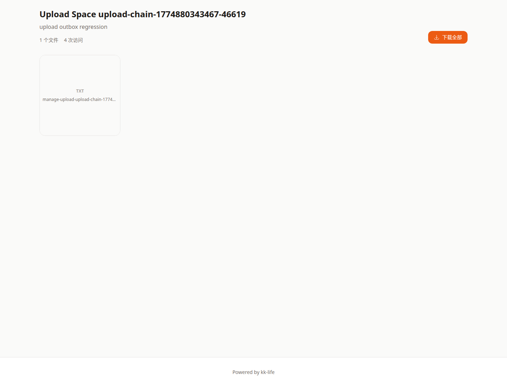

# 公开空间页教程

- 页面路由：`/space/:token`

## 页面用途

公开空间页用于查看由后台空间管理发布出的展示页。

与公开相册不同，它会根据空间模板渲染不同布局。

## 页面里可以做什么

- 通过分享 token 打开空间
- 在启用密码保护时先输入密码
- 在启用 Turnstile 的环境中先完成人机验证
- 根据模板浏览内容

当前支持的展示模板包括：

- `gallery`
- `product`
- `collection`
- `document`

## 常见排查

### 提示“该空间未公开分享”

说明后台还没有把这个空间发布成公开状态，需要联系管理员。

### 页面要求密码或验证

这是分享方设置的访问限制，不是异常。

### 打开后内容和预期不一致

优先联系后台确认空间模板、文件绑定和封面是否已经更新。

## 关联文档

- [公开相册页](gallery-share.md)
- [销售端共享空间](sales-spaces.md)
