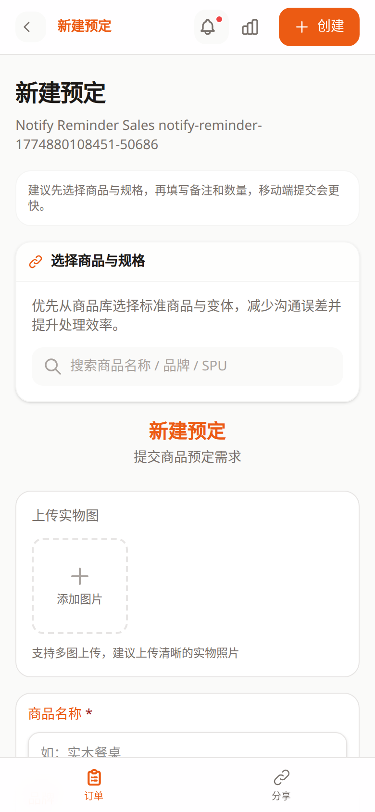
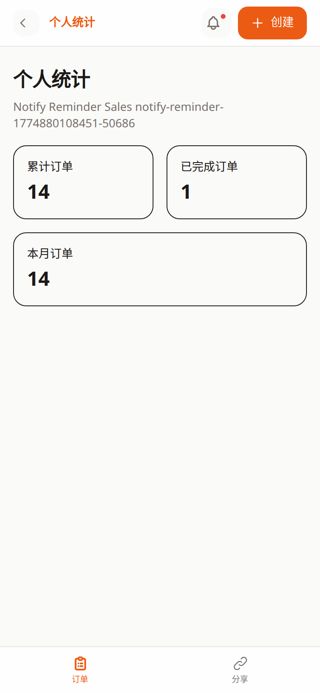

# 销售端使用手册

本手册面向当前手机浏览器销售端，主入口为 `/sales/:token`。

销售端界面按移动端优先设计，建议销售同事使用手机竖屏打开，不要把它当作桌面后台来使用。

如果你使用的是微信小程序入口，而不是手机浏览器入口，请改看 [微信小程序销售端手册](minisales-guide.md)。

## 适用范围

- 销售登录
- 我的订单列表
- 新建订单
- 订单详情与评论跟进
- 个人统计
- 共享空间展示

如果你需要逐页查某个界面，可以同时参考 [用户侧逐页教程](pages/README.md)。

## 入口与准备

在开始前，请先确认三件事：

1. 已收到管理员分发的专属链接 `/sales/:token`。
2. 已拿到当前有效的销售密码。
3. 手机浏览器允许站点保存登录态。

## 登录流程

销售端的登录过程很短，通常只需要：

1. 打开管理员分发的专属链接。
2. 输入销售密码。
3. 如果你经常使用同一台手机，可保留“7 天内免登录”。
4. 登录成功后进入“我的订单”。

登录页是销售端的唯一入口页。如果链接能打开但始终提示密码错误或未授权，优先联系管理员确认密码和 token 是否被重置。

## 首页怎么用

登录后的默认首页就是订单列表页。

手机端首页最常用的控件有：

- 顶部铃铛：查看通知与订单反馈
- 顶部统计图标：进入个人统计
- 右上角“新建订单”：进入建单页
- 页面中部搜索框：查订单号、商品名、客户名
- 底部标签栏：在“订单”和“共享空间”之间切换

日常推荐顺序：

1. 先看通知红点，有更新就先点进去。
2. 再搜索或浏览当天要跟进的订单。
3. 需要新建需求时，直接点右上角“新建订单”。

## 新建订单

新建订单页是销售端最核心的录单页面。

建议按这个顺序填写：

1. 先绑定商品和规格。
2. 核对系统带出的品牌、系列、SKU。
3. 再填数量、补充说明、交期要求。
4. 上传参考图或附件。
5. 提交后回到订单列表确认是否已生成。

使用要点：

- 商品和规格一旦绑定，部分字段会自动带出并锁定，能减少手填错误。
- 参考图不是强制项，但业务上强烈建议上传。
- 提交后如果没有马上看到订单，先回列表刷新，再确认有没有被搜索条件过滤。

## 跟进订单详情

每笔订单都可以从列表进入详情页继续跟进。

详情页通常用来做三件事：

- 看当前状态、时间线和历史反馈
- 追加评论，补充客户要求
- 基于已有订单复制一单，再进入新建页

查看状态时要注意：

- 主状态反映整单进度
- 时间线反映最新处理动作
- 评论区适合补充客户变更、到货要求、备注说明

如果出现“部分到货”“部分处理”这类状态，通常表示后台已开始处理，但还没有全部完成，不一定是异常。

## 个人统计

统计页适合快速看自己的出单情况。

这里通常能直接回答三个问题：

- 我累计提了多少单
- 最近一个月有没有持续出单
- 已完成订单大概有多少

统计页更适合复盘，不适合处理单笔订单。需要沟通具体客户或商品时，还是回订单列表或详情页。

## 共享空间

共享空间页用于给客户展示后台分配给你的公开空间。

使用方式很简单：

1. 在底部标签切到“共享空间”。
2. 找到目标空间卡片。
3. 点击后进入销售端空间详情页 `/sales/:token/spaces/:id`。
4. 在详情页查看素材、下级空间或继续给客户展示。

如果页面没有任何卡片，通常表示后台暂时还没给你分配可展示空间。

## 手机端日常操作建议

- 建议固定使用同一台手机和同一浏览器，减少重复登录。
- 录单时先选商品规格，再写备注，效率更高。
- 有通知红点时优先处理，避免漏掉后台反馈。
- 评论尽量写清客户变化点，不要只写“已沟通”“知道了”。
- 给客户发展示内容时，优先从“共享空间”进入，不要随手转发后台链接。

## 常见问题

### 打不开销售链接

- 先检查链接里的 `:token` 是否完整
- 再确认是不是复制时多了空格或少了字符

### 反复要求重新登录

- 先检查手机浏览器是否禁止 Cookie
- 再检查当前环境是否清除了登录态

### 搜不到自己刚建的订单

- 先清空搜索词
- 回到列表下拉刷新一次
- 再确认订单是否提交成功

### 评论发不出去

- 不要连续重复提交
- 先等页面提示结果，再决定是否重试

### 共享空间没有内容

- 联系管理员确认是否已分配空间
- 再确认空间是否已经发布和绑定文件

## 相关文档

- [用户侧逐页教程](pages/README.md)
- [销售端登录页教程](pages/sales-login.md)
- [销售端订单列表教程](pages/sales-orders.md)
- [销售端新建订单教程](pages/sales-create.md)
- [销售端订单详情教程](pages/sales-detail.md)
- [销售端个人统计教程](pages/sales-stats.md)
- [销售端共享空间教程](pages/sales-spaces.md)
- [销售端空间详情教程](pages/sales-space-detail.md)
- [文件上传与附件管理](uploading-images.md)
- [微信小程序销售端手册](minisales-guide.md)
- [预订单业务简化版](preorder-business-quick-guide.md)
