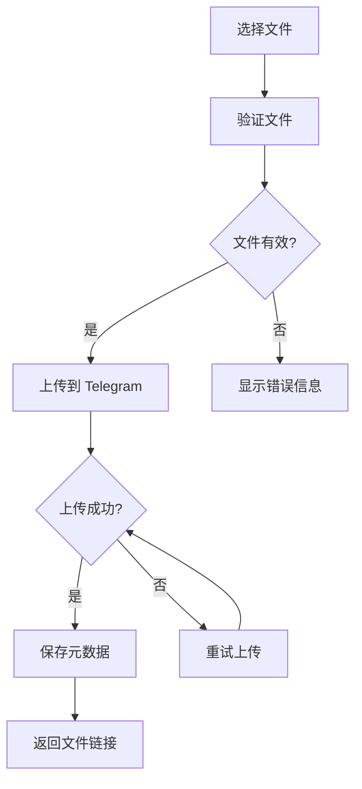

# 图片上传指南

本指南将详细介绍如何使用 Telegraph-Image 上传各种类型的文件。

## 📋 上传概览

Telegraph-Image 支持多种文件类型的上传，包括图片、文档、音频和视频文件。所有文件都通过 Telegram Bot API 存储，确保稳定性和可靠性。

## 📁 支持的文件格式

### 🖼️ 图片格式
**推荐格式**（优化处理）:
- **JPEG/JPG** - 最常用的图片格式，压缩效果好
- **PNG** - 支持透明背景，适合图标和截图
- **GIF** - 支持动画，适合表情包和简单动画
- **WebP** - 现代格式，文件小质量高

**其他支持格式**:
- BMP, TIFF, ICO 等（作为文档处理）

### 📄 文档格式
- **PDF** - 文档、电子书、报告等
- **DOC/DOCX** - Microsoft Word 文档
- **TXT** - 纯文本文件
- **RTF** - 富文本格式
- **其他** - 大部分常见文档格式

### 🎵 音频格式
- **MP3** - 最常用的音频格式
- **WAV** - 无损音频格式
- **OGG** - 开源音频格式
- **M4A** - Apple 音频格式

### 🎬 视频格式
- **MP4** - 最常用的视频格式
- **AVI** - 传统视频格式
- **MOV** - Apple 视频格式
- **MKV** - 开源视频容器

## 📏 文件大小限制

### 大小限制
- **最大文件大小**: 5MB（受 Telegram API 限制）
- **推荐大小**: 2MB 以下（上传更快，访问更稳定）
- **最小大小**: 无限制

### 优化建议
**图片优化**:
- 使用适当的压缩比例
- 选择合适的分辨率
- 考虑使用 WebP 格式

**文档优化**:
- 压缩 PDF 文件
- 移除不必要的元数据
- 使用高效的文档格式

## 🚀 上传方法

### 方法一：拖拽上传

1. **打开上传页面**
   ```
   https://your-domain.pages.dev
   ```

2. **拖拽文件**
   - 将文件从文件管理器拖拽到上传区域
   - 支持同时拖拽多个文件
   - 拖拽时会显示高亮提示

3. **确认上传**
   - 文件会自动开始上传
   - 显示上传进度
   - 完成后显示结果

### 方法二：点击上传

1. **点击上传区域**
   - 点击页面中的上传区域
   - 或点击"选择文件"按钮

2. **选择文件**
   - 在文件选择对话框中选择文件
   - 支持多选（按住 Ctrl/Cmd 键）
   - 点击"打开"确认选择

3. **开始上传**
   - 点击"上传"按钮
   - 等待上传完成

### 方法三：API 上传

适合开发者和高级用户：

```bash
curl -X POST https://your-domain.pages.dev/upload \
  -F "file=@/path/to/your/file.jpg" \
  -H "Content-Type: multipart/form-data"
```

**响应格式**:
```json
[
  {
    "src": "/file/AgACAgEAAxkDAAMDZt1Gzs4W8dQPWiQJxO5YSH5X-gsAAt-sMRuWNelGOSaEM_9lHHgBAAMCAANtAAM2BA.png"
  }
]
```

## 📊 上传过程详解

### 上传流程



### 上传状态

**准备阶段**:
- 文件选择和验证
- 显示文件信息预览

**上传阶段**:
- 显示上传进度条
- 实时更新上传状态
- 支持取消上传

**完成阶段**:
- 显示上传结果
- 提供文件链接
- 显示分享选项

## 🔧 高级上传功能

### 批量上传

**操作步骤**:
1. 选择多个文件（最多 10 个）
2. 系统会依次处理每个文件
3. 显示整体进度和单个文件状态
4. 完成后提供所有文件的链接

**注意事项**:
- 批量上传时间较长，请耐心等待
- 如果某个文件失败，不影响其他文件
- 建议分批上传大量文件

### 重试机制

**自动重试**:
- 网络错误时自动重试（最多 3 次）
- 图片上传失败时自动转为文档模式
- 显示重试进度和状态

**手动重试**:
- 上传失败时提供重试按钮
- 可以修改文件名后重试
- 支持更换文件后重试

### 上传优化

**智能压缩**:
- 大图片自动压缩到合适大小
- 保持图片质量和清晰度
- 支持手动调整压缩参数

**格式转换**:
- 不支持的格式自动转为文档
- 提供格式转换建议
- 保留原始文件信息

## ❗ 常见问题

### 上传失败

**问题**: 文件上传时返回错误
**可能原因**:
- 文件大小超过 5MB 限制
- 网络连接不稳定
- Telegram Bot 配置错误
- 文件格式不支持

**解决方案**:
1. 检查文件大小和格式
2. 尝试压缩文件
3. 检查网络连接
4. 联系管理员检查配置

### 上传速度慢

**问题**: 文件上传速度很慢
**可能原因**:
- 网络带宽限制
- 文件大小较大
- 服务器负载高
- 地理位置影响

**解决方案**:
1. 检查网络连接速度
2. 尝试压缩文件
3. 选择网络较好的时间上传
4. 分批上传多个文件

### 上传中断

**问题**: 上传过程中断
**可能原因**:
- 网络连接中断
- 浏览器页面刷新
- 文件读取错误
- 服务器临时故障

**解决方案**:
1. 检查网络连接
2. 重新选择文件上传
3. 尝试使用其他浏览器
4. 稍后重试

## 💡 上传技巧

### 提高上传效率

1. **文件预处理**
   - 提前压缩大文件
   - 使用合适的文件格式
   - 批量重命名文件

2. **网络优化**
   - 选择网络状况良好的时间
   - 关闭其他占用带宽的应用
   - 使用有线网络而非 WiFi

3. **浏览器设置**
   - 清理浏览器缓存
   - 禁用不必要的扩展
   - 确保浏览器版本较新

### 文件管理建议

1. **命名规范**
   - 使用有意义的文件名
   - 避免特殊字符和空格
   - 包含日期或版本信息

2. **分类整理**
   - 按用途分类上传
   - 记录重要文件的链接
   - 定期清理不需要的文件

3. **备份策略**
   - 重要文件多处备份
   - 记录上传时间和用途
   - 定期检查链接有效性

## 🔗 相关功能

- **[图片管理功能](managing-images.md)** - 了解如何管理已上传的文件
- **[图片分享方法](sharing-images.md)** - 学习如何分享和使用文件链接
- **[API 文档](../api-docs/upload-api.md)** - 开发者集成指南

---

🎉 **恭喜！** 您已掌握 Telegraph-Image 的上传功能，现在可以高效地上传和管理文件了！
